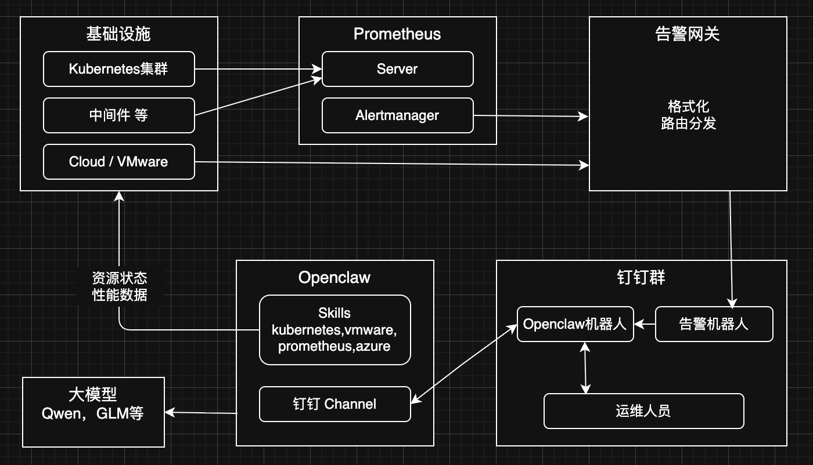
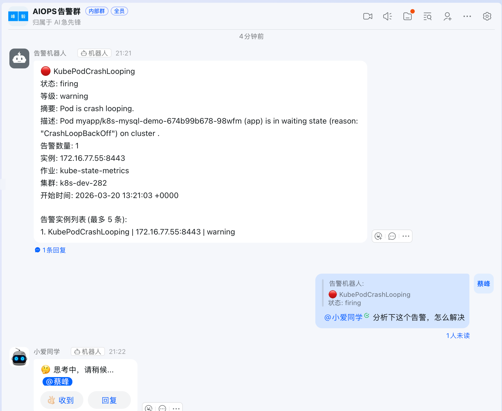
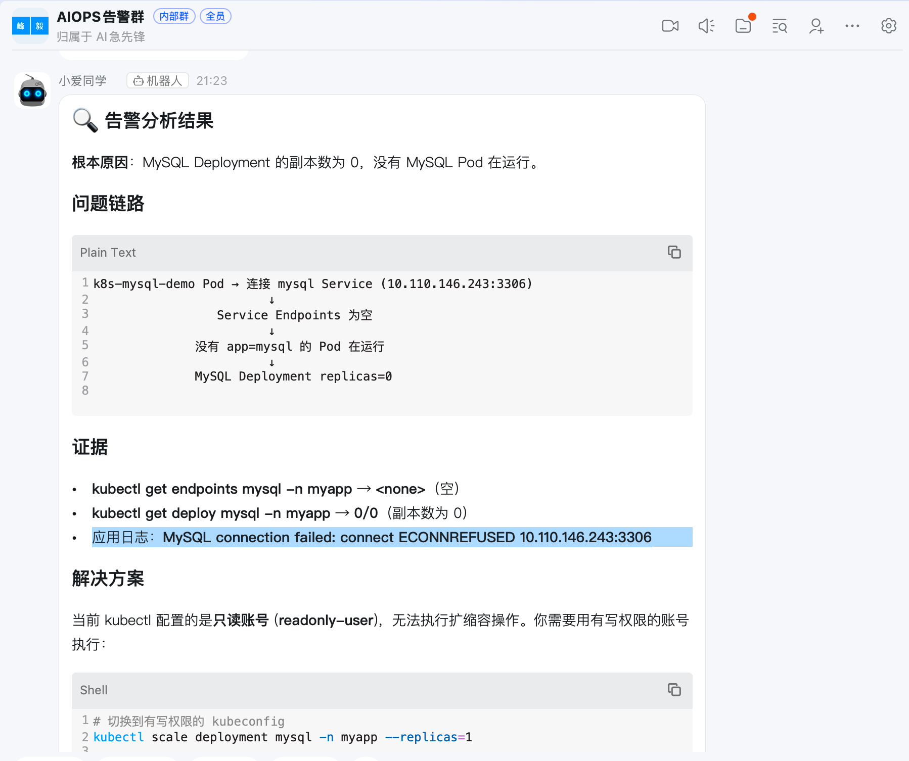
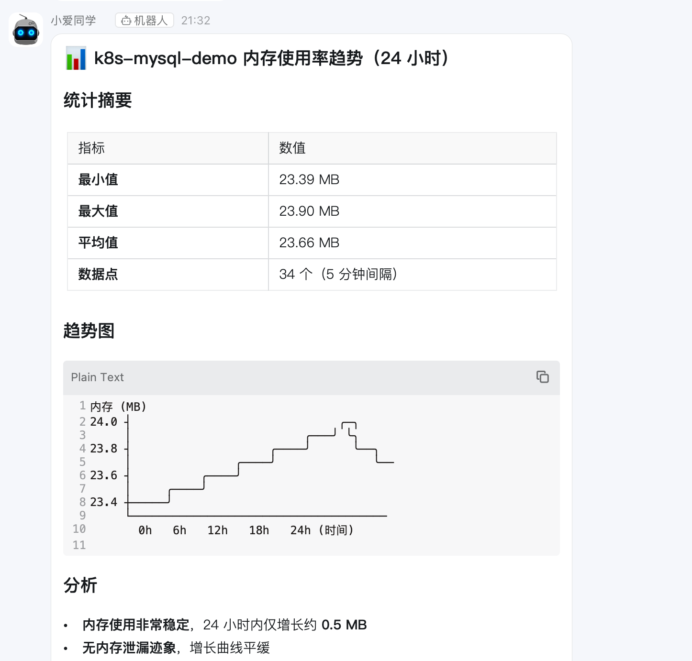
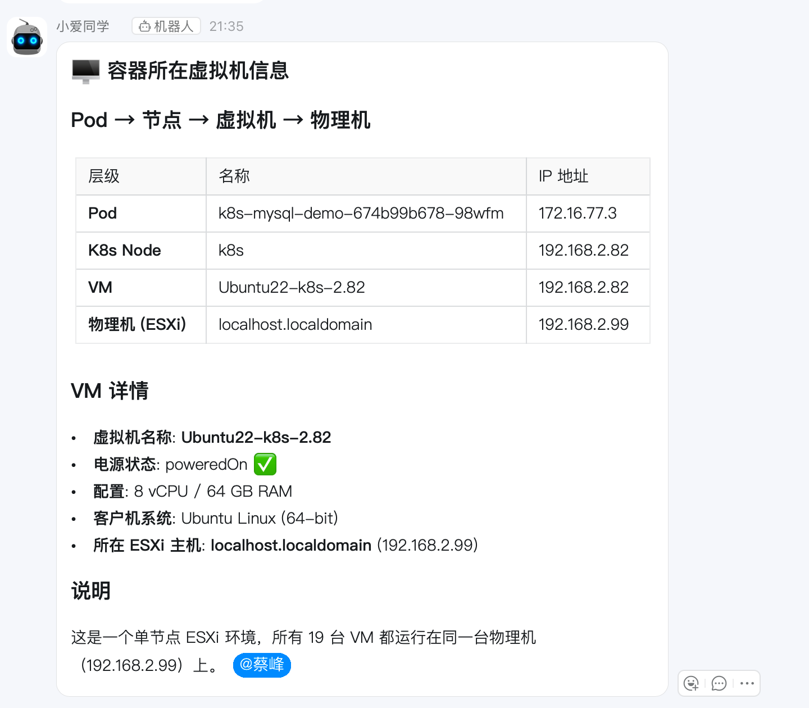
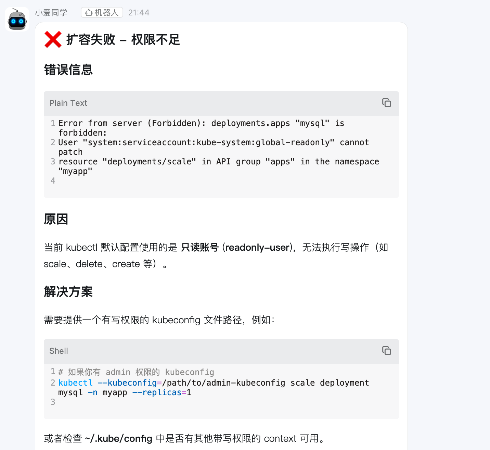

OpenClaw 告警分析实践

目前大家很熟悉的告警推送场景：各种告警平台直接通过 webhook 或者经由统一告警平台将告警推送到不同的钉钉群/企微群。

基于 openclaw 钉钉机器人，可以跟机器人对话扩展以下场景：
1. 告警的解决方案，他会结合服务的状态，日志及AI能力统筹分析
2. 资源状态，如服务是否运行，服务所在虚拟机/VMware宿主机的状态，日志，性能数据
3. 告警修复涉及到变更流程/权限隔离等问题，虽可实现，暂不涉及。AI的自动修复方案存在变数，我认为在一些简单场景通过传统的方式，基于固定的脚本来实现风险更低。复杂场景更加不用说了。

### 基本架构

### 资源部署情况
1. Kubernetes集群（部署在我的VMware ESXI上）。模拟应用运行在k8s上，一个mysql 实例， 一个 nodejs 应用连接到mysql， 当mysql 异常时，nodejs 状态会异常，且日志会报错 mysql 连接失败。k8s 上部署了 Prometheus 监控。
2. 告警网关：运行在笔记本上，当前就是很简单接受alertmanager并转发到钉钉，让AI写一个
3. openclaw：运行在笔记本上。安装了dingding channel， skill 安装了 kube-medic，kubectl，prometheus，vmware-aiops
4. 钉钉群：两个机器人，一个告警机器人，一个连接 openclaw 对话的，配置方式不一样。

具体的部署步骤网上很多，也写的很好，不再赘述。

### 告警测试流程
1. 将 mysql 副本缩容到0
kubectl -n myapp scale deploy mysql --replicas=0

2. Prometheus会通过alertmanager将告警转发到网关，网关转发到钉钉群

3. 跟 openclaw 机器人对话，让他分析告警，
他通过 kubectl 查看应用的环境变量及日志，找到了原因

 
@小爱同学 给我查下 k8s-mysql-demo Pod 这个容器24小时的内存使用率趋势图

@小爱同学 查下这个容器所在的虚拟机IP地址，还有这个虚拟机在哪个物理机上。

4. 尝试下读写能力，让他扩容mysql 副本来修复。
我之前对 openclaw 只授权了 k8s 的view 权限。应该会执行失败才对。

openclaw接入微信的机器人好像不支持添加到群聊，只能私聊，没有测试过。飞书应该是可以实现的。

### 后续可以优化及需要思考的地方
1. 告警内容优化，在告警网关处，对告警内容结合知识库、历史告警及AI能力进行初步分析，推送告警时给出建议或关联知识库。但是如果每条告警都去做初步分析，对AI的压力比较大，使用在线模型的话会带来不少费用。可以尝试本地小模型。
2. 当前使用到了两类钉钉机器人。一是告警机器人，每个钉钉群都会有一个，并分别具有独立的webhook地址用来区分告警推送，但是不支持聊天。 二是 openclaw 对接的机器人，只有一个，会同时添加到多个群，如果拿来做告警推送，应该会没有办法区分群。暂时没有想到好办法进行合并。
可以在网关处将告警进行落地存档，后续openclaw在分析告警的时候可以结合这部分历史数据。
3. 权限隔离，整个openclaw 只有一个钉钉机器人，所有的人/不同钉钉群/不同业务线的人员都是跟这个钉钉机器人聊天，如只是查询资源性能数据，服务状态，风险基本可控。若赋予读写权限，则风险太大。

### 一些遇到的问题或注意事项
1. 机器人不回复。重启 openclaw gateway，或者在机器人页面重新发布一下。每次机器人对话他都会返回“🤔 思考中，请稍候...”，这个不要关闭，有回复说明连接openclaw 成功了。
2. k8s、vmware集群的信息，每个集群对应的监控地址，这些都要 openclaw 提前记住。但是每个虚拟机的详情这些不要记录了，按需查询。

### 后续计划
1. 接入知识库，在告警推送及告警分析时调用
2. 尝试本地模型，我有一块小小的 4060ti 16g，想试试本地小模型的能力