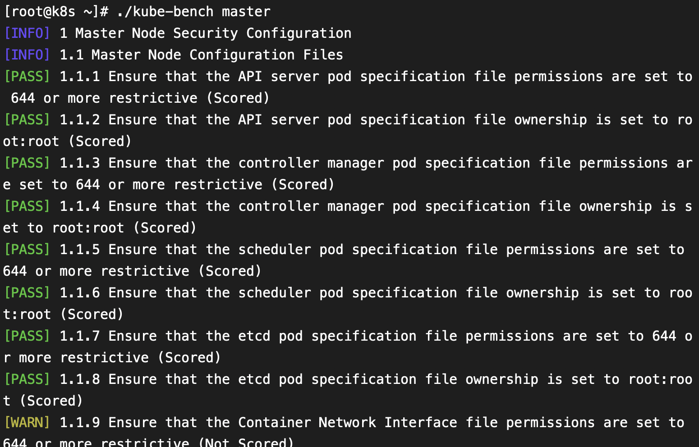
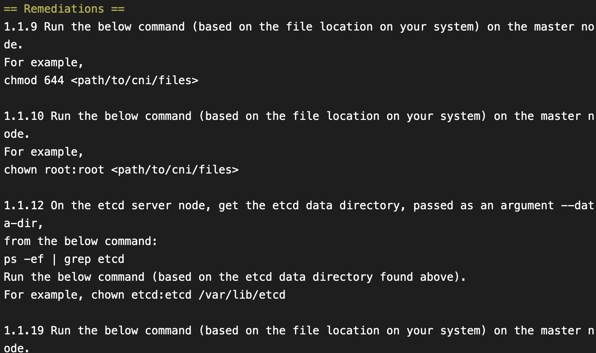
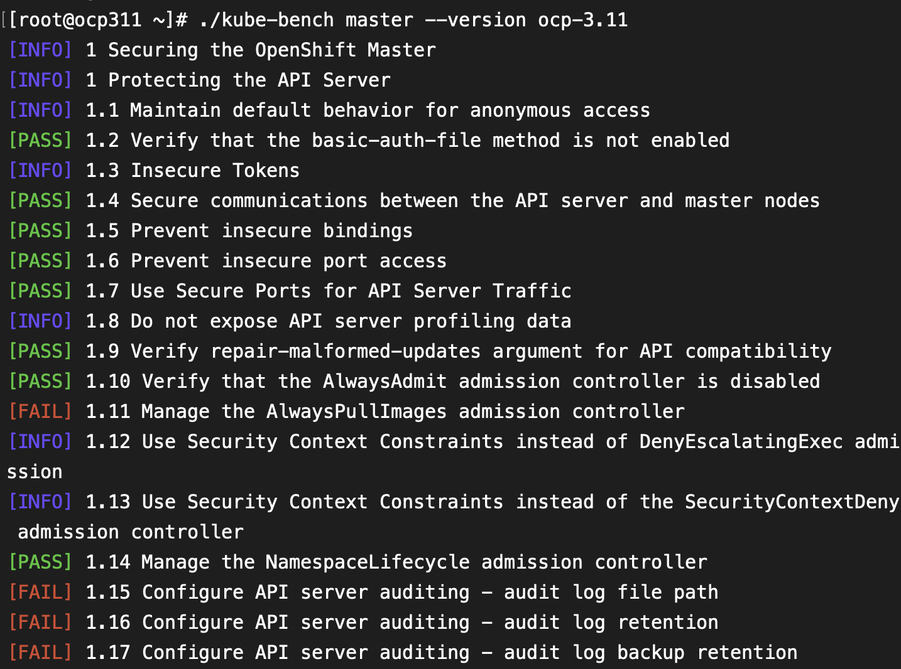

互联网安全中心（CIS）是一个非营利性组织，其制定自己的配置策略基准（即CIS基准），使组织可以改善其安全性和合规性计划及态势。

除了针对操作系统、数据库等，该组织也推出了适用Kubernetes、dockers的Benchmark基准。

kubernetes CIS基准下载地址。当前版本为v1.5.0，下载的pdf显示release日期为 10-14-2019

https://www.cisecurity.org/benchmark/kubernetes/

或者通过我共享的百度盘下载：  
链接: https://pan.baidu.com/s/1bI2gb4klSMRw082XpsdTWA 提取码: 69ye

### kubernetes CIS基准内容
文件内容一共几大块  
master节点的服务 apiserver，controller manager，scheduler，etcd  
node节点的服务 kubelet, proxy  
安全控制: RBAC, pod policy, network policy  

服务组件会涉及数据文件权限及参数配置。

pdf一共276页，这其中的项目如果一项项手动执行下来是比较费时的，下面介绍一种开源的脚本检查工具。

### kubernetes CIS基准测试方法
容器安全厂商Aquq以CIS推出的K8s Benchmark作为基础，开源出了一套安全检测工具Kube-bench。

https://github.com/aquasecurity/kube-bench

Aquq技术负责人Liz Rice表示，该工具是使用Go语言完成，而测试文件则兼容于YAML格式，其测试结果也能支持JSON格式，方便使用者整合其他的自动化工具。在执行完测试任务后，系统除了告诉开发者Kubernetes未通过哪些测试外，也会给予如何改善的建议，例如移除K8s上某个不安全的配置设置建议，或者限制配置文件的权限等。

我在自己笔记本上的k8s 1.16 环境进行了测试，该环境为通过kubeadm 部署的单机节点。

CIS Kubernetes Benchmark 1.5.0，适用的k8s版本为1.15--，对应kube-bench监测工具版本是cis-1.5

| CIS Kubernetes Benchmark | kube-bench config | Kubernetes versions |
|---|---|---|
| 1.3.0| cis-1.3 | 1.11-1.12 |
| 1.4.1| cis-1.4 | 1.13-1.14 |
| 1.5.0 | cis-1.5 | 1.15- |

#### 安装 aqua 的开源工具 kube-bench
有四种安装方法
1. 在容器中运行kube-bench，使用宿主机的PID namespace
2. 运行一个容器来实现在宿主机上安装kube-bench，然后直接在宿主机上运行kube-bench
3. 下载release文件直接运行
4. 源码编译安装

本次通过第三种方式安装，方便直接查看或者修改配置文件，release文件 在官方 github 下载

其他方式见官方github

```bash
[root@k8s ~]# tar -zxvf kube-bench_0.2.3_linux_amd64.tar.gz
[root@k8s ~]# mkdir /etc/kube-bench
[root@k8s ~]# mv cfg/ /etc/kube-bench/

kube-bench 会监测当前节点类型、k8s 的版本，并自动选择相应的cis版本。也可以通过master, node 这样的参数来手动指定，--version 指定k8s测试版本

使用自动版本监测，针对master和node，自动匹配k8s版本进行测试，默认使用这种即可

kube-bench master

kube-bench node 

更多参数：

或者手动指定一个计算节点使用k8s 1.13的测试标准
kube-bench node --version 1.13

使用--version 指定k8s测试版本时候，kube-bench会根据上面的表格自动选择对应的cis benchmark 版本，如果要手动指定cis版本，则用 --benchmark
kube-bench node --benchmark cis-1.4

如果想要手动指定 CIS Benchmark target (i.e master, node, etcd, etc...) 可以用 --targets 命令
不同cis 支持的target参数看下表，当前是cis-1.5， 有 master, controlplane, node, etcd, policies 

kube-bench --benchmark cis-1.4 run --targets master,node
or

kube-bench --benchmark cis-1.5 run --targets master,node,etcd,policies

```

 | CIS Benchmark | Targets |
 |---|---| 
 | cis-1.3| master, node | 
 | cis-1.4| master, node | 
 | cis-1.5| master, controlplane, node, etcd, policies |

#### 测试结果解读
有三种输出状态：
- [PASS]和[FAIL]表示测试已成功运行，并且通过或失败。
- [WARN]表示此测试需要进一步关注，例如，它是需要手动运行的测试。
- [INFO]是不需要进一步操作的信息输出。



对于FAIL和WARN的项目，在测试结果 Remediations 中都会给出修改建议。


测试结果的判断规则：

首先每个测试项目的参数在 /etc/kube-bench/cfg/cis-1.5/

config.yaml        etcd.yaml    node.yaml
controlplane.yaml  master.yaml  policies.yaml

测试项中有几个关键词

type: "manual"  
scored: true  
scored: false    
test_items:

- 如果测试项为 type：manual，则始终会生成WARN（因为用户必须手动运行它）
- 如果测试项为 scored：true，而kube-bench无法运行测试，则会生成“fail”（因为该测试尚未通过，并且作为“得分”测试，如果未通过，则必须视为失败）。
- 如果测试项为 scored：false，而kube-bench无法运行测试，则会生成WARN。
- 如果测试项为  scored：true，没有type参数，并且 test_items 不存在，则会生成WARN。

简单说，就是：
- 手动测试项，都是WARN
- 自动项目，得分项，成功了PAAS，失败了FAIL
- 自动项目，得分项，没有测试内容的，生成WARN
- 自动项目，不算分项，成功了PASS，失败了WARN

在我的k8s环境中，执行 kube-bench master，总的结果如下：

可以根据实际环境需要进行配置文件调整，不是所有的FAIL都是需要修复的。

== Summary ==  
40 checks PASS  
14 checks FAIL  
11 checks WARN  
0 checks INFO  

#### 问题修复
针对测试中出现的FAIL和WARN进行修复，修复方法在测试脚本的输出信息中都有提示。

比如这几条关于审计日志：  
[FAIL] 1.2.22 Ensure that the --audit-log-path argument is set (Scored)  
[FAIL] 1.2.23 Ensure that the --audit-log-maxage argument is set to 30 or as appropriate (Scored)  
[FAIL] 1.2.24 Ensure that the --audit-log-maxbackup argument is set to 10 or as appropriate (Scored)  
[FAIL] 1.2.25 Ensure that the --audit-log-maxsize argument is set to 100 or as appropriate (Scored)


给出的修复建议是：  
1.2.22 Edit the API server pod specification file /etc/kubernetes/manifests/kube-apiserver.yaml
on the master node and set the --audit-log-path parameter to a suitable path and
file where you would like audit logs to be written, for example:
--audit-log-path=/var/log/apiserver/audit.log

1.2.23 Edit the API server pod specification file /etc/kubernetes/manifests/kube-apiserver.yaml
on the master node and set the --audit-log-maxage parameter to 30 or as an appropriate number of days:
--audit-log-maxage=30

1.2.24 Edit the API server pod specification file /etc/kubernetes/manifests/kube-apiserver.yaml
on the master node and set the --audit-log-maxbackup parameter to 10 or to an appropriate
value.
--audit-log-maxbackup=10

1.2.25 Edit the API server pod specification file /etc/kubernetes/manifests/kube-apiserver.yaml
on the master node and set the --audit-log-maxsize parameter to an appropriate size in MB.
For example, to set it as 100 MB:
--audit-log-maxsize=100

kubernetes官网的参数说明:  
https://kubernetes.io/zh/docs/reference/command-line-tools-reference/kube-apiserver/
```bash
  --audit-log-path string 
  如果设置该值，所有到 apiserver 的请求都将会被记录到这个文件。'-' 表示记录到标准输出。

  --audit-log-maxage int            
  基于文件名中的时间戳，旧审计日志文件的最长保留天数。

  --audit-log-maxbackup int    
  旧审计日志文件的最大保留个数。

  --audit-log-maxsize int 
  审计日志被轮转前的最大兆字节数。
```

解决方法就是编辑文件 /etc/kubernetes/manifests/kube-apiserver.yaml 加上上面四个参数

重新测试

```bash
[root@k8s ~]# ./kube-bench master |grep audit
[PASS] 1.2.22 Ensure that the --audit-log-path argument is set (Scored)
[PASS] 1.2.23 Ensure that the --audit-log-maxage argument is set to 30 or as appropriate (Scored)
[PASS] 1.2.24 Ensure that the --audit-log-maxbackup argument is set to 10 or as appropriate (Scored)
[PASS] 1.2.25 Ensure that the --audit-log-maxsize argument is set to 100 or as appropriate (Scored)
```

关于审计日志，既然选择了保留日志，那么就还需要在 api-server 的yaml配置加一条hostpath，把 /var/log/apiserver/ 挂载到宿主机本地以持久化。

#### 排除测试项目
如果一些项目不适合我们的场景或者不适合我们当前版本，比如 
1.2.21 1.3.2 1.4.1 三个测试项，是要求 /etc/kubernetes/manifests/ 目录下的三个文件  kube-controller-manager.yaml
kube-apiserver.yaml  kube-scheduler.yaml ，需要设置参数 --profiling=false

通过查询官网，这个参数在1.16 k8s，kube-scheduler 已经弃用，apiserver和controller-manager没有说弃用。 所以我们把 1.4.1 这项忽略掉。

kubernetes官方说明：
https://v1-16.docs.kubernetes.io/zh/docs/reference/command-line-tools-reference/kube-scheduler/
--profiling
弃用: 通过 Web 界面主机启用配置文件：port/debug/pprof/

修改以忽略测试项的方法是：  
cd /etc/kube-bench/cfg/cis-1.5  
编辑 master.yaml  找到 1.4.1   
在id下面加一行参数

```bash
      - id: 1.4.1
        type: "skip"
```

重新测试，上面忽略的1.4.1，结果变成了INFO

```bash
[root@k8s ~]# ./kube-bench master |grep 1.4.1
[INFO] 1.4.1 Ensure that the --profiling argument is set to false (Scored)
```

#### 运行环境
除了在私有的k8s环境中运行，也支持在公有云厂商提供的k8s环境，Google Container Engine（GKE），Azure Container Service（AKS）和Amazon Web Services的Elastic Container Service（EKS）。

方法见github，我没有相应环境，未做测试，从说明来看，和本地k8s环境测试差异不大。

以及支持Redhat的容器平台 openshift 3.10,3.11

这个测试方法和本地k8s完全一致，只是参数有差异，需要指定版本
 --benchmark rh-07, or --version ocp-3.10 or --version ocp-3.11

./kube-bench master --version ocp-3.11



最终结果，可以根据实际环境需要进行配置文件调整，不是所有的FAIL都是需要修复的。

== Summary ==  
44 checks PASS  
14 checks FAIL  
10 checks WARN  
13 checks INFO


### 参考文档
https://github.com/aquasecurity/kube-bench
https://github.com/freach/kubernetes-security-best-practice/blob/master/README.md


