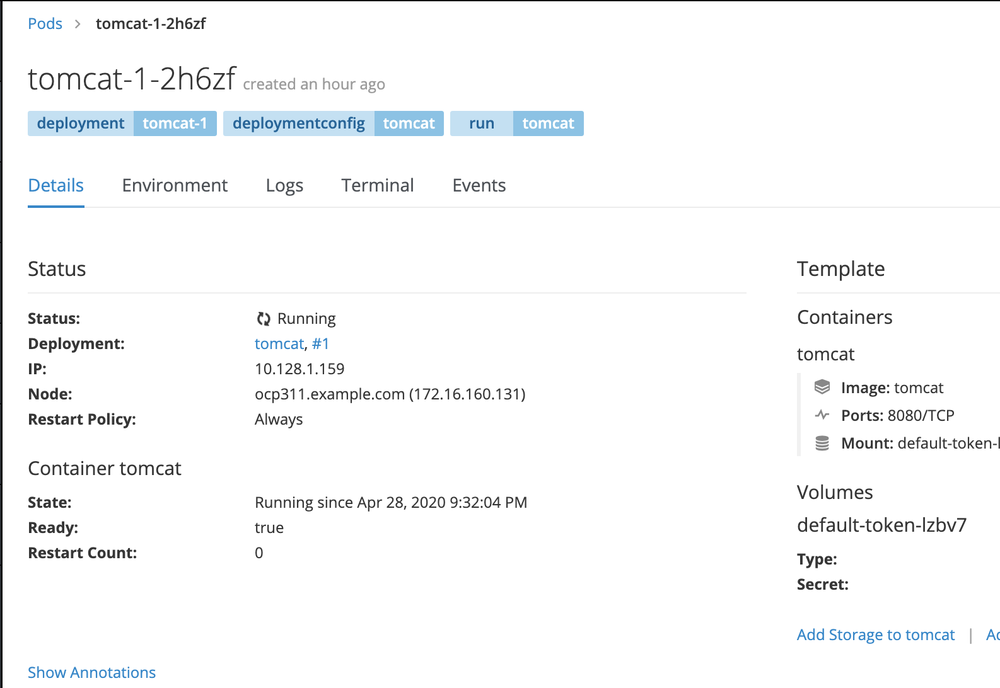
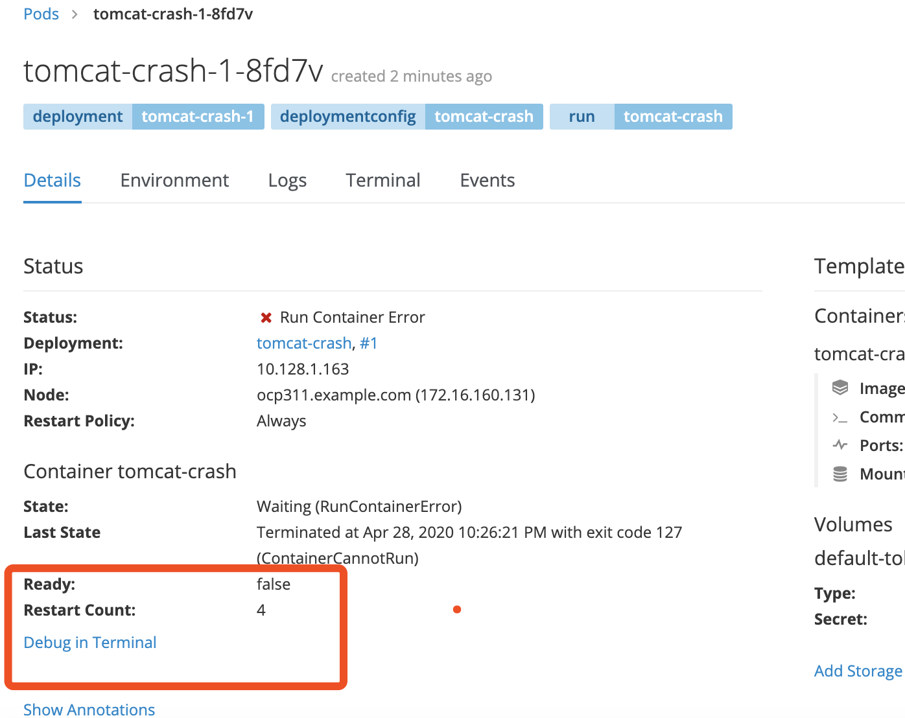
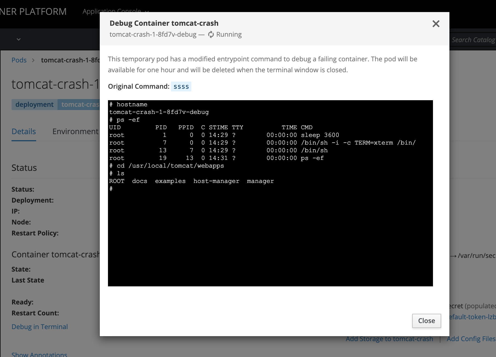

面对 k8s/openshift 的集群或者应用的异常情况，除了通过日志、事件来排查，还会借助各种工具。

本篇介绍 kubectl-debug 插件及 openshift 的debug 模式，来协助我们debug， 提高效率。

### kubectl-debug 插件

官方文档见这里，设计思路、配置和使用说明写的很详细。 
作者：吴叶磊  aylei  
https://github.com/aylei/kubectl-debug/blob/master/docs/zh-cn.md

本节以下内容只是记录了我的部分操作。  

简述： 在运行中的 Pod 上额外起一个新容器, 并将新容器加入到目标容器的 pid, network, user 以及 ipc namespace 中, 这时我们就可以在新容器中直接用 netstat, tcpdump 这些熟悉的工具来解决问题了, 而旧容器可以保持最小化, 不需要预装任何额外的排障工具。

这就是 kubectl-debug 的出发点： 用工具容器来诊断业务容器 。背后的设计思路和 sidecar 等模式是一致的：每个容器只做一件事情。

具体到实现上，一条 kubectl debug <target-pod> 命令背后是这样的：


步骤分别是:

* 插件查询 ApiServer：demo-pod 是否存在，所在节点是什么
* ApiServer 返回 demo-pod 所在所在节点
* 插件请求在目标节点上创建 Debug Agent Pod
* Kubelet 创建 Debug Agent Pod
* 插件发现 Debug Agent 已经 Ready，发起 debug 请求（长连接）
* Debug Agent 收到 debug 请求，创建 Debug 容器并加入目标容器的各个 Namespace 中，创建完成后，与 Debug 容器的 tty 建立连接
* 接下来，客户端就可以开始通过 5，6 这两个连接开始 debug 操作。操作结束后，Debug Agent 清理 Debug 容器，插件清理 Debug Agent，一次 Debug 完成。

#### 安装与使用

```bash
export PLUGIN_VERSION=0.1.1
# linux x86_64
curl -Lo kubectl-debug.tar.gz https://github.com/aylei/kubectl-debug/releases/download/v${PLUGIN_VERSION}/kubectl-debug_${PLUGIN_VERSION}_linux_amd64.tar.gz
# macos
curl -Lo kubectl-debug.tar.gz https://github.com/aylei/kubectl-debug/releases/download/v${PLUGIN_VERSION}/kubectl-debug_${PLUGIN_VERSION}_darwin_amd64.tar.gz

tar -zxvf kubectl-debug.tar.gz kubectl-debug
sudo mv kubectl-debug /usr/local/bin/
```

kubectl-debug 使用 nicolaka/netshoot 作为默认镜像. 默认镜像和指令都可以通过命令行参数进行覆盖. 考虑到每次都指定有点麻烦, 也可以通过文件配置的形式进行覆盖, 编辑 ~/.kube/debug-config 文件:

```bash
# debug-agent 映射到宿主机的端口
# 默认 10027
agentPort: 10027

# 是否开启ageless模式
# 默认 true
agentless: true
# agentPod 的 namespace, agentless模式可用
# 默认 default
agentPodNamespace: default
# agentPod 的名称前缀，后缀是目的主机名, agentless模式可用
# 默认 debug-agent-pod
agentPodNamePrefix: debug-agent-pod
# agentPod 的镜像, agentless模式可用
# 默认 aylei/debug-agent:latest
agentImage: aylei/debug-agent:latest

# debug-agent DaemonSet 的名字, port-forward 模式时会用到
# 默认 'debug-agent'
debugAgentDaemonset: debug-agent
# debug-agent DaemonSet 的 namespace, port-forward 模式会用到
# 默认 'default'
debugAgentNamespace: kube-system
# 是否开启 port-forward 模式
# 默认 true
portForward: true
# image of the debug container
# default as showed
image: nicolaka/netshoot:latest
# start command of the debug container
# default ['bash']
command:
- '/bin/bash'
- '-l'
# private docker registry auth kuberntes secret, default is kubectl-debug-registry-secret
# 使用私有仓库镜像,并设置私有仓库使用的kubernetes secret
# secret data原文请设置为 {Username: <username>, Password: <password>}
# 默认RegistrySecretName为kubectl-debug-registry-secret,默认RegistrySecretNamespace为default
RegistrySecretName: my-debug-secret
RegistrySecretNamespace: debug
# 在默认的agentless模式下可以设置agent pod的resource资源限制
# 若不设置,默认为空
agentCpuRequests: ""
agentCpuLimits: ""
agentMemoryRequests: ""
agentMemoryLimits: ""
# 当使用fork mode时,如果需要复制出来的pod保留原pod的labels,可以设置需要保留的labels列表
# 格式为[]string
# 默认为空(既不保留任何原POD的labels,新fork出pod的labels)
forkPodRetainLabels: []
```

#### 测试 debug command
先运行一个 tomcat ，再使用 debug 

```bash
[root@k8s ~]# kubectl run tomcat --image=tomcat:8.5 --port=8080
[root@k8s ~]# kubectl get pod
NAME                     READY   STATUS    RESTARTS   AGE
tomcat-b7dd96c5c-kqjs8   1/1     Running   0          2m23s

[root@k8s ~]# kubectl debug tomcat-b7dd96c5c-kqjs8 

# debug 容器和 tomcat 具备了相同的主机名、网络和pid1 
~ hostname 
tomcat-b7dd96c5c-kqjs8
~ ip a |grep eth0
4: eth0@if33: <BROADCAST,MULTICAST,UP,LOWER_UP> mtu 1440 qdisc noqueue state UP group default 
    inet 10.244.77.15/32 scope global eth0

~ ps -ef |grep java
    1 root      0:03 /usr/local/openjdk-8/bin/java -Djava.util.logging.config.file=/usr/local/tomcat/conf/logging.properties -Djava.util.logging.manager=org.apache.juli.ClassLoaderLogManager -Djdk.tls.ephemeralDHKeySize=2048 -Djava.protocol.handler.pkgs=org.apache.catalina.webresources -Dorg.apache.catalina.security.SecurityListener.UMASK=0027 -Dignore.endorsed.dirs= -classpath /usr/local/tomcat/bin/bootstrap.jar:/usr/local/tomcat/bin/tomcat-juli.jar -Dcatalina.base=/usr/local/tomcat -Dcatalina.home=/usr/local/tomcat -Djava.io.tmpdir=/usr/local/tomcat/temp org.apache.catalina.startup.Bootstrap start
  156 root      0:00 grep java    
```

这种场景多用于排查网络问题，镜像里也内置了很多网络工具。

这个时候，应用容器还是可以运行的，对于应用容器本身的排查，比如配置挂载、环境变量是否生效，启动参数，启动日志，我们完全可以直接通过容器终端来排查。

####  诊断 CrashLoopBackoff 

这种情况在平时是比较棘手的，因为容器在不停的重启，kubectl exec 不管用。

 为了让针对 CrashLoopBackoff 的排查更方便， kubectl-debug 参考 oc debug 命令，添加了一个 --fork 参数。当指定 --fork 时，插件会复制当前的 Pod Spec，做一些小修改， 再创建一个新 Pod：

新 Pod 的所有 Labels 会被删掉，避免 Service 将流量导到 fork 出的 Pod 上
新 Pod 的 ReadinessProbe 和 LivnessProbe 也会被移除，避免 kubelet 杀死 Pod
新 Pod 中目标容器（待排障的容器）的启动命令会被改写，避免新 Pod 继续 Crash

模拟 crash 状态，运行一个 tomcat ，给他一个不正常的启动命令
```bash
[root@k8s ~]# kubectl run tomcat2 --image=tomcat:8.5 --command ssss 
# 可以看到在不停的重启
[root@k8s ~]# kubectl get pod
NAME                       READY   STATUS             RESTARTS   AGE
tomcat2-69fc49687c-n2bxn   0/1     CrashLoopBackOff   2          50s


~ kubectl debug tomcat2-69fc49687c-n2bxn --fork

# chroot 到目标容器的根文件系统中
~   chroot /proc/1/root
~ ls /usr/local/openjdk-8/
```

这和上一个场景的区别是：  
上一个场景是启动了一个都是工具的 netshoot pod，和应用pod 处于同样的网络环境，常用于诊断网络环境   
这个 --fork 还是启动了一个都是工具的 netshoot pod，不过spec 复制了应用pod，常用于调试启动参数异常导致的反复重启

两种场景都可以在debug 容器中通过 chroot /proc/1/root 进入到应用pod 

这个 --fork 参数测试下来和 openshift 还是不太一样，openshift 直接复制了一个应用 pod ，替换掉了启动参数

### openshift debug 模式

openshift 内置了 debug 工具，可以在后台 oc debug 命令或者web 页面选择 debug in terminal 

差别： web 页面 只有pod 处于异常的状态才会出现 debug 的选项
oc debug 命令没有这个限定

#### oc debug command 

通过 oc debug --help 可以看到介绍，是复制了一个 pod，把启动参数换成了 /bin/sh  
以及移除了 readiness 和liveness  方式健康检查导致重启  
可以通过参数指定 UID 和所部署 node, 或者选择保留健康检查参数  

```bash
# 先起一个服务
~ oc run tomcat --image=tomcat:8.5 --port=8080

~ oc get pod
NAME                       READY     STATUS    RESTARTS   AGE
tomcat-1-2h6zf             1/1       Running   0          44m

# 进入debug 模式
~  oc debug tomcat-1-2h6zf
# hostname      
tomcat-1-2h6zf-debug
# ls /usr/local/tomcat
LICENSE  NOTICE  RELEASE-NOTES	RUNNING.txt  bin  conf	include  lib  logs  native-jni-lib  temp  webapps  work

# 另起一个终端看下，发现是单独起了一个debug 的pod
[root@ocp311 ~]# oc get pod
NAME                       READY     STATUS    RESTARTS   AGE
tomcat-1-2h6zf             1/1       Running   0          45m
tomcat-1-2h6zf-debug       1/1       Running   0          33s
```

#### web 控制台 debug 模式

先运行一个异常的服务，因为 web 页面只有异常的pod 才有debug 选项

```bash
~ oc run tomcat-crash --image=tomcat:8.5 --port=8080 --command  ssss

~ oc get pod
NAME                       READY     STATUS              RESTARTS   AGE
tomcat-1-2h6zf             1/1       Running             0          53m
tomcat-crash-1-8fd7v       0/1       RunContainerError   1          22s
tomcat-crash-1-deploy      1/1       Running             0          25s
```

进入 web 控制台看下，对比下正常的pod tomcat-1-2h6zf 和异常的 pod tomcat-crash-1-8fd7v  

正常的pod


异常的pod


进入 debug 模式，可以直接在页面进入新启动的 debug pod，不过启动参数是 sleep 3600

这样就可以去手动调试启动参数了



所以，这个的场景主要和 kubectl-debug 插件的第二个场景是一致的，主要应对应用的调试，而且可以在web 控制台操作，是很方便的。

如果要使用调试工具，可以使用上面的 kubectl-debug 插件，或者直接运行这个很多工具的镜像 nicolaka/netshoot 

### debug 思路

工具终归都是辅助，我们还是要深入理解k8s 原理，有一个清晰的思路，才能更好的排查问题，下文是以前写的故障排查介绍，供参考。

https://github.com/cai11745/k8s-ocp-yaml/blob/master/kubernetes-docs/2019-07-27-openshift-k8s-troubleshooting.md
