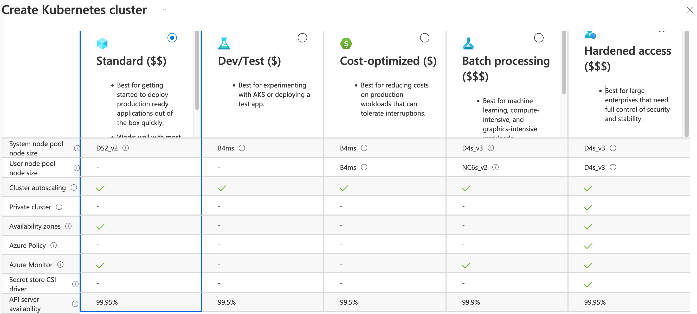
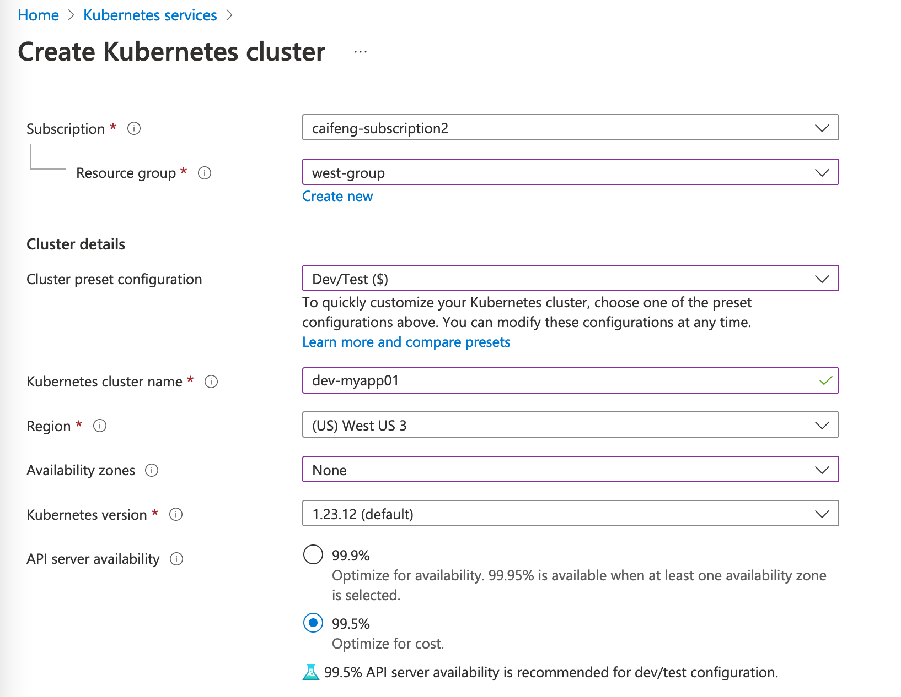
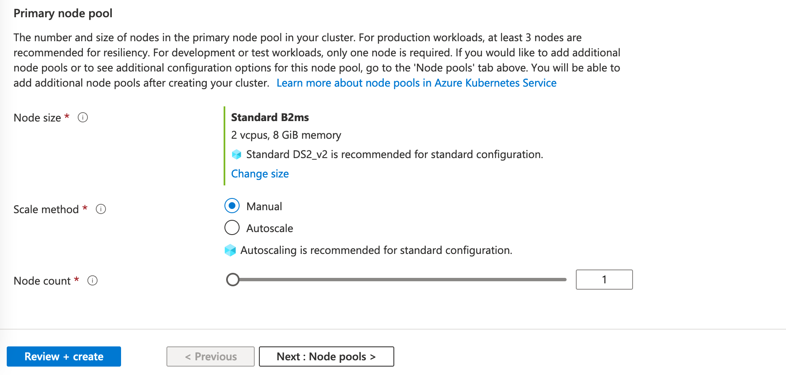
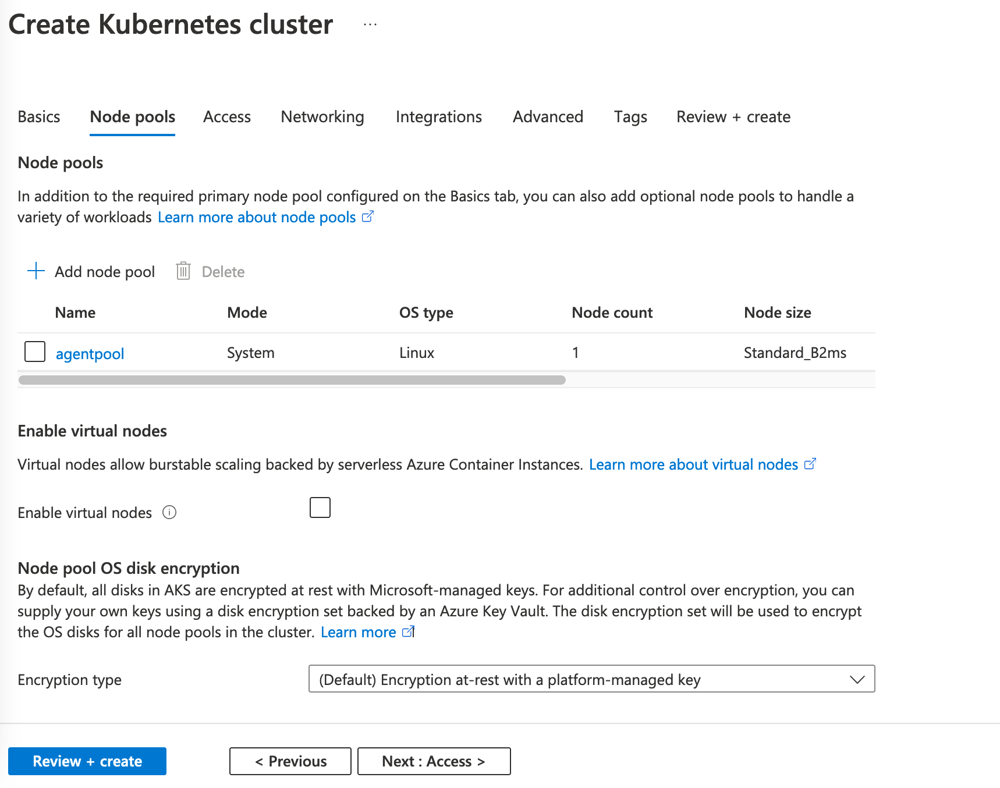
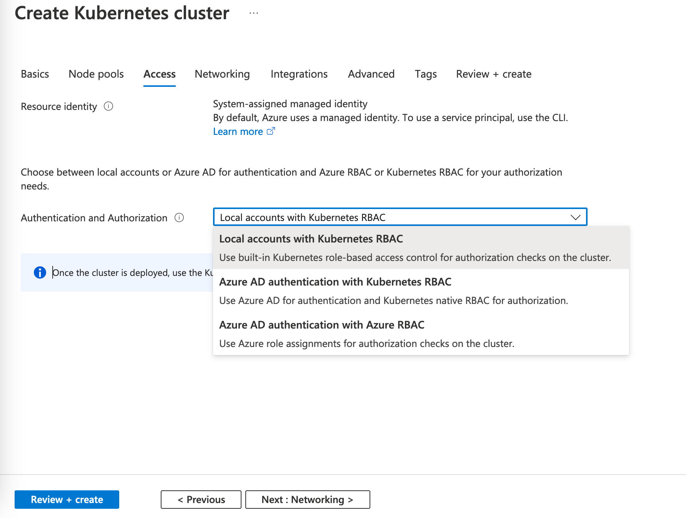
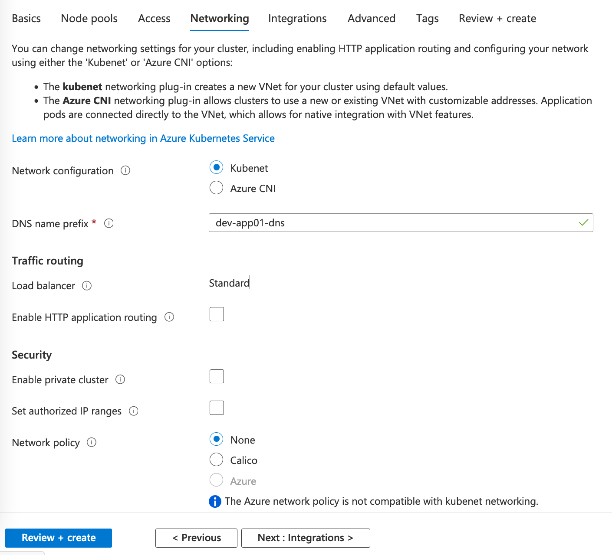
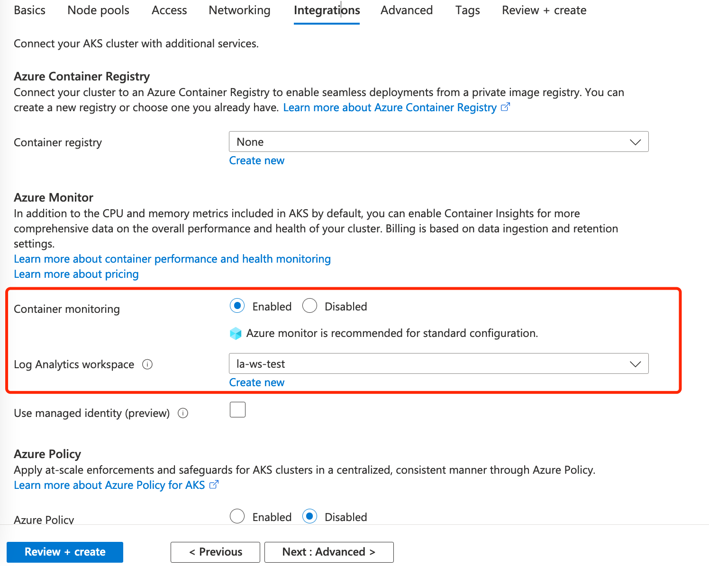
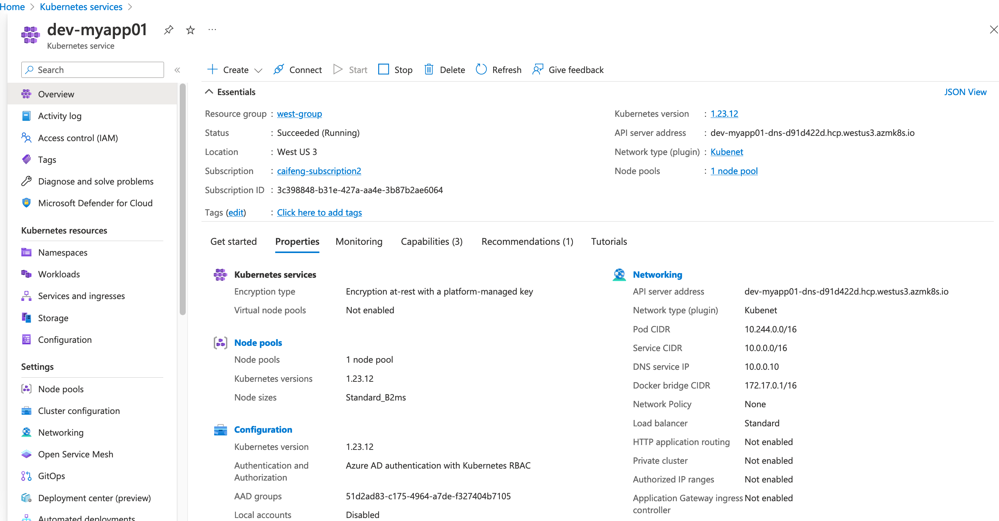
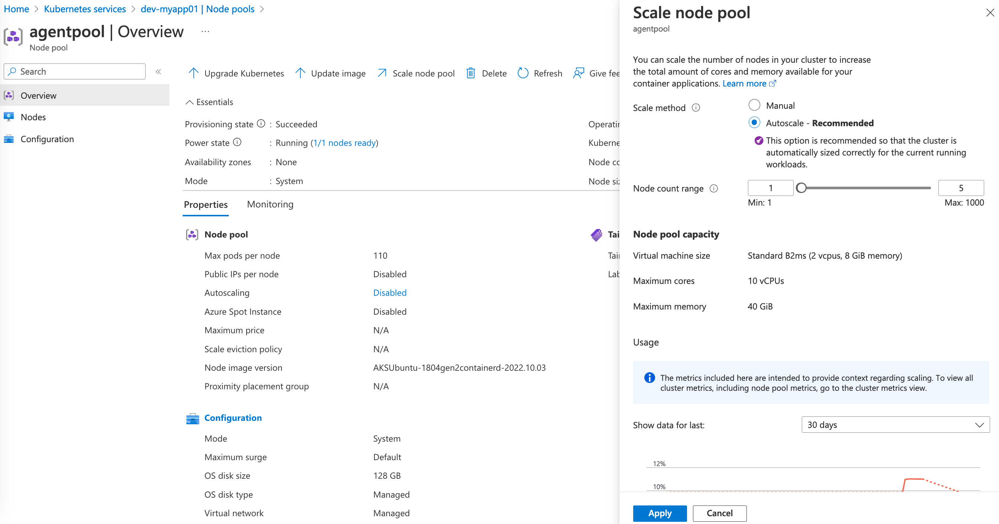
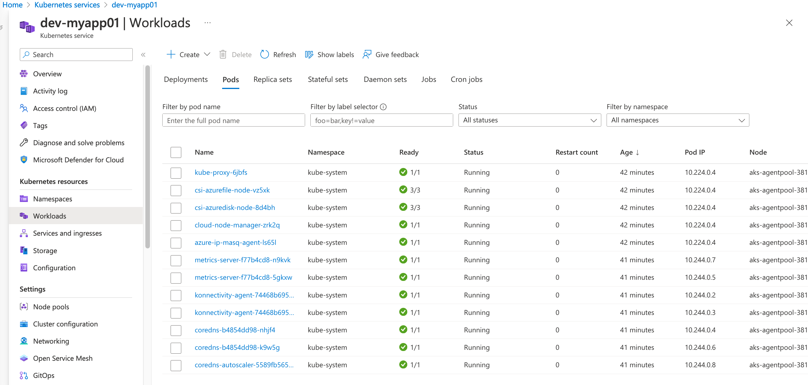

测试环境：azure global （国内azure个人无法注册）

### 创建kubernetes 集群

主要参数：
subscription 和 resource group 按照资源规划情况创建，可以和关联应用放在一个resource group里  
Cluster preset configuration: 快速设置，比如选便宜的Dev，下面的Availability Zones就会设置成0，API server availability 会变成99.5%。 如果选的Standard，Availability Zones就会设置成123，API server availability 会变成99.95%。各个规格的功能特性也有差异。正式测试/生产环境建议选Hardend access，可以满足更多的安全设定。

Availability Zones：可用分区是一种高可用性产品，它允许您将此节点池中的节点分布到多个物理位置，保护您的应用程序不受数据中心故障的影响。就是aks计算节点分布在多个可用区，提高可用性，应对区域故障。
Kubernetes version: 一般就选推荐的默认，没必要选最新的，除非你需要最新版本的某个功能特性。  
API server availability： AKS集群的控制节点是由微软提供的，当然也就包括的了API部分，正式环境选择更高的可用性，同时这个参数的可选级别也与Availability Zones有关。

一个集群可以有多个node pool，每个pool里虚机规格一致，不同的pool可以使用不同的规格。并可根据node selector等特性对应用进行按pool分发。创建的时候必须设定primary node pool，也叫system pool，kubesystem 等系统组件会运行在这个node pool。  
Node size：目前主流的配置是D3s v4，D4s V4和V3版本。V4性能好一点，略贵，暂不支持购买CPP（就是包年打折）。D3s是4C16G，D4s是8C32G
Scale method: 是否根据负载自动弹性扩缩容节点，这个后续还可以手动进行配置。
Node count: 最少1个节点

此处除了上面添加的node pool，可以新增node pool，也可以集群创建完成后再添加。  
Enable virtual nodes：一般不开启。虚拟节点支持在Azure容器实例(ACI)和AKS集群中运行的pod之间进行网络通信。虚拟节点只能与使用高级网络(Azure CNI)创建的AKS集群一起工作。缺省情况下，AKS集群采用基本组网(kubenet)方式创建。  
Node pool OS disk encryption：节点操作系统硬盘加密方式，一般采用默认即可。  

Access，分配对aks资源的操作权限  
Kubernetes RBAC: 就是k8s里的ClusterRole和Role，比如clusteredit，view，edit 等角色分配，角色授予的对象可以是用户、组、sa。这些都是针对单一集群的。  

Azure RBAC: azure里的资源都是通过Azure RBAC来分配和管理权限的。Azure RBAC除了集成上面Kubernetes RBAC，还可以使用AKS API控制集群的缩放和升级。使用 Azure RBAC，可创建“角色定义”，描述要应用的权限。然后，可通过特定范围的角色分配为用户或组分配此角色定义。范围可以是单个资源、资源组或整个订阅。  

如果是企业用户，一般会使用Azure AD，可以选择第三个。
个人测试只是使用AKS的容器能力，就默认。更多的权限测试后续会再做验证。

网络方案有两种可选，默认是 kubenet ，会创建一个新的vnet和subnet， aks节点用subnet中获取ip。pod地址不和节点ip不属于一个段  

Azure CNI的话，pod 会从 subnet中获取ip，就是pod 和 节点ip 使用的一个vnet，处于同一vnet中的虚拟机可以直接访问pod ip，这一点kubenet网络是做不到的。这个在私有云场景，有几个厂商会提供实现这种场景的自研网络方案。  

Enable Private Cluster：开启后，将不能通过公网连接的aks集群，只能通过和aks集群同vnet的虚拟机，或者使用peering或vpn方式连通。企业部署可以采用这种方式提高集群安全性  

Container registry：可以后续再创建

Azure Monitor： 如果上面价格选的便宜的，这边默认是关闭的。集群创建完可以手动开启或关闭。可以用于采集性能、事件、日志，汇聚到Log Analytics workspace, 并可通过查询语句检索、告警，很好用，也很贵，很贵，很贵。测试记得及时关闭。生产环境可以通过配置，不采集应用日志，只采集性能和事件，配合告警蛮好用的。收费是根据数据量来的，一般情况数据量最大的就是应用日志了，可以自建EFK来代替。

创建完成后，页面提供了集群的管理，权限分配，节点性能，节点扩缩容、弹性，节点升级。aks的master节点是全托管模式，在节点池中看不到，也无法ssh进入。  

开启节点弹性

可以在页面查看应用信息，deploy，pod的yaml、events，满足了日常运维的需要。

但是发布应用的话，只提供了yaml方式，正式使用还是要是要配合devops平台来做发布。  
作为一个运维，当然不能少了 kubectl，在集群的overview页面，点击connect，会提示通过 az 命令登录，认证后即可使用 kubectl。此处同样，如果开启了 private cluster，需要打通网络才能连接。

### 总结

整体来看，AKS部署简便，master节点免维护且免费，多种规格的计算节点可以选择，弹性方便，完全满足生产环境的部署需求。特别是企业刚迁移到容器，在k8s这块人员技能储备相对不足的情况下，是一个很好的选择。可以结合微软或者第三方的devops工具，实现持续部署，更高效。  

最后再次提醒，azure monitor 开启后关闭采集应用日志，很贵。

欢迎关注我的github  
https://github.com/cai11745/hybrid-cloud

### 参考链接

官网：https://learn.microsoft.com/zh-cn/training/modules/configure-azure-kubernetes-service/1-introduction
