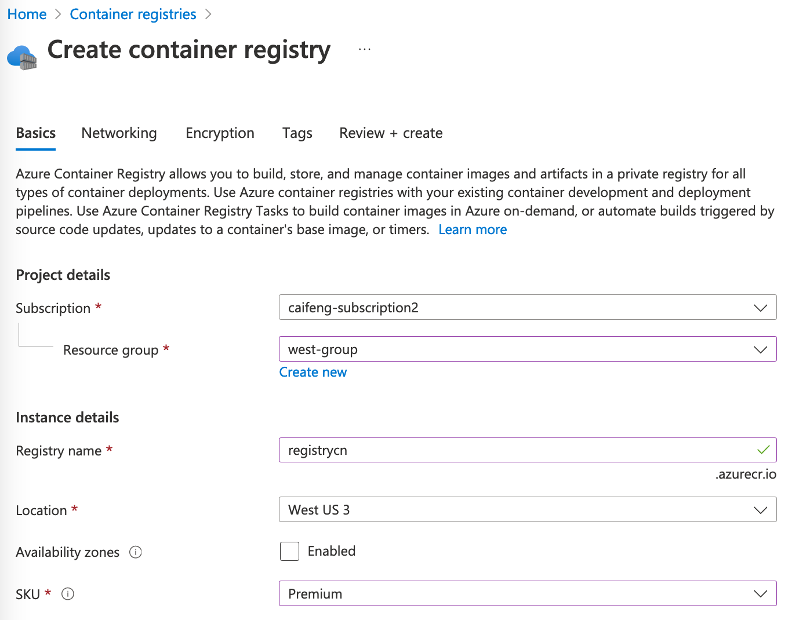

测试环境：azure global （国内azure个人无法注册）

在微软云Azure上使用Kubernetes必然离不开镜像仓库，Azure也提供了开箱即用的镜像仓库（国内azure环境叫容器注册表）。

### 创建容器镜像仓库



名称： 在 Azure 中必须是唯一的，并且需包含 5-50 个 字母 数字，不支持符号。
Availability zones：多可可用区支持，在一个region下多个可用区复制仓库副本，和VM的有点类似，不过没法选在几个 zone 中实现高可用。只有SKU 为 premium 的时候才支持开启。  
SKU：Basic/Standard/Premium 有三个sku可选

规格对比  
https://learn.microsoft.com/en-us/azure/container-registry/container-registry-skus

Availability zones、Geo-replication、Private link with private endpoints 这些企业级场景，只有premium才支持。所以个人测试环境就Basic，企业环境Premium  


价格表  
https://azure.microsoft.com/en-us/pricing/details/container-registry/

各种规格容量收费是一致的，差的是日租费，差的也不多，企业用肯定选premium了


**Networking: Public access/Private access**
您可以通过公共IP地址公开地连接到这个注册中心，也可以使用私有端点私有地连接到这个注册中心。虚拟网络上的客户端和注册中心的私有端点之间的网络流量穿过虚拟网络和Microsoft骨干网上的私有链接，消除了对公共internet的暴露。私有链接还支持通过Azure ExpressRoute私有对等体或VPN网关从内部访问私有注册表。企业环境建议采用后者。  

Private access (Recommended) is only available for Premium SKU.


**Encryption： Customer-Managed Key**  
Azure 容器注册表服务加密可保护静态数据。将映像和其他项目推送到注册表时，Azure 容器注册表对它们进行加密，并在你拉取它们时自动进行解密。
默认情况下，容器注册表中的数据是加密的。你可选择为 Azure 容器注册表加密提供自己的密钥。

客户管理的密钥提供在 Azure Key Vault 中创建自己的密钥所需的所有权。 启用客户管理的密钥时，可以管理其轮换、控制其使用的访问权限和权限，以及审核其使用情况。

主要功能包括：  
法规符合性：Azure 使用 服务管理的密钥自动加密静态注册表内容，但客户管理的密钥加密可帮助你满足法规合规性准则。  
与 Azure Key Vault 集成：客户管理的密钥通过与 Azure Key Vault 集成来支持服务器端加密。 使用客户管理的密钥，可以创建自己的加密密钥并将其存储在密钥保管库中。 或者，可以使用 Azure Key Vault API 来生成密钥。  
关键生命周期管理：将客户管理的密钥与 Azure Key Vault 集成，可让你完全控制和负责密钥生命周期，包括轮换和管理。  

Customer-Managed Key is only available for Premium SKU. 企业环境建议开启  

注意：  
目前只能在创建注册表时启用客户管理的密钥。  
对注册表启用客户管理的密钥后，无法禁用加密。  


### 上传镜像

如果从公网登录，先在 networking -- public access 中 enable all networks 或者放行自己的网段  

```bash
az login
az acr login --name registrycn
或者
docker login registrycn.azurecr.io
(用户密码在Access Key中开启 Admin user 即可获取)
```

实际操作一下
```bash
[root@alicentos ~]# az acr login --name registrycn
Login Succeeded

# 先从公网下载个nginx
[root@alicentos ~]# docker pull docker.io/nginx:1.14
Trying to pull repository docker.io/library/nginx ... 
1.14: Pulling from docker.io/library/nginx
27833a3ba0a5: Pull complete 
0f23e58bd0b7: Pull complete 
8ca774778e85: Pull complete 
Digest: sha256:f7988fb6c02e0ce69257d9bd9cf37ae20a60f1df7563c3a2a6abe24160306b8d
Status: Downloaded newer image for docker.io/nginx:1.14
 
# 改成我的镜像仓库地址，然后push
[root@alicentos ~]# docker tag docker.io/nginx:1.14 registrycn.azurecr.io/middleware/nginx:1.14
[root@alicentos ~]# docker push registrycn.azurecr.io/middleware/nginx:1.14
The push refers to a repository [registrycn.azurecr.io/middleware/nginx]
82ae01d5004e: Pushed 
b8f18c3b860b: Pushed 
5dacd731af1b: Pushed 
1.14: digest: sha256:706446e9c6667c0880d5da3f39c09a6c7d2114f5a5d6b74a2fafd24ae30d2078 size: 948
```

或者使用import命令从其他仓库同步镜像过来
```bash
az acr import  --name registrycn --source docker.io/library/tomcat:8.5 --image middleware/tomcat:8.5

```


欢迎关注我的github  
https://github.com/cai11745/hybrid-cloud

### 参考链接

官网：https://learn.microsoft.com/zh-cn/training/modules/build-and-store-container-images/2-deploy-azure-container-registry