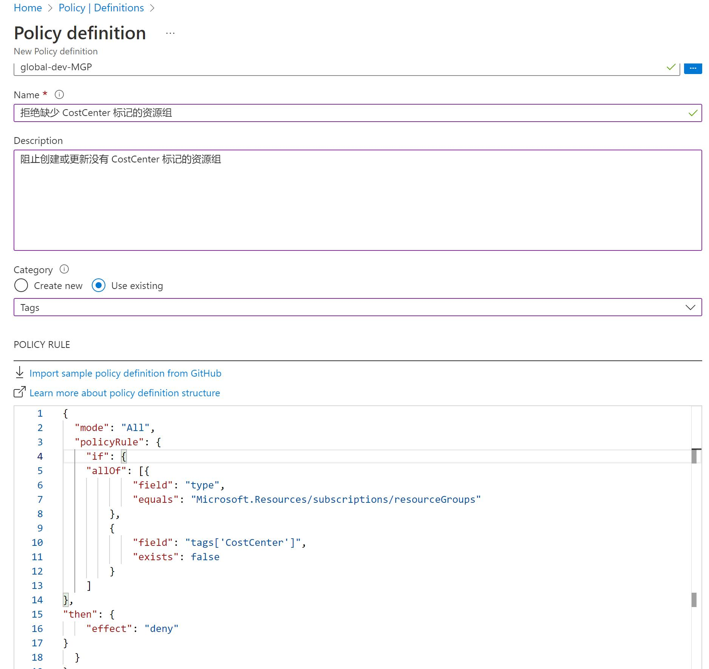
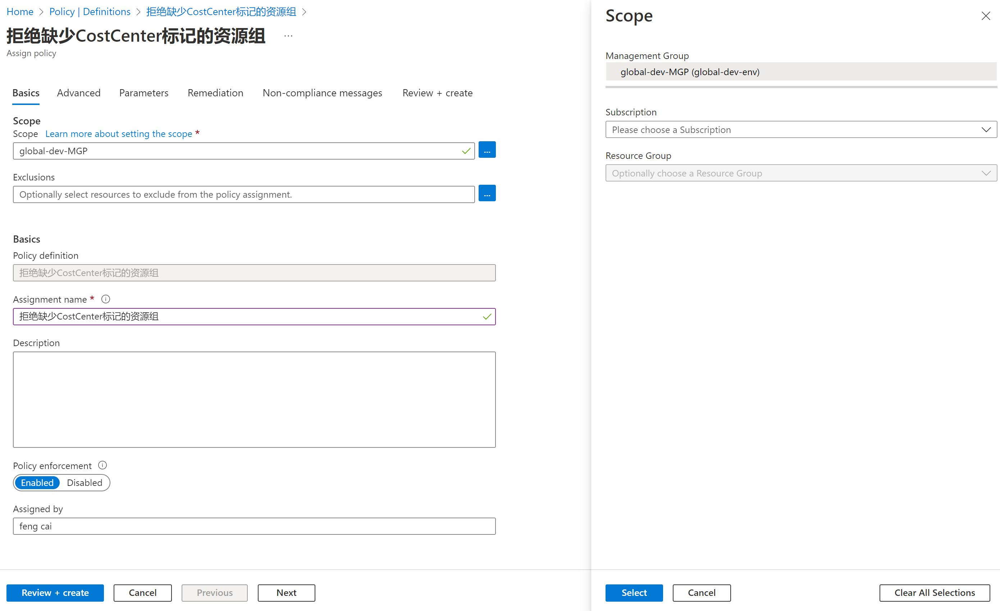
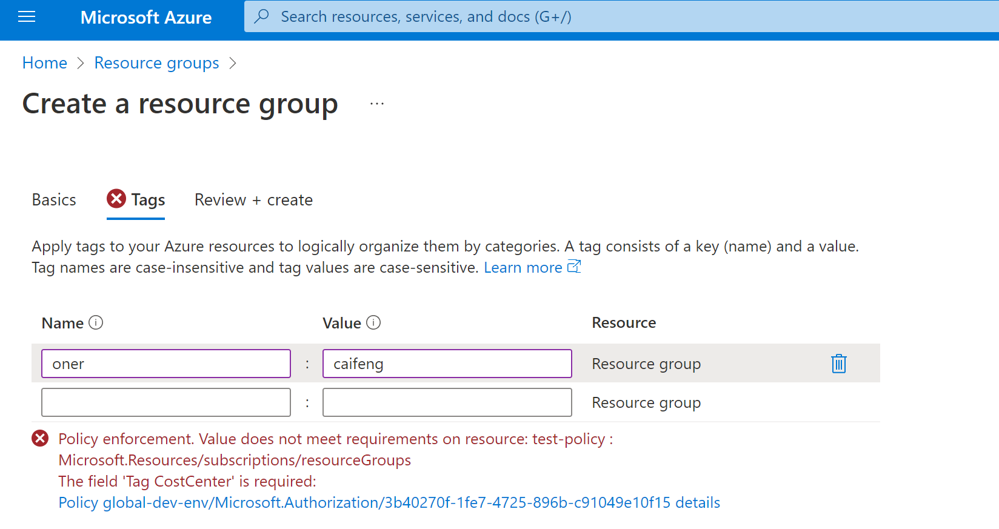
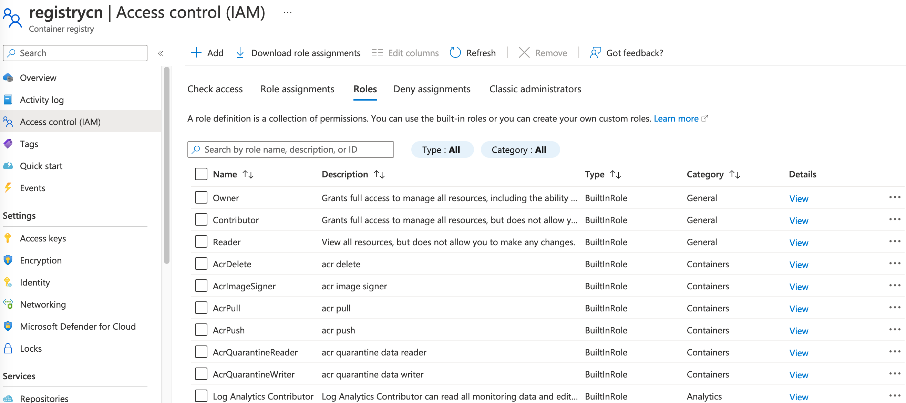
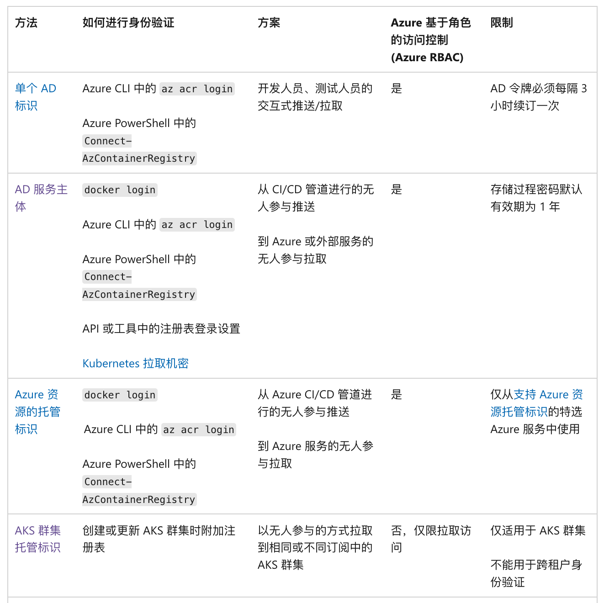
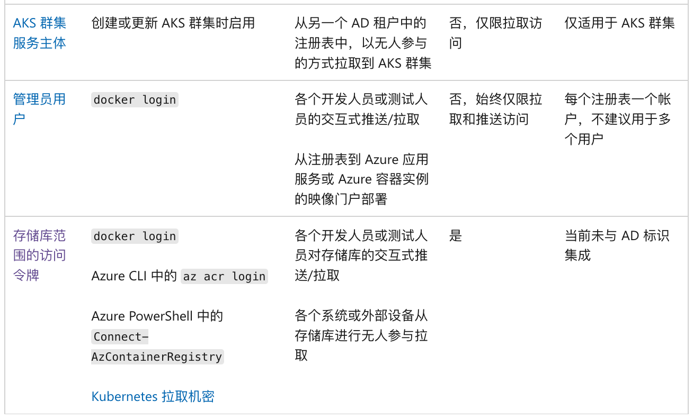
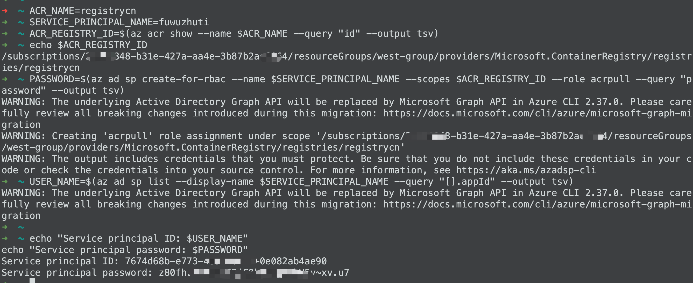
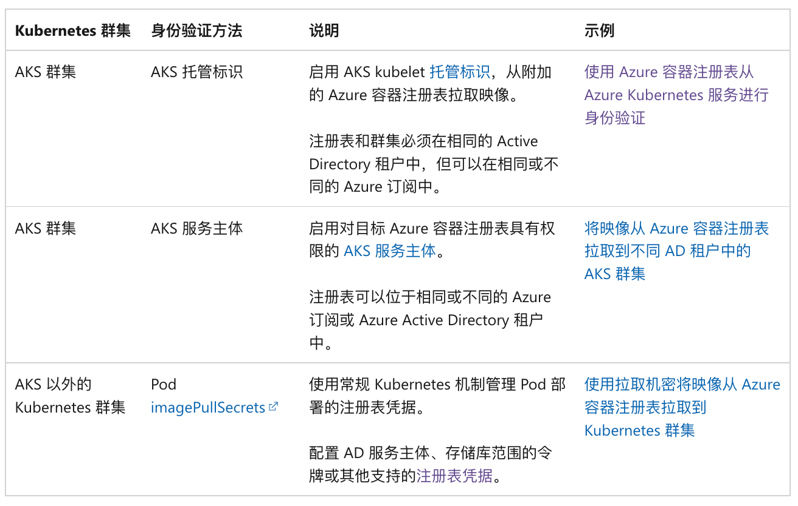
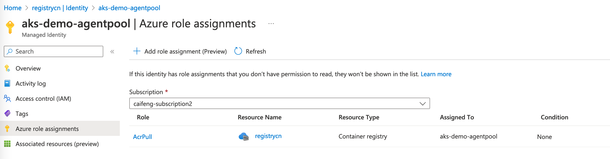

测试环境：azure global

标记（tags）是将 Azure 资源组整理到分类中的关键部分。标记可以作为应用业务策略或使用成本管理跟踪成本的基础。 无论使用标记的方式和原因是什么，重要的是可以在 Azure 资源上快速添加、更改和删除这些标记。使用 Azure Policy 对 Azure 资源上快速添加、更改和删除这些标记。

比如基于业务管理需求，所有资源上有两个所需标记：CostCenter 和 Env，需求如下：  
1. 标记“CostCenter”必须在所有资源和资源组上。资源继承自它们所在的资源组，但可以单独重写，即允许资源自定义CostCenter，value 不同于资源组，不强制修改资源上定义的CostCenter  
2. 标记“Env”，根据资源组名称匹配，设定资源组标记。组内的资源强制修改 Env 的 value 与资源组保持一致

### 配置 CostCenter 标记

#### 拒绝缺少 CostCenter 标记的资源组

通过 policy 设定，当资源组中标记缺乏 CostCenter 时，拒绝创建资源组。

在 Policy 页面，Authoring -> Definitions，选择 "+ Policy definition" 创建一条策略定义  



Definition location: 选管理组，管理组是多个订阅的组合，这样策略后续可以一次性分配到多个订阅中。  
Name：拒绝缺少CostCenter标记的资源组  
Description: 阻止创建或更新没有 CostCenter 标记的资源组  
Category：Tags ， 分类，方便检索，可以用系统自带的或者自建  
PolicyRule：

```bash
{
  "mode": "All",
  "policyRule": {
  "if": {
    "allOf": [
       {
        "field": "type",
        "equals": "Microsoft.Resources/subscriptions/resourceGroups"
      },
       {
        "field": "tags['CostCenter']",
        "exists": false
      }
     ]
      },
      "then": {
        "effect": "deny"
      }
  }
}
```

在策略定义详情页，选择 "Assign" 将策略分配到订阅下


Scope：作用范围，可以选 管理组，或者 选择管理组下的几个订阅， 或者某个订阅下的特定几个资源组  
Exclusions: 同样可以选择管理组或订阅或资源组，可以添加多条  
Assignment name 和 Description 就自己定义了  
Policy enforcement：如果设为 Disabled，那么 deny 策略就不会强制执行，但是 Compliance assessment results 即合规检查结果还是可以生效的，就是光检查，不强制执行。  

Advanced：页面通过选择适用的地区和资源类型进一步缩小范围。  
Parameters：可以填入自定义参数，但是我们上面的rule里没有使用自定义参数，这边暂时不用填  
Remediation：默认情况下，此分配仅对新创建的资源生效。分配策略后，可以通过修正任务更新现有资源。如果 effect type 是 deployIfNotExists 或 modify，会对现有资源进行修改，则需要创建一个托管标识。 此处我们不会修改资源，不需要创建，跳过。  
Non-compliance messages： 可帮助用户了解资源不符合策略的原因。当资源被拒绝时，以及任何不合规资源的评估详细信息中将显示该消息。

策略分配之后，在Authoring -> Assignments 里可以查看分配情况

创建一个资源组测试下效果，发现在填写 tag 的时候就会提醒必须包含 CostCenter



#### 修改资源以在缺少 CostCenter 标记时继承此标记
资源没有 CostCenter 标记的时候才继承，如果资源自己定义了 CostCenter，则不继承

在 Policy 页面，Authoring -> Definitions，选择 "+ Policy definition" 创建一条策略定义  

Definition location: 选管理组或订阅  
Name：资源在缺少CostCenter标记时继承此标记  
Description: 资源没有 CostCenter 标记的时候从资源组继承，如果资源自己定义了 CostCenter，则不继承    
Category：Use existing -- Tags    
PolicyRule：

```bash
{
  "mode": "indexed",
  "policyRule": {
      "if": {
          "field": "tags['CostCenter']",
          "exists": "false"
      },
      "then": {
          "effect": "modify",
          "details": {
              "roleDefinitionIds": [
                  "/providers/microsoft.authorization/roleDefinitions/b24988ac-6180-42a0-ab88-20f7382dd24c"
              ],
              "operations": [{
                  "operation": "add",
                  "field": "tags['CostCenter']",
                  "value": "[resourcegroup().tags['CostCenter']]"
              }]
          }
      }
  }
}
```

Role definitions: Contributor ，因为要修正资源，后续策略 assign 的时候需要创建托管标识，azure policy 将对托管标识分配此处定义的role，role 根据修正的操作，分配最小权限。

此策略规则使用“add”操作，而不是“addOrReplace”，因为我们不想要在修正现有资源时更改已有的标记值。它还使用 [resourcegroup()] 模板函数从父资源组获取标记值。

策略创建后，在策略详情页，执行 Assign  
各个参数的定义可以参照上文  

**Basic**  
Scope：作用范围，这里直接选管理组
Exclusions:  例外，可不选
Assignment name 和 Description 自己定义  
Policy enforcement：Enabled

**Adcanced / Parameters**  
不需要修改

**Remediation**  
选中 Create a Managed Identity  
选择 System assigned managed identity  
也可提前手动创建一个托管标识

Permissions：Contributor 由策略同步过来，不能修改

**Non-compliance messages**  
资源缺少CostCenter标记


Advanced：页面通过选择适用的地区和资源类型进一步缩小范围。  
Parameters：可以填入自定义参数，但是我们上面的rule里没有使用自定义参数，这边暂时不用填  
Remediation：默认情况下，此分配仅对新创建的资源生效。分配策略后，可以通过修正任务更新现有资源。如果 effect type 是 deployIfNotExists 或 modify，会对现有资源进行修改，则需要创建一个托管标识。 此处我们不会修改资源，不需要创建，跳过。  
Non-compliance messages： 可帮助用户了解资源不符合策略的原因。当资源被拒绝时，以及任何不合规资源的评估详细信息中将显示该消息。


### ACR 角色与角色分配

Azure 内置了一些角色，分别对应了仓库的不同权限，可以通过RBAC对用户、服务主体或其他标识分配特定的权限，还可以自定义角色，进行精细化控制。


Access Resource Manager：访问Azure门户和使用azure CLI进行镜像仓库管理。  
Change policies： 在镜像仓库上配置策略，包括镜像清除、启用隔离和镜像签名。  

权限的分配在 Access control（IAM） 页面，通过 role assignment 可以将以下 role 或者自定义 role，分配到用户或者组  


角色的分配：  
比如CICD平台，需要pull 和push 镜像，可以分配AcrPush。  
容器主机节点，需要拉取镜像，分配AcrPull，而不是Reader，因为他不需要resource manager。  
运维团队分配Contributer  

### 身份认证配置

以下列出了可用的身份验证方法和典型场景：  




#### 使用Azure AD 进行单次登录

直接使用仓库时（例如向开发工作站拉取映像和从中将映像推送到创建的注册表），可使用单独的 Azure 标识进行身份验证。 使用 az login 登录到 Azure CLI，然后运行 az acr login 命令：

```bash
az login
az acr login --name <acrName>
```

使用 az acr login 登录时，CLI 将使用执行 az login 时创建的令牌和注册表对会话进行无缝身份验证。 若要完成身份验证流，你的环境中必须已安装且正在运行 Docker CLI 和 Docker 守护程序。  
**az acr login 使用 Docker 客户端在 docker.config 文件中设置 Azure Active Directory 令牌。**
以这种方式登录后，系统会缓存凭据，并且会话中的后续 docker 命令将不再需要用户名或密码。

az acr login 使用的令牌有效期为 3 小时。如果令牌过期，可以通过再次使用 az acr login 命令重新进行身份验证来刷新令牌。

配合RBAC可以做到分级权限管理。

az acr login --expose-token 导出token

```bash
az acr login --name <acrName> --expose-token

{
  "accessToken": "eyJhbGciOiJSUzI1NiIs[...]24V7wA",
  "loginServer": "myregistry.azurecr.io"
}

TOKEN=$(az acr login --name <acrName> --expose-token --output tsv --query accessToken)
# 然后，运行 docker login，将 00000000-0000-0000-0000-000000000000 
# 作为用户名进行传递并使用访问令牌作为密码：

docker login myregistry.azurecr.io --username 00000000-0000-0000-0000-000000000000 --password $TOKEN
```

#### 服务主体认证

如果为镜像仓库分配了服务主体，则应用程序或服务可以将其用于无外设身份验证。服务主体允许对仓库进行 Azure 基于角色的访问控制 (Azure RBAC)，并且可以为仓库分配多个服务主体。 如果拥有多个服务主体，则可为不同应用程序定义不同的访问权限。

Azure AD 服务主体提供对订阅中 Azure 资源的访问权限。 可以将服务主体视为某个服务的用户标识，其中，“服务”是需要访问资源的任何应用程序、服务或平台。 可以为服务主体配置作用域仅限于你指定的那些资源的访问权限。 然后，将应用程序或服务配置为使用服务主体的凭据来访问这些资源。

此处服务主体的场景比如：devops平台需要推送或拉取镜像，k8s容器平台需要拉取镜像。

**创建服务主体**

若要创建可以访问容器注册表的服务主体，在 Azure Cloud Shell 或本地安装的 Azure CLI 中运行以下脚本。

将 ACR_NAME 变量更新为镜像的名称。 SERVICE_PRINCIPAL_NAME 值必须在 Azure Active Directory 租户中唯一。 如果收到“'http://acr-service-principal' already exists.”错误，请为服务主体指定另一名称。

如果需要授予其他权限，可以选择修改 az ad sp create-for-rbac 命令中的 --role 值。 有关角色的完整列表，请参阅 ACR 角色和权限。

运行脚本后，请记下服务主体的 ID 和密码。 获得其凭据后，可以配置应用程序和服务使其作为服务主体对容器注册表进行身份验证。

```bash
#!/bin/bash
# This script requires Azure CLI version 2.25.0 or later. Check version with `az --version`.

# Modify for your environment.
# ACR_NAME: The name of your Azure Container Registry
# SERVICE_PRINCIPAL_NAME: Must be unique within your AD tenant
ACR_NAME=$containerRegistry
SERVICE_PRINCIPAL_NAME=$servicePrincipal

# Obtain the full registry ID
ACR_REGISTRY_ID=$(az acr show --name $ACR_NAME --query "id" --output tsv)
# echo $registryId

# Create the service principal with rights scoped to the registry.
# Default permissions are for docker pull access. Modify the '--role'
# argument value as desired:
# acrpull:     pull only
# acrpush:     push and pull
# owner:       push, pull, and assign roles
PASSWORD=$(az ad sp create-for-rbac --name $SERVICE_PRINCIPAL_NAME --scopes $ACR_REGISTRY_ID --role acrpull --query "password" --output tsv)
USER_NAME=$(az ad sp list --display-name $SERVICE_PRINCIPAL_NAME --query "[].appId" --output tsv)

# Output the service principal's credentials; use these in your services and
# applications to authenticate to the container registry.
echo "Service principal ID: $USER_NAME"
echo "Service principal password: $PASSWORD"

```



**使用现有服务主体**

若要向现有服务主体授予注册表访问权限，必须为服务主体分配新角色。 与创建新的服务主体一样，可以授予“拉取”、“推送和拉取”以及“所有者”访问权限等。

以下脚本使用 az role assignment create 命令向 SERVICE_PRINCIPAL_ID 变量中指定的服务主体授予“拉取”权限。 如果要授予不同的访问级别，请调整 --role 值。

```bash
#!/bin/bash
# Modify for your environment. The ACR_NAME is the name of your Azure Container
# Registry, and the SERVICE_PRINCIPAL_ID is the service principal's 'appId' or
# one of its 'servicePrincipalNames' values.
ACR_NAME=$containerRegistry
SERVICE_PRINCIPAL_ID=$servicePrincipal

# Populate value required for subsequent command args
ACR_REGISTRY_ID=$(az acr show --name $ACR_NAME --query id --output tsv)

# Assign the desired role to the service principal. Modify the '--role' argument
# value as desired:
# acrpull:     pull only
# acrpush:     push and pull
# owner:       push, pull, and assign roles
az role assignment create --assignee $SERVICE_PRINCIPAL_ID --scope $ACR_REGISTRY_ID --role acrpull

```

**使用服务主体进行身份认证**

拥有了授权的服务主体后，就可以配置凭据以访问镜像仓库，或者使用 docker login 命令验证。  

用户名 - 服务主体的“应用程序(客户端) ID”  
密码 - 服务主体的“密码(客户端密码)”  
每个值的格式均为 xxxxxxxx-xxxx-xxxx-xxxx-xxxxxxxxxxxx  

可通过运行 az ad sp credential reset 命令重新生成服务主体的密码（客户端密码）。

**服务主体续订**

创建的服务主体的有效期为 1 年。 你可以选择将有效期延长为超过 1 年，或者可以使用 az ad sp credential reset 命令提供所选的到期日期。

### 使用托管标识进行身份认证

使用 Azure 资源的托管标识从另一个 Azure 资源向 Azure 容器镜像仓库验证身份，而无需提供或管理镜像仓库凭据。 例如，在 Linux VM 上设置用户分配或系统分配的托管标识，以便从镜像仓库访问容器映像，就像使用公共镜像仓库一样容易。 或者，将 Azure Kubernetes 服务群集设置为使用其托管标识从用于 pod 部署的 Azure 镜像仓库拉取容器映像。

#### 在 Azure VM 上启用用户分配或系统分配的标识
创建一个启用了docker的VM，并安装Azure CLI。如果已有虚拟机，可跳过虚拟机创建步骤。

使用az vm create 命令部署一个centos的虚拟机

```bash
az vm create \
    --resource-group west-group \
    --name myDockerVM \
    --image OpenLogic:CentOS:7_9:7.9.2022101800 \
    --admin-username caifeng \
    --generate-ssh-keys
```
创建 VM 需要几分钟时间。 等该命令完成后，记下 Azure CLI 显示的 publicIpAddress。 使用此地址与 VM 建立 SSH 连接。


关于镜像名称，没有特别要求，--image Centos 就可以，会指定为默认版本

查看支持的镜像

```bash
# 列出主流的镜像
az vm image list --output table
# 列出指定OS的镜像
az vm image list --offer CentOS --all --output table 
# 只列出Centos官方镜像
az vm image list --offer CentOS --publisher OpenLogic --all --output table 
```

在VM上安装docker和Azure CLI

```bash
ssh username@publicIP

echo -e "[azure-cli]
name=Azure CLI
baseurl=https://packages.microsoft.com/yumrepos/azure-cli
enabled=1
gpgcheck=1
gpgkey=https://packages.microsoft.com/keys/microsoft.asc" | sudo tee /etc/yum.repos.d/azure-cli.repo

sudo yum install azure-cli
```

对VM可以自行分配标识或者使用系统分配的标识

**示例1：用户自行分配的标识**

创建标识

使用 az identity create 命令在订阅中创建标识。 可以使用先前用于创建容器注册表或虚拟机的相同资源组，也可以使用不同的资源组。

```bash
# az identity create --resource-group myResourceGroup --name myACRId
az identity create --resource-group west-group --name registrycn

# 若要在以下步骤中配置标识，请使用 az identity show 命令将标识的资源 ID 和服务主体 ID 存储在变量中。  
# Get resource ID of the user-assigned identity
userID=$(az identity show --resource-group west-group --name registrycn --query id --output tsv)

# Get service principal ID of the user-assigned identity
spID=$(az identity show --resource-group west-group --name registrycn --query principalId --output tsv)

# 当你从虚拟机登录 CLI 时，需要在稍后的步骤中使用标识的 ID，因此请显示以下值：
echo $userID

# ID 的格式如下：
/subscriptions/xxxxxxxx-xxxx-xxxx-xxxx-xxxxxxxxxxxxx/resourcegroups/myResourceGroup/providers/Microsoft.ManagedIdentity/userAssignedIdentities/myACRId
```

为VM分配标识

以下 az vm identity assign 命令可为 Docker VM 配置用户分配的标识：

```bash
az vm identity assign --resource-group west-group --name myDockerVM --identities $userID
```
分配之后，在azure portal中，VM的identity--User assigned 中可以看到此标识

授予标识对容器注册表的访问权限

```bash
# 现在将标识配置为访问仓库。 首先使用 az acr show 命令获取注册表的资源 ID：
#resourceID=$(az acr show --resource-group myResourceGroup --name myContainerRegistry --query id --output tsv)
resourceID=$(az acr show --resource-group west-group --name registrycn --query id --output tsv)

# 使用 az role assignment create 命令向标识分配 AcrPull 角色。 此角色将提供对仓库的拉取权限。 若要同时提供拉取和推送权限，请分配 AcrPush 角色。
az role assignment create --assignee $spID --scope $resourceID --role acrpull
```

使用标识访问注册表

通过 SSH 连接到配置了标识的 Docker 虚拟机。 使用 VM 上安装的 Azure CLI 运行以下 Azure CLI 命令。

首先，使用在 VM 上配置的标识，通过 az login 向 Azure CLI 进行身份验证。 对于 <userID>，请替换成在上一步中检索到的标识 ID。

```bash
# 以下在VM上执行

# 安装docker并login仓库
sudo yum install docker
sudo systemctl start docker
sudo systemctl enable docker

sudo az login --identity --username <userID>
sudo az acr login --name registrycn
# 会看到Login Successed
# 测试拉取镜像
sudo docker pull registrycn.azurecr.io/middleware/nginx:1.14
```

**示例2：使用系统分配的标识进行访问**

为 VM 配置系统托管标识

```bash
az vm identity assign --resource-group west-group --name myDockerVM 
```
分配之后，在azure portal中，VM的identity--System assigned 的status 会变成 on

使用 az vm show 命令将变量设置为 VM 标识的值 principalId（服务主体 ID），以便在后续步骤中使用。

```bash
spID=$(az vm show --resource-group west-group --name myDockerVM --query identity.principalId --out tsv)

```

授予标识对容器注册表的访问权限
```bash
# 现在将标识配置为访问仓库。 首先使用 az acr show 命令获取注册表的资源 ID：
#resourceID=$(az acr show --resource-group myResourceGroup --name myContainerRegistry --query id --output tsv)
resourceID=$(az acr show --resource-group west-group --name registrycn --query id --output tsv)

# 使用 az role assignment create 命令向标识分配 AcrPull 角色。 此角色将提供对仓库的拉取权限。 若要同时提供拉取和推送权限，请分配 AcrPush 角色。
az role assignment create --assignee $spID --scope $resourceID --role acrpull
```

使用标识访问注册表

通过 SSH 连接到配置了标识的 Docker 虚拟机。 使用 VM 上安装的 Azure CLI 运行以下 Azure CLI 命令。

首先，使用在 VM 上配置的标识，通过 az login 向 Azure CLI 进行身份验证。 对于 <userID>，请替换成在上一步中检索到的标识 ID。

```bash
# 以下在VM上执行

# 安装docker并login仓库
sudo yum install docker
sudo systemctl start docker
sudo systemctl enable docker

# 此处login，使用默认标识，不需要指定userid了
sudo az login --identity
sudo az acr login --name registrycn
# 会看到Login Successed
# 测试拉取镜像
sudo docker pull registrycn.azurecr.io/middleware/nginx:1.14
```

#### 使用托管标识访问注册表并拉取容器映像

使用ACR作为kubernetes集群的镜像仓库，需要建立身份验证和授权机制。根据集群环境，选择以下方法之一：



默认情况下，创建 AKS 群集时会自动创建系统分配的托管标识。 标识由 Azure 平台托管，无需预配或轮换任何机密。

若要使用服务主体，你必须创建一个服务主体，因为 AKS 不会自动创建服务主体。 使用服务主体的群集最终会过期，必须续订服务主体才能让群集保持正常运行。 管理服务主体会增加复杂性，这也是托管标识使用起来更简单的原因。 服务主体和托管标识适用相同的权限要求。

托管标识本质上是服务主体的包装器，这使其更易于管理。 托管标识使用基于证书的身份验证，每个托管标识凭据的有效期为 90 天，在 45 天后滚动更新。 AKS 使用系统分配和用户分配的托管标识类型，这些标识是不可变的。

所以AKS集连接ACR使用托管标识是最优解。

可以使用 Azure CLI 或 Azure PowerShell 通过几个简单的命令设置 AKS 与 ACR 的集成。 此集成会将 AcrPull 角色分配给关联到 AKS 群集的托管标识。

**通过 ACR 集成创建新的 AKS 群集**

可以在一开始创建 AKS 群集时设置 AKS 与 ACR 的集成。

```bash
# set this to the name of your Azure Container Registry.  It must be globally unique
MYACR=myContainerRegistry

# Run the following line to create an Azure Container Registry if you do not already have one
az acr create -n $MYACR -g myContainerRegistryResourceGroup --sku basic

# Create an AKS cluster with ACR integration
az aks create -n myAKSCluster -g myResourceGroup --generate-ssh-keys --attach-acr $MYACR

# 或者，可以使用 ACR 资源 ID 指定 ACR 名称，其格式如下：
/subscriptions/\<subscription-id\>/resourceGroups/\<resource-group-name\>/providers/Microsoft.ContainerRegistry/registries/\<name\>

# 如果所用 ACR 与 AKS 群集位于不同的订阅中，则在从 AKS 群集进行附加或分离时，请使用 ACR 资源 ID。
az aks create -n myAKSCluster -g myResourceGroup --generate-ssh-keys --attach-acr /subscriptions/<subscription-id>/resourceGroups/myContainerRegistryResourceGroup/providers/Microsoft.ContainerRegistry/registries/myContainerRegistry

```

**为现有的 AKS 群集配置 ACR 集成**

通过为 acr-name 或 acr-resource-id 提供有效值，将现有 ACR 与现有 AKS 群集集成，如下所示。

```bash
# az aks update -n myAKSCluster -g myResourceGroup --attach-acr <acr-name>
az aks update -n aks-demo -g west-group --attach-acr registrycn
或者

az aks update -n myAKSCluster -g myResourceGroup --attach-acr <acr-resource-id>
```

运行 az aks update --attach-acr 使用运行该命令的用户的权限来创建角色 ACR 分配。 此角色分配给 kubelet 托管标识。 有关 AKS 托管标识的详细信息，请参阅托管标识摘要。

进入仓库的identity - user assigned， aks-demo-agentpool，在Azure role assignments一栏可以看到被分配了AcrPull的权限。


连接到aks集群，使用仓库中的镜像发布应用测试下，可以正常拉取镜像。

```bash
~ kubectl create deploy demoapp --image=registrycn.azurecr.io/middleware/nginx:1.14
deployment.apps/demoapp created

➜  ~ kubectl get pod
NAME                       READY   STATUS    RESTARTS   AGE
demoapp-6b7765c978-ppstb   1/1     Running   0          8m27s

```

还可以使用以下命令删除 ACR 与 AKS 群集之间的集成

```bash
az aks update -n myAKSCluster -g myResourceGroup --detach-acr <acr-name>
或
az aks update -n myAKSCluster -g myResourceGroup --detach-acr <acr-resource-id>
```

#### 使用服务主体注册到镜像仓库

要为 AKS 群集更新凭据时，可以选择以下任一操作：

为现有服务主体更新凭据。
创建新服务主体并更新群集以使用这些新凭据。

若尚未有服务主体，则跳过检查和重置服务主体。先创建服务主体，然后更新 AKS 群集以使用这些新凭据

**检查服务主体的到期日期**

若要检查服务主体的到期日期，请使用 az ad sp credential list 命令。 以下示例使用 az aks show 命令获取 myResourceGroup 资源组中名为 myAKSCluster 的群集的服务主体 ID 。 将服务主体 ID 设置为名为“SP_ID”的变量，以便与 az ad sp credential list 命令一起使用。

```bash
SP_ID=$(az aks show --resource-group west-group --name aks-demo \
    --query servicePrincipalProfile.clientId -o tsv)
az ad sp credential list --id "$SP_ID" --query "[].endDate" -o tsv
```

**重置现有的服务主体凭据**

若要为现有服务主体更新凭据，请使用 az aks show 命令获取群集的服务主体 ID。 以下示例获取 myResourceGroup 资源组中名为 myAKSCluster 的群集的 ID 。 服务主体 ID 设置为名为“SP_ID”变量以供在其他命令中使用。 这些命令使用 Bash 语法。

在使用 Azure 虚拟机规模集的 AKS 群集上重置群集凭据时，将执行节点映像升级以使用新凭据信息更新节点。
```bash
SP_ID=$(az aks show --resource-group myResourceGroup --name myAKSCluster \
    --query servicePrincipalProfile.clientId -o tsv)

# 借助包含服务主体 ID 的变量集，现在使用 az ad sp credential reset 重置凭据。 下面的示例可让 Azure 平台为服务主体生成新安全密码。 此新安全密码也存储为变量。

SP_SECRET=$(az ad sp credential reset --id "$SP_ID" --query password -o tsv)
```

**创建新服务主体**

若当前没有服务主体，则新建，然后更新AKS集群以使用这些新凭据

```bash
# az ad sp create-for-rbac --role Contributor --scopes /subscriptions/mySubscriptionID
az ad sp create-for-rbac --role Contributor --scopes /subscriptions/3c398848-b31e-427a-aa4e-3b87b2ae6064
# 输出类似于以下示例。 记下你自己的 appId和 password。 下一步会使用这些值。
{
  "appId": "56d50a1e-035f-485b-bee4-185c0b467da8",
  "displayName": "azure-cli-2022-11-10-15-55-39",
  "password": "aJKaLmcKo8wvR1Bj2c3Wec2d~wROCmJ5.-",
  "tenant": "28e6f6d6-c467-402a-896d-f1eab45f5538"
}

# 现在使用自己的 az ad sp create-for-rbac 命令的输出为服务主体 ID 和客户端密码定义变量，如下面的示例所示。 SP_ID 是 appId，SP_SECRET 是 password：
SP_ID=7d837646-b1f3-443d-874c-fd83c7c739c5
SP_SECRET=a5ce83c9-9186-426d-9183-614597c7f2f7
```

**使用新的服务主体创建集群**

```bash
az aks create \
    --resource-group west-group \
    --name myAKSCluster \
    --service-principal 56d50a1e-035f-485b-bee4-185c0b467da8 \
    --client-secret aJKaLmcKo8wvR1Bj2c3Wec2d~wROCmJ5.-
```

--service-principal 对应 appid  
--client-secret 对应 password

**使用新的服务主体凭据更新 AKS 群集**

对于大型群集，使用新服务主体更新 AKS 群集可能需要较长时间才能完成。 请考虑查看和自定义节点激增升级设置，以最大程度地减少群集更新和升级期间的中断。

无论是选择为现有服务主体更新凭据还是创建服务主体，现在都通过 az aks update-credentials 命令，使用新凭据更新 AKS 群集。 会使用 --service-principal 和 --client-secret 的变量：

```bash
az aks update-credentials \
    --resource-group west-group \
    --name aks-demo \
    --reset-service-principal \
    --service-principal "$SP_ID" \
    --client-secret "${SP_SECRET:Q}"

```


如果有报错
(BadRequest) Updating service principal profile is not allowed on MSI cluster.
Code: BadRequest
Message: Updating service principal profile is not allowed on MSI cluster.

```bash
➜  ~ az aks update \            
    --resource-group west-group \
    --name aks-demo \
     --enable-managed-identity


#### 使用秘钥进行身份认证


欢迎关注我的github  
<https://github.com/cai11745/hybrid-cloud>

### 参考链接

官网：https://learn.microsoft.com/zh-cn/azure/container-registry/container-registry-authentication?tabs=azure-cli#service-principal