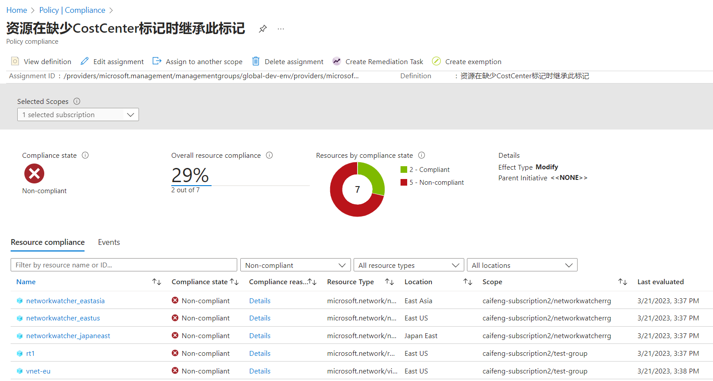
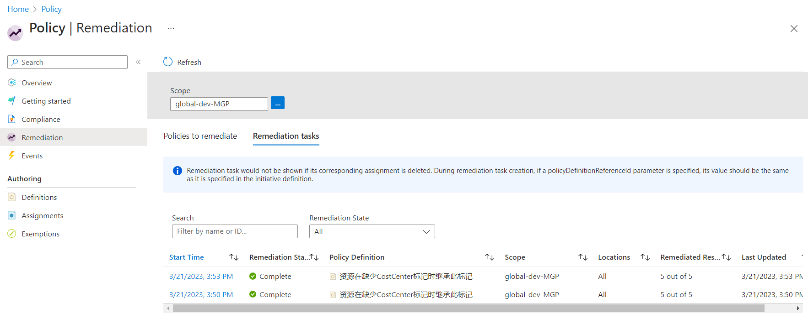
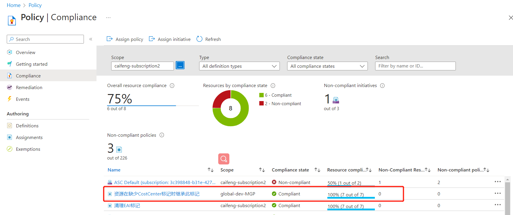
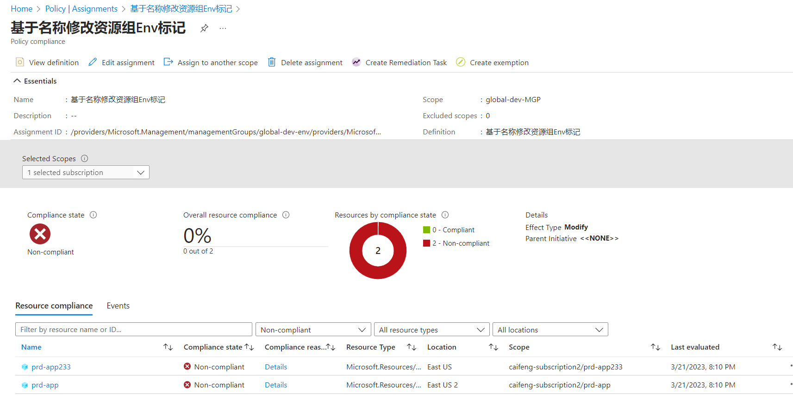
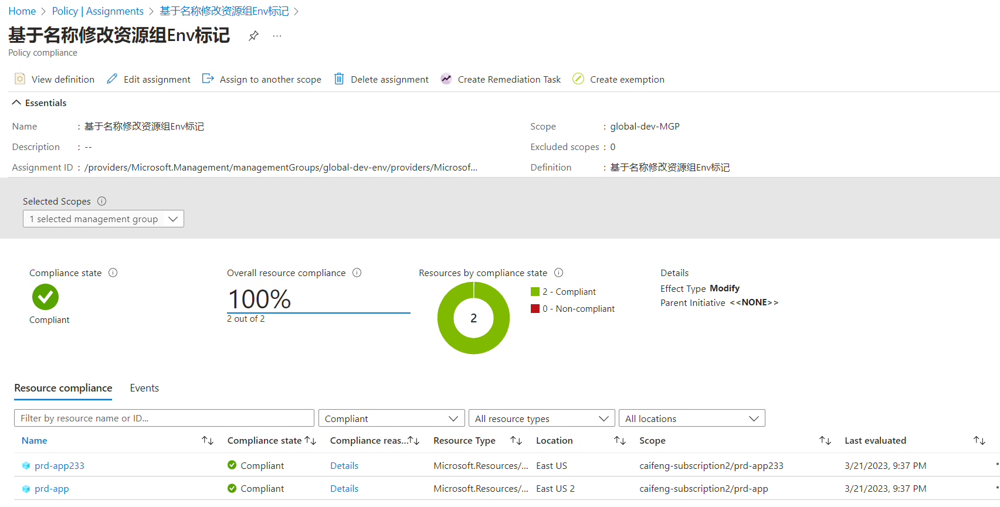
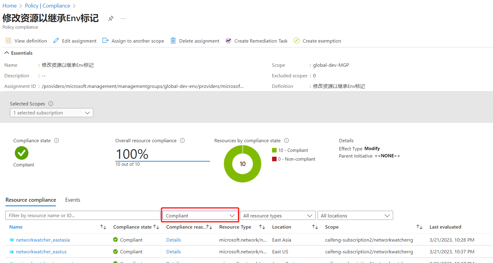

测试环境：azure global

标记（tags）是将 Azure 资源组整理到分类中的关键部分。标记可以作为应用业务策略或使用成本管理跟踪成本的基础。 无论使用标记的方式和原因是什么，重要的是可以在 Azure 资源上快速添加、更改和删除这些标记。使用 Azure Policy 对 Azure 资源上快速添加、更改和删除这些标记。

比如基于业务管理需求，所有资源上有两个所需标记：CostCenter 和 Env，需求如下：  
1. 标记“CostCenter”必须在所有资源和资源组上。资源继承自它们所在的资源组，但可以单独重写，即允许资源自定义CostCenter，value 不同于资源组，不强制修改资源上定义的CostCenter  
2. 标记“Env”，根据资源组名称匹配，设定资源组标记。组内的资源强制修改 Env 的 value 与资源组保持一致

### 配置 CostCenter 标记

#### 拒绝缺少 CostCenter 标记的资源组

通过 policy 设定，当资源组中标记缺乏 CostCenter 时，拒绝创建资源组。

在 Policy 页面，Authoring -> Definitions，选择 "+ Policy definition" 创建一条策略定义  


Definition location: 选管理组，管理组是多个订阅的组合，这样策略后续可以一次性分配到多个订阅中。  
Name：拒绝缺少CostCenter标记的资源组  
Description: 阻止创建或更新没有 CostCenter 标记的资源组  
Category：Tags ， 分类，方便检索，可以用系统自带的或者自建  
PolicyRule：

```bash
{
  "mode": "All",
  "policyRule": {
  "if": {
    "allOf": [
       {
        "field": "type",
        "equals": "Microsoft.Resources/subscriptions/resourceGroups"
      },
       {
        "field": "tags['CostCenter']",
        "exists": false
      }
     ]
      },
      "then": {
        "effect": "deny"
      }
  }
}
```

由于此策略规则以资源组为目标，策略定义上的“mode”必须是“All”，而不是“indexed”。

**在策略定义详情页，选择 "Assign" 将策略分配到订阅下**


Scope：作用范围，可以选 管理组，或者 选择管理组下的几个订阅， 或者某个订阅下的特定几个资源组  
Exclusions: 同样可以选择管理组或订阅或资源组，可以添加多条  
Assignment name 和 Description 就自己定义了  
Policy enforcement：如果设为 Disabled，那么 deny 策略就不会强制执行，但是 Compliance assessment results 即合规检查结果还是可以生效的，就是光检查，不强制执行。  

Advanced：页面通过选择适用的地区和资源类型进一步缩小范围。  
Parameters：可以填入自定义参数，但是我们上面的rule里没有使用自定义参数，这边暂时不用填  
Remediation：默认情况下，此分配仅对新创建的资源生效。分配策略后，可以通过修正任务更新现有资源。如果 effect type 是 deployIfNotExists 或 modify，会对现有资源进行修改，则需要创建一个托管标识。 此处我们不会修改资源，不需要创建，跳过。  
Non-compliance messages： 可帮助用户了解资源不符合策略的原因。当资源被拒绝时，以及任何不合规资源的评估详细信息中将显示该消息。

策略分配之后，在Authoring -> Assignments 里可以查看分配情况

创建一个资源组测试下效果，发现在填写 tag 的时候就会提醒必须包含 CostCenter


#### 修改资源以在缺少 CostCenter 标记时继承此标记
资源没有 CostCenter 标记的时候才继承，如果资源自己定义了 CostCenter，则不继承

在 Policy 页面，Authoring -> Definitions，选择 "+ Policy definition" 创建一条策略定义  

Definition location: 选管理组或订阅  
Name：资源在缺少CostCenter标记时继承此标记  
Description: 资源没有 CostCenter 标记的时候从资源组继承，如果资源自己定义了 CostCenter，则不继承    
Category：Use existing -- Tags    
PolicyRule：

此处以资源为目标，mode 为 indexed

```bash
{
  "mode": "indexed",
  "policyRule": {
      "if": {
          "field": "tags['CostCenter']",
          "exists": "false"
      },
      "then": {
          "effect": "modify",
          "details": {
              "roleDefinitionIds": [
                  "/providers/microsoft.authorization/roleDefinitions/b24988ac-6180-42a0-ab88-20f7382dd24c"
              ],
              "operations": [{
                  "operation": "add",
                  "field": "tags['CostCenter']",
                  "value": "[resourcegroup().tags['CostCenter']]"
              }]
          }
      }
  }
}
```

Role definitions: Contributor ，因为要修正资源，后续策略 assign 的时候需要创建托管标识，azure policy 将对托管标识分配此处定义的role，role 根据修正的操作，分配最小权限。

此策略规则使用“add”操作，而不是“addOrReplace”，因为我们不想要在修正现有资源时更改已有的标记值。它还使用 [resourcegroup()] 模板函数从父资源组获取标记值。

**在策略定义详情页，选择 "Assign" 将策略分配到订阅下**

各个参数的定义可以参照上文  

**Basic**  
Scope：作用范围，这里直接选管理组
Exclusions:  例外，可不选
Assignment name 和 Description 自己定义  
Policy enforcement：Enabled

**Adcanced / Parameters**  
不需要修改

**Remediation**  
因为这个策略会去修改资源的tag，所以选中 Create a Managed Identity，创建一个托管标识，去授权  
选择 System assigned managed identity  
也可提前手动创建一个托管标识

Permissions：Contributor 由策略同步过来，不能修改

**Non-compliance messages**  
资源缺少CostCenter标记

策略创建完，在 policy - compliant 可以看到合规情况，比如当前一共有7个资源，5个没有 CostCenter 标记



在compliant 页面或者，Assignments 的详情页，选择 “create remediation task”，创建一个修复任务，按照 policy 的定义去给资源补充tag  
任务在 policy - Remediation 页面，Remediation tasks 能看到任务执行过程和结果。注意 Scope 与策略定义一致。待任务完成后，回到 compliant 页面会看到合规变成 7/7 





策略分配后，做几个测试。  
1. 创建资源，比如vnet，或者托管标识，不带 CostCenter tag，建完会自动从资源组继承tag  
2. 创建资源，自定义 CostCenter tag，value 不要与资源组相同，验证允许资源的CostCenter tag不同于资源组

### 配置 ENV 标记
两个策略： 
1. 标记“Env”，根据资源组名称匹配，设定资源组标记。  
2. 组内的资源强制修改 Env 的 value 与资源组保持一致

#### 根据资源组名称匹配标记 Env
资源组名称开头是 prd- 自动添加标记 Env:Production  
如果当前Env已有其他值，也会进行修正

在 Policy 页面，Authoring -> Definitions，选择 "+ Policy definition" 创建一条策略定义  

name： 基于名称修改资源组Env标记
Role definitions: Contributor

由于此策略规则以资源组为目标，策略定义上的“mode”必须是“All”，而不是“indexed”。

```bash
{
  "mode": "All",
"policyRule": {
    "if": {
        "allOf": [{
            "field": "type",
            "equals": "Microsoft.Resources/subscriptions/resourceGroups"
        },
        {
            "field": "name",
            "like": "prd-*"
        },
        {
            "field": "tags['Env']",
            "notEquals": "Production"
        }

    ]
    },
    "then": {
        "effect": "modify",
        "details": {
            "operations": [{
                "operation": "addOrReplace",
                "field": "tags['Env']",
                "value": "Production"
            }]
        }
    }
}
}

```

语法的定义是：类别资源组，名称开头为 prd- ，ENV标记不为Production 或者没有ENV标记的  
操作：addOrReplace 添加或者修正当前Env标记，改为 Production

将策略分配到管理组或者订阅。

我先建了两个 prd- 资源组，所以会看到有两个不合格的，创建一个修正任务。



在 Policy - Remediation 观察修正进度，完成后，观察现存的两个 prd- 资源组是否添加了tag Env:Production



当策略分配生效后，后续创建的资源组，只要符合条件 prd- ，都会自动加上tag  

测试： 新建两个资源组，一共名为 prd-app ，一个名为 test-app ，检查是否自动添加 Env tag

#### 修改资源以继承 Env 标记

组内的资源强制修改 Env 的 value 与资源组保持一致

在 prd-app 资源组内创建两个vnet或者其他资源，一个不带 Env 标记，一个带标记 Env:test

创建策略  
name： 修改资源以继承Env标记
Role definitions: Contributor

这个策略，只能针对于那些资源组带 Env tag 执行继承操作，若资源组没有 Env tag，则会对资源创建 Env tag 值为空。
可以通过对资源组命名的规范，结合上一步的策略，自动对所有资源组打上不同环境的tag：test，uat，prod，dr 等，避免出现资源的Env 为空的情况。

```bash
{
  "mode": "indexed",
"policyRule": {
    "if": {
        "anyOf": [{
            "field": "tags['Env']",
            "notEquals": "[resourcegroup().tags['Env']]"
        },
        {
            "field": "tags['Env']",
            "exists": false
        }
    ]
    },
    "then": {
        "effect": "modify",
        "details": {
            "operations": [{
                "operation": "addOrReplace",
                "field": "tags['Env']",
                "value": "[resourcegroup().tags['Env']]"
            }]
        }
    }
}
}
```

分配策略，并修正之后，Compliance 页面会看到资源都合规。Compliance 的数据会有一些延迟。

默认只显示 Non-compliant, 可以选择其他状态，查看所有资源



测试：在 prd-* 资源组下，新建资源会自动继承 Env tag

### 通过 policy 删除指定tag
上述通过资源组继承了tag，后续如果某个 tag 后续不想要了，即使移除了资源组的tag，但是资源的tag 还是存在的，也可以通过policy 进行删除。

移除 app tag。方法与上面类似，创建策略，分配策略，创建修正任务。

```bash
{
  "mode": "Indexed",
  "policyRule": {
    "if": {
      "field": "tags['app']",
      "exists": "true"
    },
    "then": {
      "effect": "modify",
      "details": {
        "operations": [
          {
            "operation": "Remove",
            "field": "tags['app']"
          }
        ],
        "roleDefinitionIds": [
          "/providers/Microsoft.Authorization/roleDefinitions/b24988ac-6180-42a0-ab88-20f7382dd24c"
        ]
      }
    }
  },
  "parameters": {}
}
```

欢迎关注我的github  
<https://github.com/cai11745/hybrid-cloud>

### 参考链接

https://learn.microsoft.com/zh-cn/azure/governance/policy/tutorials/govern-tags