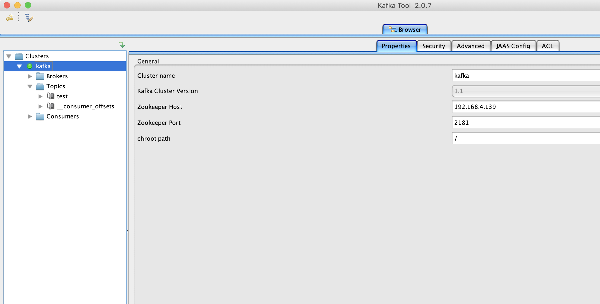

Kafka是一个分布式、分区的、多副本的、多订阅者，基于zookeeper协调的分布式日志系统（也可以当做MQ系统），常见可以用于web/nginx日志、访问日志，消息服务等。

主要应用场景是：日志收集系统和消息系统。

本篇记录测试环境的kafka安装步骤并开启ACL认证。

### 环境与文件准备

kafka 版本信息： v1.1.1（版本由于环境需要不是采用最新版）

环境信息: Centos7.5  192.168.4.139（内网地址）

安装包： jdk-8u221-linux-x64.rpm  kafka_2.11-1.1.1.tgz

### 安装步骤
Kafka 使用Zookeeper 来保存相关配置信息，Kafka及Zookeeper 依赖Java 运行环境。

Kafka 安装包里带了zookeeper。

#### 安装jdk

```bash
[root@localhost ~]# rpm -ivh jdk-8u221-linux-x64.rpm
[root@localhost ~]# java -version
java version "1.8.0_221"
Java(TM) SE Runtime Environment (build 1.8.0_221-b11)
Java HotSpot(TM) 64-Bit Server VM (build 25.221-b11, mixed mode)
```

#### 安装kafka

```bash
# 设置下主机名
[root@localhost ~]# hostnamectl set-hostname kafka

[root@localhost ~]# tar -zxvf kafka_2.11-1.1.1.tgz 
[root@localhost ~]# cd kafka_2.11-1.1.1

启动Zookeeper
bin/zookeeper-server-start.sh -daemon config/zookeeper.properties

修改kafka配置，为了远端能够访问到kafka
打开config/server.properties文件，在很靠前的位置有listeners和 advertised.listeners两处配置的注释，去掉这两个注释，并且根据当前服务器的IP修改如下：
# EXAMPLE:
# listeners = PLAINTEXT://your.host.name:9092
listeners=PLAINTEXT://192.168.4.139:9092

# Hostname and port the broker will advertise to producers and consumers. If not set, 
# it uses the value for "listeners" if configured. Otherwise, it will use the value
# returned from java.net.InetAddress.getCanonicalHostName().
advertised.listeners=PLAINTEXT://192.168.4.139:9092

启动Kafka 服务
bin/kafka-server-start.sh -daemon config/server.properties

创建topic
使用kafka-topics.sh 创建单分区单副本的topic test：
bin/kafka-topics.sh --create --zookeeper localhost:2181 --replication-factor 1 --partitions 1 --topic test

查看topic
bin/kafka-topics.sh --list --zookeeper localhost:2181

产生消息
使用kafka-console-producer.sh 发送消息：
bin/kafka-console-producer.sh --broker-list localhost:9092 --topic test
随便敲点内容，然后ctrl+c

消费消息
使用kafka-console-consumer.sh 接收消息并在终端打印：
bin/kafka-console-consumer.sh --bootstrap-server localhost:9092 --topic test --from-beginning
```

### kafka 开启 ACL
ACL 用于控制对kafka的读写操作权限。

#### Broker 端

创建 JAAS 文件，注意结尾两个分号，保存为 kafka_server_jaas.conf

```bash
vim config/kafka_server_jaas.conf

KafkaServer {
org.apache.kafka.common.security.plain.PlainLoginModule required
username="admin"
password="admin"
user_admin="admin"
user_reader="reader"
user_writer="writer";
};

```

要配置SASL和ACL，我们需要在broker端进行两个方面的设置。首先是创建包含所有认证用户信息的JAAS文件。本例中，我们假设有3个用户：admin, reader和writer，其中admin是管理员，reader用户读取Kafka集群中topic数据，而writer用户则负责向Kafka集群写入消息。我们假设这3个用户的密码分别与用户名相同（在实际场景中，管理员需要单独把密码发给各自的用户），因此编写JAAS文件就是上面的内容

由于 kafka-server-start.sh 只接收 server.properties 的位置，故需要修改启动脚本，cp 一份修改最后一行
```bash
cp bin/kafka-server-start.sh bin/kafka-server-start.sh.bak
vim bin/kafka-server-start.sh
最后一行改成如下，注意文件的绝对路径要正确

exec $base_dir/kafka-run-class.sh $EXTRA_ARGS -Djava.security.auth.login.config=/root/kafka_2.11-1.1.1/config/kafka_server_jaas.conf kafka.Kafka "$@"

```

修改 broker 启动所需的 server.properties 文件  
并且要把之前的  listeners 和 advertised.listeners 那两行参数注释掉，或者把PLAINTEXT改成SASL_PLAINTEXT

```bash
# 配置ACL入口类
authorizer.class.name=kafka.security.auth.SimpleAclAuthorizer

# 本例使用SASL_PLAINTEXT，注意IP地址必须要写，不然无法从外部连接进来
listeners=SASL_PLAINTEXT://192.168.4.139:9092
security.inter.broker.protocol= SASL_PLAINTEXT
sasl.mechanism.inter.broker.protocol=PLAIN
sasl.enabled.mechanisms=PLAIN
advertised.listeners=SASL_PLAINTEXT://192.168.4.139:9092
# 设置本例中admin为超级用户
super.users=User:admin

#一个参数allow.everyone.if.no.acl.found
#设置为true，ACL机制改为黑名单机制，只有黑名单中的用户无法访问
#设置为false，ACL机制改为白名单机制，只有白名单中的用户可以访问，默认值为false
```

重启broker

```bash
/bin/kafka-server-stop.sh 
bin/kafka-server-start.sh -daemon config/server.properties
# 如果重启后没有对应进程，把 -daemon 去掉，日志输出到前台，方便排查
```

#### console-producer 脚本

创建 kafka-prod-jaas.conf 认证文件

```bash
vim config/writer_jaas.conf

KafkaClient { org.apache.kafka.common.security.plain.PlainLoginModule required
     username="writer"
     password="writer";
     };

```

cp 一份脚本，修改最后一行

```bash
cp bin/kafka-console-producer.sh bin/kafka-console-producer.sh.bak

vim bin/kafka-console-producer.sh
替换最后一行，注意配置文件绝对路径要正确

exec $(dirname $0)/kafka-run-class.sh -Djava.security.auth.login.config=/root/kafka_2.11-1.1.1/config/writer_
jaas.conf kafka.tools.ConsoleProducer "$@"

```

```bash
vim config/producer.config

security.protocol=SASL_PLAINTEXT
sasl.mechanism=PLAIN

```


使用 ACL 配置 producer 写入授权

```bash
bin/kafka-acls.sh --authorizer kafka.security.auth.SimpleAclAuthorizer --authorizer-properties zookeeper.connect=localhost:2181 --add --allow-principal User:writer --operation Write --topic test
```

使用修改后的 console-producer 脚本发送消息

```bash
bin/kafka-console-producer.sh --broker-list localhost:9092 --topic test --producer.config config/producer.config
```
如果失败，请将localhost更改成brokerIP

#### console-cosnumer 脚本
创建 kafka-cons-jaas.conf 认证文件

```bash
vim config/reader_jaas.conf

KafkaClient {
org.apache.kafka.common.security.plain.PlainLoginModule required
username="reader"
password="reader";
};

```

cp 一份脚本，修改最后一行

```bash
cp bin/kafka-console-consumer.sh bin/kafka-console-consumer.sh.bak

vim bin/kafka-console-consumer.sh 

exec $(dirname $0)/kafka-run-class.sh -Djava.security.auth.login.config=/root/kafka_2.11-1.1.1/config/reader_jaas.conf kafka.tools.ConsoleConsumer "$@"
```

```bash
vim config/consumer.config

security.protocol=SASL_PLAINTEXT
sasl.mechanism=PLAIN
group.id=test-group

#group.id=test-group
#group可以指定，也可以不指定。
#一个问题：指定group后--from-beginning不生效，consumer会从记录的offset处继续消费
```

使用 ACL 配置 consumer 读取授权

```bash
bin/kafka-acls.sh --authorizer kafka.security.auth.SimpleAclAuthorizer --authorizer-properties zookeeper.connect=localhost:2181 --add --allow-principal User:reader --operation Read --topic test
```

使用修改后的 console-consumer 脚本接收消息
```bash
bin/kafka-console-consumer.sh --bootstrap-server localhost:9092 --topic test --from-beginning --consumer.config config/consumer.config
```

仍然会报错

消费者组制授权
```bash
bin/kafka-acls.sh --authorizer kafka.security.auth.SimpleAclAuthorizer --authorizer-properties zookeeper.connect=localhost:2181 --add --allow-principal User:reader --operation Read --group test-group
```

这样就可以接受消息了


### 使用 kafkatool 图形工具连接测试

社区版的 Kafka 没有图形化的管理工具，很多实际生产中的需求满足不了，比如创建删除 topic、查看消息生产速率，查看消费 lag 等等。  
kafkatool可以方便的安装在桌面系统  
http://www.kafkatool.com/download.html

参数配置：
Properties 菜单： 
Cluster name: 自己定义  
Kafka Cluster Version: 1.1  
Zookeeper Host: 192.168.4.139  
Zookeeper Port: 2181  
chroot path: /

Security 菜单：  
Type： SASL Plaintext  

Advanced 菜单：  
Bootstrap server: 192.168.4.139:9092  
SASL Mechanism: PLAIN  
Offset Topoc： 勾选 Usebackground ...   

JAAS Config:  
Value: 
```bash
org.apache.kafka.common.security.plain.PlainLoginModule required
username="admin"
password="admin";
```

然后就可以连接了，可以看到topic信息等。。。



也可以使用yahoo的kafka-manager 来连接，开源的，github有