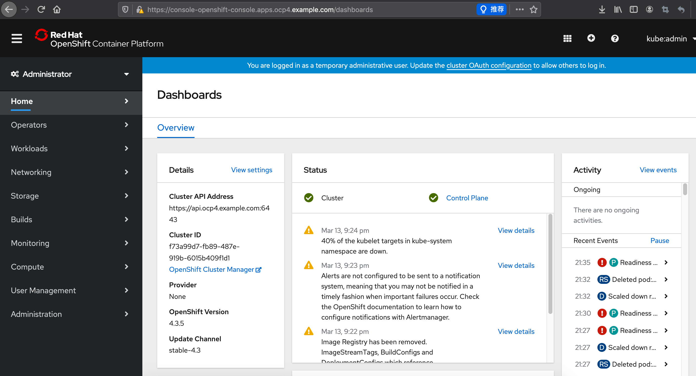

本文描述openshift4.3 baremental 离线安装方式，我的环境是 vmwamre esxi 虚拟化，也适用于其他方式提供的虚拟主机或者物理机。

4.x部署方式和之前3.x完全不同，请暂时忘记3.x的部署方式。

本篇采用PXE方式安装openshift集群，会启用dhcp服务，要求部署环境不能有其他dhcp服务，如果有，要想办法把网络隔离开。

如果对于DHCP冲突无法解决，建议采用静态IP方法，可以参照文末的其他文章，比如redhat wangzheng那篇。

### 部署环境介绍

本节介绍高可用部署所需的资源配置，及需要的安装文件。

整个环境部署可以不需要RHEL官方源，本文档部署所需的所有离线文件均可在网盘中下载，地址见下文。

#### 官方推荐最小化资源配置--可忽略，直接看下一小节
这步介绍下官方推荐的配置，实际部署还会使用到dns，dhcp等服务。  
知道下就好，实际部署不是按这个来。  
一个临时 bootstrap 机器  
三台 control plane 或 master 机器  
至少两台计算或 worker 机器  

Note: 集群要求 bootstrap 机器在三台 control plane 机器上部署 OpenShift Container Platform 集群。您可在安装集群后删除 bootstrap 机器。

官方推荐最低资源需求。  
|Machine|Operating System|vCPU|RAM|Storage|
|-|-|-|-|-|
|Bootstrap|RHCOS|4|16GB|120 GB|
|Control plane|RHCOS|4|16 GB|120 GB|
|Compute|RHCOS or RHEL 7.6|2|8 GB|120 GB|

dns，dhcp，负载均衡等服务官网未做配置要求，可以用利用环境内已有服务进行配置。也可以全新部署。

#### 本此部署使用资源

方案还是采用高可用，比官方多了一个base节点，用来搭建部署需要的dns，dhcp等服务，这台系统用Centos7.6，因为centos解决源比较方便，等熟悉部署及所需安装包后可以换成RHEL。

其他机器都用RHCOS，就是coreos专门针对openshift的操作系统版本。  
对虚机资源做了压缩，家里穷，没那么多资源 T T

如果不要master高可用，可以把master1，2 去掉。  

**openshift集群节点统一使用RHCOS。注意系统不需要提前安装！！！会通过自动部署来安装。**  

几台RHCOS节点可以先把虚机创建好，不要装系统.  

|Machine|OS|vCPU|RAM|Storage|IP|
|-|-|-|-|-|-|
|bastion|Centos7.6|2|8GB|100 GB|192.168.2.10|
|bootstrap-0|RHCOS|2|4GB|40 GB|192.168.2.11|
|master-0|RHCOS|4|8 GB|40 GB|192.168.2.12|
|master-1|RHCOS|4|8 GB|40 GB|192.168.2.13|
|master-2|RHCOS|4|8 GB|40 GB|192.168.2.14|
|worker-0|RHCOS|4|16 GB|40 GB|192.168.2.15|
|worker-1|RHCOS|4|16 GB|40 GB|192.168.2.16|

节点角色：  
1台 基础服务节点，用于安装部署所需的dhcp，dns，ftp服务。系统不限。同时承担负载均衡，用于负载master节点api及router，功能同3.x。这个服务现在需要自己部署，生产环境也可用硬负载。  
1台 部署引导节点 Bootstrap，用于安装openshift集群，在集群安装完成后可以删除。系统RHCOS  
3台 控制节点 Control plane，即master，通常使用三台部署高可用，etcd也部署在上面。系统RHCOS  
2台 计算节点 Compute，用于运行openshift基础组件及应用 。系统RHCOS

#### 安装所需文件

rpm-packages.tar.gz   所需rpm安装包  
docker-io-registry-2.tar  docker镜像文件  
openshift-client-linux-4.3.5.tar.gz   oc客户端命令  
registry.tar.gz  离线镜像仓库数据文件  
pull-secret.json  镜像权限文件  
openshift-install  安装程序  
dnsmasq.d/ocp4.conf   
haproxy/haproxy.cfg  
matchbox/  配置文件已经RHCOS的三个大文件  
matchbox-v0.8.3-linux-amd64.tar.gz  

对于其中配置文件，供参考，需按照文档说明修改以匹配自己环境。  
程序和安装包，数据文件可以直接使用。  

下载地址见文末

### 安装顺序

顺序就是先准备基础节点，包括需要的dhcp、dns、文件服务器、引导文件等，然后安装引导机 bootstrap，再后面就是 master， 再 node


### 安装准备-镜像仓库

#### 安装base基础组件节点
|base|centos7.6|4|8GB|100 GB|192.168.2.10|

1. 安装系统 centos7.6 mini  
设置IP，设置主机名，关闭防火墙和selinux
注意所有节点主机名采用三级域名格式  如 master1.aa.bb.com

```bash
hostnamectl set-hostname bastion.ocp4.example.com
sed -i 's/SELINUX=enforcing/SELINUX=disabled/g' /etc/selinux/config
setenforce 0
systemctl disable firewalld
systemctl stop firewalld

```
2. 设置 yum 缓存包到本地 - 可选步骤  
针对在线安装，这样以后如果切换到离线安装，可以方便知道用了哪些包  
编辑 /etc/yum.conf 把keepcache改为1  
keepcache=1

3. 针对离线安装 -- 离线安装必做

把我缓存的rpm包，一次性都装上，后面所有的yum install 都不需要再执行了，但是其他命令和参数配置还是要的。

```bash
tar -zxvf rpm-packages.tar.gz
cd rpm-packages
yum localinstall *.rpm
```

#### 创建内部镜像仓库
此仓库用于存放用于部署openshift平台所需使用的镜像，仓库本身也是用容器启动的。    
安装所需软件包，及创建所需目录，这些文件夹将挂载到registry容器中。

在线安装直接使用yum install即可

```bash
yum -y install podman httpd httpd-tools vim

mkdir -p /opt/registry/{auth,certs,data}
```

为 registry 提供证书。如果您没有现有的可信证书颁发机构，您可以生成自签名证书。 
registry.example.com 是仓库的域名，自己定义，不要求和主机名一致。  

```bash
cd /opt/registry/certs
openssl req -subj '/CN=registry.example.com/O=My Company Name LTD./C=US' -new -newkey rsa:2048 -days 365 -nodes -x509 -keyout domain.key -out domain.crt
```

给仓库生成用户密码，root password分别为仓库的用户名和密码。
```bash
htpasswd -bBc /opt/registry/auth/htpasswd root password
```

离线安装先导入下registry2的镜像，现在安装也可以这么多，docker.io的镜像拉取比较慢

运行内部镜像仓库，-p 后面第一个5000表示镜像映射端口，可以修改成其他的。
```bash
podman load -i docker-io-registry-2.tar 

podman run --name mirror-registry -p 5000:5000 \
     -v /opt/registry/data:/var/lib/registry:z \
     -v /opt/registry/auth:/auth:z \
     -e "REGISTRY_AUTH=htpasswd" \
     -e "REGISTRY_AUTH_HTPASSWD_REALM=Registry Realm" \
     -e REGISTRY_AUTH_HTPASSWD_PATH=/auth/htpasswd \
     -v /opt/registry/certs:/certs:z \
     -e REGISTRY_HTTP_TLS_CERTIFICATE=/certs/domain.crt \
     -e REGISTRY_HTTP_TLS_KEY=/certs/domain.key \
     -d docker.io/library/registry:2
```

如果防火墙没关闭，需要放行本地端口，下面这个5000对应上面podman -p 后面第一个5000
```bash
firewall-cmd --add-port=5000/tcp --zone=internal --permanent
firewall-cmd --add-port=5000/tcp --zone=public   --permanent
firewall-cmd --add-service=http  --permanent
firewall-cmd --reload
```

hosts 添加 registry.example.com 域名解析，IP是本机地址，域名与上面生成证书使用的域名一致。

```bash
echo "192.168.2.10 registry.example.com" >>/etc/hosts
```

测试访问仓库，没有报错返回空值就是正常的，当前仓库内还没有镜像
```bash
curl -u root:password -k https://registry.example.com:5000/v2/_catalog
```

如仓库无法访问,您应该检查
1.) registry 容器是否正常启动
2.) registry.example.com 域名是否可以正常解析
3.) htpasswd 文件中的用户名密码是否正确
4.) 防火墙5000端口是否开放
5.) 证书域名是否正确

#### 下载镜像文件
   
下载最新的oc命令。进入下载链接，下载openshift client，install 文件不需要，后面从镜像里面提取  
直接选一个4.3最新的 openshift-client-linux-4.3.5.tar.gz  网盘里有这个文件

https://mirror.openshift.com/pub/openshift-v4/clients/ocp/latest-4.3/

```bash
tar -zxvf openshift-client-linux-4.3.5.tar.gz
mv oc /usr/local/bin/
oc version
Client Version: 4.3.5
```

准备拉取镜像权限认证文件。 
从 Red Hat OpenShift Cluster Manager 站点的 Pull Secret 页面下载 registry.redhat.io 的 pull secret。
https://cloud.redhat.com/openshift/install/pull-secret

```bash
 # 把下载的txt文件转出json格式，如果没有jq命令，通过epel源安装，或者通过
 cat ./pull-secret.txt | jq . > pull-secret.json

yum install epel-release
yum install jq
```

json文件内容大概如下
```bash
{
  "auths": {
    "cloud.openshift.com": {
      "auth": "b3BlbnNo...",
      "email": "you@example.com"
    },
    "quay.io": {
      "auth": "b3BlbnNo...",
      "email": "you@example.com"
    },
    "registry.connect.redhat.com": {
      "auth": "NTE3Njg5Nj...",
      "email": "you@example.com"
    },
    "registry.redhat.io": {
      "auth": "NTE3Njg5Nj...",
      "email": "you@example.com"
    }
  }
}
```

把本地仓库的用户密码转成base64编码
```bash
echo -n 'root:password' | base64 -w0 
cm9vdDpwYXNzd29yZA==
```

然后在pull-secret.json里面加一段本地仓库的权限。第一行仓库域名和端口，第二行是上面的base64，第三行自己写个邮箱
```bash
  "auths": {
...
    "registry.example.com:5000": {
      "auth": "cm9vdDpwYXNzd29yZA==",
      "email": "you@example.com"
   },
...

```

设置环境变量
OCP_RELEASE版本，https://quay.io/repository/openshift-release-dev/ocp-release?tab=tags 这个页面可以查看，版本写的不对，下面oc adm 时候会提示  image does not exist
LOCAL_REGISTRY 本地仓库的域名和端口
LOCAL_REPOSITORY 镜像存储库名称，使用ocp4/openshift4，不需要改
PRODUCT_REPO RELEASE_NAME，都是一些版本特征，保持不变即可
LOCAL_SECRET_JSON 密钥路径，就是上面pull-secret.json 的存放路径

```bash
export OCP_RELEASE="4.3.5-x86_64"
export LOCAL_REGISTRY='registry.example.com:5000' 
export LOCAL_REPOSITORY='ocp4/openshift4'
export PRODUCT_REPO='openshift-release-dev'
export LOCAL_SECRET_JSON='/root/pull-secret.json'
export RELEASE_NAME="ocp-release"
```
将自签名的证书复制到默认信任证书路径
```bash
cp /opt/registry/certs/domain.crt /etc/pki/ca-trust/source/anchors/
update-ca-trust extract
```

拉取镜像，这一步的动作就是把quay官方仓库中的镜像，同步到我们本地仓库，如果失败了重新执行命令。  
整体内容大概5G。本地仓库数据在 /opt/registry/data   
可以直接用我的离线文件 registry.tar.gz   
tar -zxvf registry.tar.gz ,把data 目录放到 /opt/registry,然后重启镜像仓库 podman restart mirror-registry

用离线文件的话，这句oc adm 命令就不需要执行了，下面返回的imageContentSource内容也不必介意，每次都一样的，抄下面的就行，仓库名称改成你的就好  

```bash
oc adm -a ${LOCAL_SECRET_JSON} release mirror \
     --from=quay.io/${PRODUCT_REPO}/${RELEASE_NAME}:${OCP_RELEASE} \
     --to=${LOCAL_REGISTRY}/${LOCAL_REPOSITORY} \
     --to-release-image=${LOCAL_REGISTRY}/${LOCAL_REPOSITORY}:${OCP_RELEASE}
```    

oc adm release mirror执行完毕后，返回的信息需要记录下来，特别是imageContentSource信息，后面 install-config.yaml 文件里配置进去

```bash
To use the new mirrored repository to install, add the following section to the install-config.yaml:

imageContentSources:
- mirrors:
  - registry.example.com:5000/ocp4/openshift4
  source: quay.io/openshift-release-dev/ocp-release
- mirrors:
  - registry.example.com:5000/ocp4/openshift4
  source: quay.io/openshift-release-dev/ocp-v4.0-art-dev


To use the new mirrored repository for upgrades, use the following to create an ImageContentSourcePolicy:

apiVersion: operator.openshift.io/v1alpha1
kind: ImageContentSourcePolicy
metadata:
  name: example
spec:
  repositoryDigestMirrors:
  - mirrors:
    - registry.example.com:5000/ocp4/openshift4
    source: quay.io/openshift-release-dev/ocp-release
  - mirrors:
    - registry.example.com:5000/ocp4/openshift4
    source: quay.io/openshift-release-dev/ocp-v4.0-art-dev
```

本地镜像仓库缓存好镜像之后，通过tag/list 接口查看所有tag，应该能列出来一堆才是正常的

```bash
curl -u root:password -k https://registry.example.com:5000/v2/ocp4/openshift4/tags/list
```

#### 提取 openshift-install 命令

为了保证安装版本一致性，会从镜像库中提取 openshift-install 命令，需要用到上面export的环境变量  
**这步要联网，如果是离线环境，直接使用提取好的 openshift-install 文件，网盘里有** 

```bash
# 这步是在线提取openshift-install文件，离线环境跳过
oc adm -a ${LOCAL_SECRET_JSON} release extract --command=openshift-install "${LOCAL_REGISTRY}/${LOCAL_REPOSITORY}:${OCP_RELEASE}"
```
如果提示"error: image dose not exist"，说明拉取的镜像不全，或者版本不对。

把文件移动到/usr/local/bin  并确认版本

```bash
chmod +x openshift-install
mv openshift-install /usr/local/bin/
openshift-install version
#openshift-install 4.3.5
#built from commit 82f9a63c06956b3700a69475fbd14521e139aa1e
#release image registry.example.com:5000/ocp4/openshift4@sha256:64320fbf95d968fc6b9863581a92d373bc75f563a13ae1c727af37450579f61a
```

### 安装准备 -- DNS/DHCP server 部署
网上部署方法诸多，有其他的写hosts文件不用dns server 及静态IP的方法或者修改RHCOS镜像。本次采用DHCP PXE方式​。​。

部署dnsmasq服务，这个服务可以同时做dns server, dhcp server和tftp，为后面的RHCOS提供PXE无人值守安装

```bash
yum install dnsmasq tftp-server ipxe-bootimgs  -y

# 配置dnsmasq，配置文件如下，网盘里也有
cd /etc/dnsmasq.d/

# 需要提前把RHCOS节点的虚机创建好，在虚机配置里把MAC地址记下来
# 因为在内网里有其他机器，不把MAC和IP绑定，DHCP server准备的IP容易被其他机器拿去。

vi ocp4.conf
dhcp-range=192.168.2.11,192.168.2.16,255.255.255.0
enable-tftp 
tftp-root=/var/lib/tftpboot
dhcp-match=set:bios,option:client-arch,0
dhcp-boot=tag:bios,undionly.kpxe
dhcp-match=set:efi32,option:client-arch,6
dhcp-boot=tag:efi32,ipxe.efi
dhcp-match=set:efibc,option:client-arch,7
dhcp-boot=tag:efibc,ipxe.efi
dhcp-match=set:efi64,option:client-arch,9
dhcp-boot=tag:efi64,ipxe.efi
dhcp-userclass=set:ipxe,iPXE
dhcp-option=option:router,192.168.2.1
dhcp-option=option:dns-server,192.168.2.10
dhcp-boot=tag:ipxe,http://bastion.ocp4.example.com:8080/boot.ipxe
address=/bastion.ocp4.example.com/192.168.2.10
address=/api.ocp4.example.com/192.168.2.10
address=/apps.ocp4.example.com/192.168.2.15
address=/api-int.ocp4.example.com/192.168.2.10
address=/master-0.ocp4.example.com/192.168.2.12
address=/etcd-0.ocp4.example.com/192.168.2.12
address=/master-1.ocp4.example.com/192.168.2.13
address=/etcd-1.ocp4.example.com/192.168.2.13
address=/master-2.ocp4.example.com/192.168.2.14
address=/etcd-2.ocp4.example.com/192.168.2.14
address=/worker-0.ocp4.example.com/192.168.2.15
address=/worker-1.aocp4.example.com/192.168.2.16
address=/bootstrap-0.ocp4.example.com/192.168.2.11
address=/registry.example.com/192.168.2.10
srv-host=_etcd-server-ssl._tcp.ocp4.example.com,etcd-0.ocp4.example.com,2380,10
srv-host=_etcd-server-ssl._tcp.ocp4.example.com,etcd-1.ocp4.example.com,2380,10
srv-host=_etcd-server-ssl._tcp.ocp4.example.com,etcd-2.ocp4.example.com,2380,10
dhcp-host=00:0c:29:7d:ef:3e,master-0.ocp4.example.com,192.168.2.12
dhcp-host=00:0c:29:a1:84:7e,master-1.ocp4.example.com,192.168.2.13
dhcp-host=00:0c:29:0f:7a:71,master-2.ocp4.example.com,192.168.2.14
dhcp-host=00:0c:29:26:c6:fb,worker-0.ocp4.example.com,192.168.2.15
dhcp-host=00:0c:29:da:5c:92,worker-1.ocp4.example.com,192.168.2.16
dhcp-host=00:0c:29:f2:40:e0,bootstrap-0.ocp4.example.com,192.168.2.11
log-queries
log-dhcp
```

dhcp-range: 几台RHCOS预留的IP池，及掩码  
dhcp-option=option:router: 网关地址  
dhcp-option=option:dns-server: 这台部署机的IP，因为这台做dns server  
dhcp-boot=tag:ipxe: 写这台部署机的主机名，其他不用改  
下面的address，分别是主机名和IP地址
api.ocp4.example.com 如果单master，指向master0，如果是多master，指向master的负载，这边写部署机，后面部署机上面安装负载均衡，负载指向到三个master api  
apps.ocp4.example.com 指向第一个node节点，router组件所在
api-int.ocp4.example.com 同api.ocp4.example.com,指向openshift api,就是当前bastion节点  
dhcp-host dhcp与mac配置，分别是几台RHCOS的mac地址，主机名，ip地址

配置tftp server，并启动dnsmasq，如果本机开启了防火墙还需要防火墙放行，我这台上面已经关闭防火墙了  
```bash
mkdir -p /var/lib/tftpboot
ln -s /usr/share/ipxe/undionly.kpxe /var/lib/tftpboot

# 启动dnsmasq
systemctl enable dnsmasq && systemctl restart dnsmasq

# 查看dnsmasq服务状态，如果有报错，会提示错误在配置文件哪一行
systemctl status dnsmasq -l

# 本地修改 resolv.conf 文件
# 加一行下面参数，IP是本机地址，要写在其他nameserver前面
# 注意这个参数写在这里重启应该会丢，要想不丢，修改  /etc/sysconfig/network-scripts/ifcfg-ens192
# 加一行 DNS1=192.168.2.10 ,然后systemctl restart network
vi /etc/resolv.conf
nameserver 192.168.2.10

# 验证dns server
yum install bind-utils -y

# 测试下dns解析
nslookup master-0.ocp4.example.com & nslookup bootstrap-0.ocp4.example.com

# 测试结果，能正常解析IP
Name:   bootstrap-0.ocp4.example.com
Address: 192.168.2.11
Name:   master-0.ocp4.example.com
Address: 192.168.2.12
```

### 安装准备 -- haproxy 负载均衡

单master可以跳过这一步，不过我还没测试单master部署。

haproxy主要用于负载master api 6443 ，worker节点的router 80 443，可以被其他负载代替

```bash
yum install haproxy -y
cd /etc/haproxy/
vim haproxy.cfg  #在最下面加配置文件，也可以把自带的frontend 和backend删掉，没有用

# 可选项,可以通过页面查看负载监控状态
listen stats
    bind :9000
    mode http
    stats enable
    stats uri /
    monitor-uri /healthz

# 负载master api，bootstrap 后面删掉
frontend openshift-api-server
    bind *:6443
    default_backend openshift-api-server
    mode tcp
    option tcplog

backend openshift-api-server
    balance source
    mode tcp
    server bootstrap 192.168.2.11:6443 check
    server master0 192.168.2.12:6443 check
    server master1 192.168.2.13:6443 check
    server master2 192.168.2.14:6443 check

frontend machine-config-server
    bind *:22623
    default_backend machine-config-server
    mode tcp
    option tcplog

backend machine-config-server
    balance source
    mode tcp
    server bootstrap 192.168.2.11:22623 check
    server master0 192.168.2.12:22623 check
    server master1 192.168.2.13:22623 check
    server master2 192.168.2.14:22623 check

# 负载router，就是*.apps.ocp4.example.com , 这个域名如果 dns server 指向了本机，则这边必须配置，否则对于测试环境可选项。
frontend ingress-http
    bind *:80
    default_backend ingress-http
    mode tcp
    option tcplog

backend ingress-http
    balance source
    mode tcp
    server worker0 192.168.2.15:80 check
    server worker1 192.168.2.16:80 check

frontend ingress-https
    bind *:443
    default_backend ingress-https
    mode tcp
    option tcplog

backend ingress-https
    balance source
    mode tcp
    server worker0 192.168.2.15:443 check
    server worker1 192.168.2.16:443 check

```

启动服务

```bash
systemctl enable haproxy && systemctl start haproxy
```

验证服务

通过浏览器页面查看 IP:9000 可以看到haproxy的监控页面，当前后端服务还没起，所以很多红色的。


### 安装准备 -- matchbox部署 -- 文件下发

安装配置matchbox ,该服务主要是用作pxe安装rhcos时,分配分配rhcos的ign部署配置文件

文件目录，下面会说明文件如何配置  
```bash
[root@bastion ~]# tree /var/lib/matchbox/
/var/lib/matchbox/
├── assets
│   ├── rhcos-4.3.0-x86_64-installer-initramfs.img
│   ├── rhcos-4.3.0-x86_64-installer-kernel
│   └── rhcos-4.3.0-x86_64-metal.raw.gz
├── groups
│   ├── bootstrap-0.json
│   ├── master-0.json
│   ├── master-1.json
│   ├── master-2.json
│   ├── worker-0.json
│   └── worker-1.json
├── ignition
│   ├── bootstrap.ign
│   ├── master.ign
│   └── worker.ign
└── profiles
    ├── bootstrap.json
    ├── cptnod.json
    ├── infnod.json
    └── master.json

4 directories, 16 files
```

官方matchbox架构图


最上面是即将部署的节点，groups目录下每个配置文件里都写了对应节点的mac，两者会根据mac进行匹配

所以groups下面是每个节点对应一个配置文件

groups下的json文件，会有一个profile参数，对应 profiles 目录下的文件。 profiles 即代表角色

assets 存放的引导文件和安装系统需要的文件

下载matchbox-v0.8.3-linux-amd64.tar.gz,可以到github的release页面下载, 
https://github.com/poseidon/matchbox/releases
 
```bash
tar xf matchbox-v0.8.3-linux-amd64.tar.gz
cd matchbox-v0.8.3-linux-amd64/
cp matchbox /usr/local/bin
cp contrib/systemd/matchbox-local.service /etc/systemd/system/matchbox.service
vi /etc/systemd/system/matchbox.service  # 把 User Group 两行删掉，直接以root运行
mkdir -p /var/lib/matchbox/{assets,groups,ignition,profiles}
```

下载rhcos 安装文件，本次部署需要下面这三个，你可以从下面官网连接下载，百度网盘里也有:  
https://mirror.openshift.com/pub/openshift-v4/dependencies/rhcos/latest/latest/

rhcos-4.3.0-x86_64-installer-initramfs.img  
rhcos-4.3.0-x86_64-installer-kernel  
rhcos-4.3.0-x86_64-metal.raw.gz  

这三个文件放到 /var/lib/matchbox/assets 目录下

groups 目录下修改节点配置文件，主要是mac地址和检查对应的 profiles 是否正确

profiles 目录下修改配置文件，主要确认kernel initrd 对应的配置文件及 url , 
install_dev ：在不同虚拟化或者物理平台磁盘命名可能不一样，看下当前部署机是sda 还是 vda，rhcos下命名规则应该是一样的

ignition 下的文件后面生成

启动matchbox  
`systemctl enable matchbox && systemctl restart matchbox `

matchbox 监听8080 端口，可以通过浏览器访问到 http://192.168.2.10:8080/assets/

### openshift 安装

#### 准备 install-config.yaml

首先创建 install-config.yaml 文件，来生成matchbox 需要的ign 文件

创建一对公钥和私钥，用作登录RHCOS  
```bash
ssh-keygen -t rsa -b 2048 -N "" -f /root/.ssh/id_rsa
mkdir /root/ocp4

cd /root/ocp4
vi install-config.yaml

apiVersion: v1
baseDomain: example.com
compute:
- hyperthreading: Enabled
  name: worker
  replicas: 0
controlPlane:
  hyperthreading: Enabled
  name: master
  replicas: 3
metadata:
  name: ocp4
networking:
  clusterNetworks:
  - cidr: 10.254.0.0/16
    hostPrefix: 24
  networkType: OpenShiftSDN
  serviceNetwork:
  - 172.30.0.0/16
platform:
  none: {}
pullSecret: '{"auths":{"registry.example.com:5000": {"auth": "cm9vdDpwYXNzd29yZA==","email": "you@example.com"}}}'
sshKey: 'ssh-rsa AAAAB3NzaC1yc2EAAAADAQABAAABAQC24BYgsRAKTm40fFIPV/0Rx1veBY5hNsCHf6X7sByLXBA3A7BkBR9UnnTtRHN6ONNajaX3ralWHDd7t9OzSPym/+27/6JGz3AcCuSu1G8ie3M+E6XaFvaptKyvv7ua+vI2xgwC1WZGRhtQAtzccjFo2+ZQijc8pqHtLSao3jB3szAc5wzQd2JUL7zJ/hppxMD4pkCu1COSdtLpQci8exL2Km837glElmKrpVzVvfjan+4BmO0R3h9H9Xf3KDBZB/A84OjsjnIy31tsF1RWuAt1MwYwaGHDXGInG3bnnchXx5SRHpdFmtdVXvgY1S/M0WF9oPedjo++C8rRft41NfaJ root@bastion.example.com'
additionalTrustBundle: |
  -----BEGIN CERTIFICATE-----
  MIIDaTCCAlGgAwIBAgIJAPe1Z6c1QYJSMA0GCSqGSIb3DQEBCwUAMEsxHTAbBgNV
  BAMMFHJlZ2lzdHJ5LmV4YW1wbGUuY29tMR0wGwYDVQQKDBRNeSBDb21wYW55IE5h
  bWUgTFRELjELMAkGA1UEBhMCVVMwHhcNMjAwMzA5MTczMzQyWhcNMjEwMzA5MTcz
  MzQyWjBLMR0wGwYDVQQDDBRyZWdpc3RyeS5leGFtcGxlLmNvbTEdMBsGA1UECgwU
  TXkgQ29tcGFueSBOYW1lIExURC4xCzAJBgNVBAYTAlVTMIIBIjANBgkqhkiG9w0B
  AQEFAAOCAQ8AMIIBCgKCAQEAvfdF5YwZdsFzI7/UUMGmipWXjRre9rk1ljXqYQRz
  CLi/a/GTXllxsdV81d3CEKIUm25PqrLT7wt9c+Pe9DP/dtzcYTAixQJzkhYyrqIw
  BhJrQ4YQauGObMnR87yAMnHDQFyIItZz3t0uMjtYHCX1kUPuAgYBD2E+Yfm0eQ7Y
  dHi4/TNbopP2PEc396wiPfYA5cDLQteKPT9dZXpFov3SNxNAfVJj+WsHz/D84Q5y
  qeJ5Y9CmlF9FuLkrERtlPRa5ppFxeV0+ggAFMc5haGBW6gP6CBes3zObuXNBGtCk
  9szUB5sgvopBbTalBBJG4iDhqHITktAWhFxvVU3JYH9qMwIDAQABo1AwTjAdBgNV
  HQ4EFgQUAOAciw0dFDFje2Dx0MrSeR5kyNUwHwYDVR0jBBgwFoAUAOAciw0dFDFj
  e2Dx0MrSeR5kyNUwDAYDVR0TBAUwAwEB/zANBgkqhkiG9w0BAQsFAAOCAQEAtbi2
  v4CO06xCwFEy1o6E8hWa3jy31O++pdsHziqlUnGnztz4FYWj7oXJbvfTnsFJN0jI
  ImYuDdXHZGHRX4Mcc5le/4J/RF+sWZijdspVfMIfS7EUUES8Pfya82SzPehgF/oa
  sQF+gOTir4cohhy+5rtDVn4nlwhfhMTjlahXq8K3dBxgbnMZoz+kkbhEsYyE0b2n
  ACNAqWTCvfmU73IrXUpUaX+vwPs15wAfQl2FZyPM3cSAlU34WOxXga+SD2hqJmj2
  cklGvWAwXAeo0BIDgU5nABoJT5++WVQ43H6BBOshrhhNzpLzDIUaEDQPkSVIw72B
  TRMFn8AEaDdTyUY2Bg==
  -----END CERTIFICATE-----
imageContentSources:
- mirrors:
  - registry.example.com:5000/ocp4/openshift4
  source: quay.io/openshift-release-dev/ocp-release
- mirrors:
  - registry.example.com:5000/ocp4/openshift4
  source: quay.io/openshift-release-dev/ocp-v4.0-art-dev

```

baseDomain 就是上面每个主机配置的域名  
metadata,name 就是节点master/worker名称后面一级，这也是为什么主机名要用好几级  
worker 0 不代表0个worker，此处不用改  
cidr 是pod ip池 ，servicenetwork 就是k8s里的service ip，两个都要和虚拟机本地ip网段区分开  
pullsecret的信息在上面pull-secret.json 中都有  
sshKey ssh公钥，cat /root/.ssh/id_rsa.pub 全部内容贴进去    
additionalTrustBundle 私有镜像仓库证书,cat /opt/registry/certs/domain.crt, 需要注意整体内容往后移个空格，换行保持不变，可以参考我的文件  
imageContentSources 是之前oc admin release mirror 返回的结果，上面有记录，如果也是ocp4.3，核对下仓库域名，其他不用修改  

#### 生产 ign 配置文件

```bash
# 备份下文件，下面命令执行后文件会被自动删除
cp install-config.yaml /tmp/install-config.yaml.bak 

# 生成ign文件，如果要重新生成，要把整个ocp4目录删了重来
# 有个隐藏文件 .openshift_install_state.json 会导致报错  
openshift-install create ignition-configs

# 查看文件目录
[root@bastion ocp4]# tree
.
├── auth
│   ├── kubeadmin-password
│   └── kubeconfig
├── bootstrap.ign
├── install-config.yaml.bak
├── master.ign
├── metadata.json
└── worker.ign

# 把 .ign 文件复制到matchbox 数据目录
cp *.ign /var/lib/matchbox/ignition/

```

#### 安装 bootstarp 和 master

部署机 bastion 执行命令监控部署状态  
```bash
cd ~
openshift-install --dir=/root/ocp4 wait-for bootstrap-complete --log-level debug
```

然后把bootstrap虚拟打开，第一次启动的时候找不到本地系统盘会自动切换到网卡pxe启动。

待系统安装完成后，bootstrap虚机控制台会停留在登录页面。

在部署机 basetion 可以通过 ssh 命令进入bootstrap

```bash
ssh core@bootstrap-0

# 检查方法:
# 查看网络信息
hostname -I
ip route show
cat /etc/resolv.conf

# 查看运行容器，sudo podman ps, 应该有运行中容器
# 如果没有在运行的容器， ps -ef 看下是否有podman pull 的进程
# 通过curl命令检查跟镜像仓库的连通性，我遇到过连不上仓库，在部署机上重启了下仓库后好了
sudo podman ps 
sudo ps -ef 

# 查看进程端口
netstat -an 查看 6443、22623

# 也可以通过haproxy的页面，就是192.168.2.10:9000 可以看到bootstrap的状态变成了绿色
# 说明这个时候bootstrap 已经部署成功

# 查看服务状态的命令，ssh进去的时候就会提示这条命令
journalctl -b -f -u bootkube.service

```

master 部署  

把master几台虚机打开，会自动从pxe启动部署，检查方法与上面类似  
通过haproxy页面查看master节点api及machine-config状态  
以及通过netstat 查看端口 api  6443， etcd 2379  

部署完成后，从haproxy上看到master-1的api状态异常，master-0 master-2 正常，还不太熟悉服务组件运行方式，我重启master-1后正常了，后续再看。

oc 命令可以看到master状态  
```bash
 cp /root/ocp4/auth/kubeconfig ~/.kube/config  
 oc get node
NAME       STATUS   ROLES           AGE    VERSION
master-0   Ready    master,worker   113m   v1.16.2
master-1   Ready    master,worker   113m   v1.16.2
master-2   Ready    master,worker   113m   v1.16.2
```

在bastion 节点，haproxy的配置文件，backend 中的 bootstrap 需要删掉，并重启haproxy。

```bash
vi /etc/haproxy/haproxy.cfg
# backend openshift-api-server 删除bootstrap这行      server bootstrap 192.168.2.11:6443 check
# backend machine-config-server 删除bootstrap这行       server bootstrap 192.168.2.11:22623 check

# 重启服务
systemctl restart haproxy
```

#### 安装 worker

部署机 bastion 执行命令监控部署状态  
```bash
cd ~
openshift-install --dir=/root/ocp4 wait-for install-complete --log-level debug
```

当两台worker 在控制台看到已经部署完

在部署机之前 get csr 命令，查看node 节点加入申请，批准之，然后就看到了node节点。 大功告成！！！

```bash
[root@bastion ~]# oc get csr 
NAME        AGE   REQUESTOR                                                                   CONDITION
csr-2mxfw   13m   system:serviceaccount:openshift-machine-config-operator:node-bootstrapper   Pending
csr-p6ckt   13m   system:serviceaccount:openshift-machine-config-operator:node-bootstrapper   Pending

[root@bastion ~]# oc get csr -ojson | jq -r '.items[] | select(.status == {} ) | .metadata.name' | xargs oc adm certificate approve

[root@bastion ~]# oc get node
NAME       STATUS   ROLES           AGE    VERSION
master-0   Ready    master,worker   120m   v1.16.2
master-1   Ready    master,worker   120m   v1.16.2
master-2   Ready    master,worker   120m   v1.16.2
worker-0   Ready    worker          45s    v1.16.2
worker-1   Ready    worker          49s    v1.16.2

```


#### Web console 登录

ocp4的web console 入口走router了，所以找下域名  
首先找到我们的域名，然后在我们自己电脑上 hosts添加解析，指向到worker-0，这样就能够访问openshift 的web 控制台了

```bash
[root@bastion ~]# oc get route --all-namespaces |grep console-openshift
openshift-console          console             console-openshift-console.apps.ocp4.example.com                       console             https   reencrypt/Redirect     None
```

把这条写入hosts  
192.168.2.15 oauth-openshift.apps.ocp4.example.com console-openshift-console.apps.ocp4.example.com

然后浏览器访问console  
https://console-openshift-console.apps.ocp4.example.com

第一次发现页面打不开. Application is not available , 这是router返回的，说明router服务好使，web console 服务异常。

```bash
[root@bastion ~]# oc get pod --all-namespaces |grep console
openshift-console-operator                              console-operator-597c74c496-gr78z                                 1/1     Running                    0          109m
openshift-console                                       console-5f4b9f69c7-kmtlz                                          0/1     Pending                    0          41m
openshift-console                                       console-87c8d8ddc-2tv59                                           0/1     Pending                    0          41m
openshift-console                                       console-87c8d8ddc-k2kpl                                           0/1     Pending                    0          37m
openshift-console                                       console-87c8d8ddc-zdpc2                                           0/1     UnexpectedAdmissionError   0          41m
openshift-console                                       downloads-7fdfb77b95-bk9cr                                        1/1     Running                    0          109m
openshift-console                                       downloads-7fdfb77b95-k84hj                                        1/1     Running                    0          109m
```

嗯，pod pending， 看event, 是通过node selector 指定了master，两个node的标签不匹配，但是master的cpu又不够。所以给三台master虚拟修改下CPU，之前是2核改成4，重启下系统

```bash
[root@bastion ~]# oc -n openshift-console describe po console-5f4b9f69c7-kmtlz

  Warning  FailedScheduling  <unknown>  default-scheduler  0/5 nodes are available: 2 node(s) didn't match node selector, 3 Insufficient cpu.

```

重新看下 console pod，正常后console 就可以打开了  
`oc -n openshift-console  get pod` 

用户名是 kubeadmin
密码在这个文件里
cat /root/ocp4/auth/kubeadmin-password



###  参考文档
如果在本文中你遇到了未描述到的问题，可以参阅以下文档。  
官方部署文档
https://docs.openshift.com/container-platform/4.3/installing/installing_bare_metal/installing-bare-metal.html
https://blog.openshift.com/openshift-4-2-disconnected-install/

这里面有静态IP的方法，修改启动参数，不修改RHCOS镜像，但是启动参数挺长的，手动敲容易出错，错了就得重来。。。

https://blog.openshift.com/openshift-4-bare-metal-install-quickstart/

参考文档，来自redhat wangzheng。静态IP，修改RHCOS镜像  
https://github.com/wangzheng422/docker_env/blob/master/redhat/ocp4/4.2.disconnect.operator.md

泰康云  
http://www.talkwithtrend.com/Article/246491

同事程吉祥的4.2 word文档（不方便上传，在此感谢祥哥，祥哥！这么大的广告，你要不要打赏一下。）

官方安装诊断手册  
Troubleshooting OpenShift Container Platform 4.x: UPI Installation  
https://access.redhat.com/articles/4292081


### 下载地址

请原谅我的小小手段。。。

识别图中二维码，关注公众号，回复  ocp4.3  即可获取百度云下载地址

<div align="center"></div>

也可以顺便关注下我的github，后续更新会同步到github

https://github.com/cai11745/k8s-ocp-yaml

