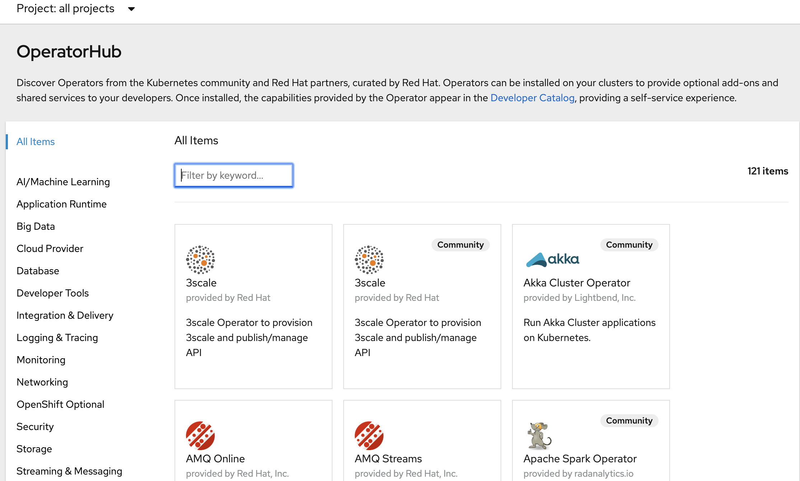

###

ocp4 console 页面，在 Operators -- OperatorHub 页面，看到一共有121个 operator, 前几天我看的时候还是30个，应该是联网自动下载了。因为其他朋友的文章里说离线部署初始应该是看到0个。  
不过这都没关系，点开一个部署就会发现，没镜像，跑不起来。  



以下记录如何手动添加一个operator 并能够成功运行，这样将能够帮助我们在离线环境下导入operator。

### 禁用默认的 OperatorSources
ocp4 安装完成后，默认安装了operatorhub， 并配置了默认源。  
把他屏蔽掉。

```bash
oc patch OperatorHub cluster --type json \
    -p '[{"op": "add", "path": "/spec/disableAllDefaultSources", "value": true}]'

oc get operatorhub -o yaml
# 可以看到三个source, disabled 的值变成了true，已禁用
```

然后 console 页面，operatorhub里面的内容都自动清空了。

### 获取

要获取默认OperatorSource的软件包列表，在可以联网的机器运行以下命令：

```bash
curl https://quay.io/cnr/api/v1/packages?namespace=redhat-operators> redhat-operators-packages.txt
curl https://quay.io/cnr/api/v1/packages?namespace=community-operators > community-operators-packages.txt
curl https://quay.io/cnr/api/v1/packages?namespace=certified-operators > certified-operators-packages.txt
```

都是json格式的，可以用jq命令格式化一下方便看，或者使用在线工具
` cat community-operators-packages.txt |jq  `

在线解析  
https://www.json.cn/


导入一个traefik 试试，traefik 功能同ingress和ocp的router，用于应用流量的入口

```bash
[root@bastion operatorhub]# cat * |jq |grep traefikee -A 4
    "name": "certified-operators/traefikee-certified",
    "namespace": "certified-operators",
    "releases": [
      "6.0.0",
      "5.0.0",
--
    "name": "certified-operators/traefikee-redhat-certified",
    "namespace": "certified-operators",
    "releases": [
      "1.0.0"
    ],
--
    "name": "community-operators/traefikee-operator",
    "namespace": "community-operators",
    "releases": [
      "2.0.2",
      "0.4.1",
```      

这几个的区别我还不是很清楚，就选第一个来测试下。

```bash
# 格式
curl https://quay.io/cnr/api/v1/packages/<namespace>/<operator_name>/<release>
# 替换成我们第一个traefik就是
curl https://quay.io/cnr/api/v1/packages/certified-operators/traefikee-certified/6.0.0
[{"content":{"digest":"30860da0b1ccb047b06cc03f156103ee4d723c7054b863d59b758ba4b08eb80b","mediaType":"application/vnd.cnr.package.helm.v0.tar+gzip","size":106028,"urls":[]},"created_at":"2020-02-14T05:10:22","digest":"sha256:81321ce3f20ad784e983d63976efb54d64f67d121be191f49c121d6772f65c47","mediaType":"application/vnd.cnr.package-manifest.helm.v0.json","metadata":null,"package":"certified-operators/traefikee-certified","release":"6.0.0"}]

# 用这条命令获取文件. 注意 sha256/ 后面的参数，是对应上面digest 
curl -XGET https://quay.io/cnr/api/v1/packages/certified-operators/traefikee-certified/blobs/sha256/30860da0b1ccb047b06cc03f156103ee4d723c7054b863d59b758ba4b08eb80b \
    -o traefikee-certified.tar.gz

# 新建一个目录，把文件解压到下面
# 解压如果出错要么文件没下完整，要么 sha256 后面参数不对
mkdir -p manifests/traefikee-certified
tar -xf traefikee-certified.tar.gz -C manifests/traefikee-certified/

# 查看解压后的文件，如果一个 bundle.yaml ，需要做文件拆解
~ tree manifests/traefikee-certified/
manifests/traefikee-certified/
└── traefikee-certified-gg5v9t1n
    └── bundle.yaml

```

bundle.yaml 内容有 data.clusterServiceVersiondata.customResourceDefinition和data.Package 三部分。  
我们需要把他们切割成三个文件。  

第一个文件 clusterserviceversion.yaml ，注意把 apiVersion 前面的 '-' 删除
```bash
apiVersion: operators.coreos.com/v1alpha1
kind: ClusterServiceVersion
[...]
```

第二个文件 customresourcedefinition.yaml , 同样 apiVersion 前面的 '-' 删除
```bash
apiVersion: apiextensions.k8s.io/v1beta1
kind: CustomResourceDefinition
[...]
```

第三个文件 package.yaml , 同样去掉前面的 '-'
```bash
channels:
- currentCSV: traefikee-certified.v0.4.1
  name: alpha 
defaultChannel: alpha 
packageName: traefikee-certified
```

在 traefikee-certified 下新建一个版本号的目录，把clusterserviceversion.yaml和customresourcedefinition.yaml放进去  
最终目录结构如下  
```bash
~ tree manifests/
manifests/
└── traefikee-certified
    ├── 6.0.0
    │   ├── clusterserviceversion.yaml
    │   └── customresourcedefinition.yaml
    └── package.yaml
```

获取镜像，查看下 yaml 文件中定义的镜像，这个是dockerhub的镜像，我们需要把他下载来，推送到我们的私有仓库，并且在yaml文件中把image改成指向私有仓库

```bash
~ grep image: -R * 
manifests/traefikee-certified/6.0.0/clusterserviceversion.yaml:                image: containous/traefikee-operator:v0.4.1
manifests/traefikee-certified/6.0.0/clusterserviceversion.yaml:                image: containous/traefikee-operator:v0.4.1
manifests/traefikee-certified/6.0.0/customresourcedefinition.yaml:                      image: containous/traefikee-operator:v0.4.1
manifests/traefikee-certified/6.0.0/customresourcedefinition.yaml:                      image: containous/traefikee-operator:v0.4.1
```

拉取镜像，改tag，推到私有仓库，docker.io 拉不动换成azure的加速器试试，嗖嗖的  
```bash
podman pull docker.io/containous/traefikee-operator:v0.4.1
# 或者 podman pull dockerhub.azk8s.cn/containous/traefikee-operator:v0.4.1
 podman tag dockerhub.azk8s.cn/containous/traefikee-operator:v0.4.1 registry.example.com:5000/containous/traefikee-operator:v0.4.1
 podman login https://registry.example.com:5000 -u root -p password 
 podman push registry.example.com:5000/containous/traefikee-operator:v0.4.1
```

这边是 Azure China docker 加速器，有docker.io gcr.io quay.io 下载不了的镜像可以替换试试

|global|proxy in China|format|example|
|-|-|-|-|
|dockerhub(docker.io)|dockerhub.azk8s.cn|dockerhub.azk8s.cn/repo-name/image-name:version|dockerhub.azk8s.cn/microsoft/azure-cli:2.0.61dockerhub.azk8s.cn/library/nginx:1.15|
|gcr.io|gcr.azk8s.cn|gcr.azk8s.cn/repo-name/image-name:version|gcr.azk8s.cn/google_containers/hyperkube-amd64:v1.13.5|
|quay.io|quay.azk8s.cn|quay.azk8s.cn/repo-name/image-name:version|quay.azk8s.cn/deis/go-dev:v1.10.0|

修改yaml 文件，把images: 改成指向私有仓库，或者 ImageContentSourcePolicy 把外部仓库地址指向内部，不过这个yaml images 里面缺省 了docker.io 不确定  ImageContentSourcePolicy 还是否有效，直接改yaml文件来的比较靠谱些。

```bash
# 修改yaml文件
grep image -rl manifests/ |xargs sed -i 's/containous\/traefikee-operator\:v0.4.1/registry.example.com:5000\/containous\/traefikee-operator\:v0.4.1/g'

# 确认下已经改过来了
 grep image: -R manifests/     
manifests/traefikee-certified/6.0.0/clusterserviceversion.yaml:                image: registry.example.com:5000/containous/traefikee-operator:v0.4.1
manifests/traefikee-certified/6.0.0/clusterserviceversion.yaml:                image: registry.example.com:5000/containous/traefikee-operator:v0.4.1
manifests/traefikee-certified/6.0.0/customresourcedefinition.yaml:                      image: registry.example.com:5000/containous/traefikee-operator:v0.4.1
manifests/traefikee-certified/6.0.0/customresourcedefinition.yaml:                      image: registry.example.com:5000/containous/traefikee-operator:v0.4.1
```

在manifests 目录同级创建文件 custom-registry.Dockerfile
```bash


```


###  参考文档
https://docs.openshift.com/container-platform/4.2/operators/olm-restricted-networks.html#olm-restricted-networks-operatorhub_olm-restricted-networks

https://www.cnblogs.com/ericnie/p/11777384.html?from=timeline&isappinstalled=0

https://github.com/wangzheng422/docker_env/blob/master/redhat/ocp4/4.2.disconnect.operator.md


关注我的github，后续更新会同步到github

https://github.com/cai11745/k8s-ocp-yaml

