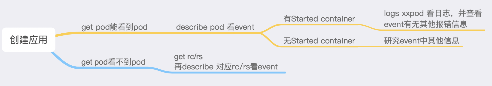
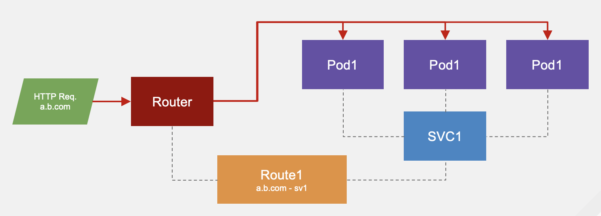

首先要知道什么是template及他的用途。  
template是某个资源或者某些资源的组合，资源是指deploymentconfig，service，route，imagestream，configmap等。   
可以将应用名、镜像名、数据库地址、密码、环境地址等不确定参数通过变量在页面发布时候传递进去，实现中间件、微服务等应用快速发布。

这是发布时选择template的页面
 
这是mariadb配置参数页面
 

openshift 已经提供了一些开箱即用的template，包含了 jboss,openjdk,nginx,php,mysql,mongo,postgres,mariadb...（openshift企业版）  
因为上面有些中间件是红帽的企业版，所以openshift社区版不包含（比如jboss,amq），template总数会少一些，不过这都没关系，看完这篇我们可以自己做哈。  
这些template位于一个名称为openshift的project下，此project下的template都是，能被所有project 看到。其他project下的是隔离的。  

以下通过几个使用template的场景，由简入难，演示如何创建及使用template，template内容解读。
1. 通过已有docker镜像发布应用，包含deploymentconfig，service，route
2. 制作基于nfs 的pv pvc持久化存储模板，通过模板发布pv pvc，并可以将他挂载到第一步发布的应用
3. 通过openshift s2i，实现源码编译自动发布springlcoud微服务应用
4. 将helm中应用的转化为template

### 场景一 通过已有docker镜像发布应用
已经制作好了应用镜像，通过openshift web 页面实现发布，并能够访问

```bash


```


### template 内容解读


### 通过template 发布服务


### 发布demo
本篇将演示几个template案例，由简入难，实现以下能力：
1. 通过已有docker镜像发布应用，包含deploymentconfig，service，route
2. 制作基于nfs 的pv pvc持久化存储模板，通过模板发布pv pvc，并可以将他挂载到第一步发布的应用
3. 通过openshift s2i，实现源码编译自动发布springlcoud微服务应用
4. 将helm中应用的转化为template


分享一些本人在k8s openshift项目中积累的一些异常诊断方法。 本文主要描述问题解决流程和思路，针对应用发布/运行异常、访问异常，会插入一些场景。
分两部分  
1. 应用发布后运行异常，即pod 无法正常启动或者启动后无限重启  
2. 应用运行正常，pod 状态是running，但是无法通过ingress，nodeport，router等方式访问  

### 一些技巧写在前面
应该能够在平时运维上提高一些效率  
a. kubectl 命令table自动补全  

```bash
echo 'source <(kubectl completion bash)' >>/etc/profile
source  /etc/profile

# mac
echo 'source <(kubectl completion zsh)' >> ~/.zshrc
source  ~/.zshrc
```

b. 切换namespace/project  
```bash
# 使用非default namespace，先写 -n xxx ,不影响table补全 xxx
kubectl -n kube-system get deploy
kubectl -n kube-system describe pod xxx

# 如果长期在某个namespace下操作，可以设置默认namespace
kubectl config set-context --current --namespace=kube-system
kubectl get pod   #看到的都是kube-system下的pod

# 如果是openshift，直接oc project 可以切换
oc project openshift-infra

```


c. 应用迁移的时候配置文件由简到繁  
不要一开始就一古脑把readiness，liveness，resource通通配上，会让你在排查故障时多走弯路。 最开始运行的时候只要镜像、端口、必要的环境变量或者存储。

### 应用运行异常整体处理流程

简单说就是看pod event，pod start了，看pod log为主，但是也有可能是liveness 失败导致了反复重启，event也要看
容器未出现start，看event,存储挂载失败有时候要等几分钟才会出现event

图中每个操作默认第一个命令是kubectl,如kubectl describe pod xxx
以下详述各步骤操作缘由和可能引起的原因。
**查看pod 及控制器event的方法是 kubectl describe pod podname-xx  及 kubectl describe deploy deployname-xxx, 看pod日志是 kubectl logs pod-name ，如果pod内多个容器，kubectl logs pod-name -c container-name**
另外，如果deploy，dc，pod中event都是空空如也，get rs,rc 看看他们的event，或许有新发现。 rs rc为deploy，dc的二级控制器，用于版本管理。

### kubectl get pod 能看到pod
#### pod event 无start container
A. pod状态处于pending  
pod未被成功调度到node节点，通过查看pod event 都能够找到原因  
下面列几个常见报错  
a. 资源不足  
```bash
kubectl apply -f https://raw.githubusercontent.com/cai11745/k8s-ocp-yaml/master/yaml-file/troubleshooting/demo-resources-limit.yaml
# kubectl get pod
NAME                                    READY   STATUS    RESTARTS   AGE
demo-resources-limit-7698bb955f-ldtgk   0/1     Pending   0          2m7s

# kubectl describe pod demo-resources-limit-7698bb955f-ldtgk
Events:
  Type     Reason            Age   From               Message
  ----     ------            ----  ----               -------
  Warning  FailedScheduling  3m3s  default-scheduler  0/1 nodes are available: 1 Insufficient cpu, 1 Insufficient memory.
  #内容解读一共1个node节点，0个node满足资源需求，1个不满足cpu，1个不满足内存。 
```
解决方法
```bash
# 手动修改deploy，kubectl edit deploy demo-resources-limit 
# 或者通过yaml文件来更新应用
kubectl apply -f https://raw.githubusercontent.com/cai11745/k8s-ocp-yaml/master/yaml-file/troubleshooting/demo-resources-limit-update.yaml
```

b. 使用了node selector，但是node节点未设置label
```bash
https://raw.githubusercontent.com/cai11745/k8s-ocp-yaml/master/yaml-file/troubleshooting/demo-node-selector.yaml

# kubectl get pod
NAME                                  READY   STATUS    RESTARTS   AGE
demo-node-selector-6cd7c5474f-whct6   0/1     Pending   0          72s
# kubectl describe pod demo-node-selector-6cd7c5474f-whct6 
Node-Selectors:  nodetest=yeyeye
Tolerations:     node.kubernetes.io/not-ready:NoExecute for 300s
                 node.kubernetes.io/unreachable:NoExecute for 300s
Events:
  Type     Reason            Age                    From               Message
  ----     ------            ----                   ----               -------
  Warning  FailedScheduling  2m50s (x2 over 2m50s)  default-scheduler  0/1 nodes are available: 1 node(s) didn't match node selector.

# deploy 配置了node selector，找不到对应label的node
# 解决方法，修改deploy中node selector或者给node 加上label
# kubectl get node --show-labels
NAME     STATUS   ROLES    AGE    VERSION   LABELS
ubuntu   Ready    master   223d   v1.13.1   beta.kubernetes.io/arch=amd64,beta.kubernetes.io/os=linux,kubernetes.io/hostname=ubuntu,node-role.kubernetes.io/master=

# kubectl label nodes ubuntu nodetest=yeyeye
node/ubuntu labeled

# kubectl get pod
NAME                                  READY   STATUS    RESTARTS   AGE
demo-node-selector-6cd7c5474f-whct6   1/1     Running   0          5m58s
```

c. 存储挂载失败
**这种情况在对接ceph，glusterfs的时候很有可能出现，可能是因为参数配置错误或者node节点未安装相应的client服务。**
**需要注意的是 创建pvc pv 并bond成功，并不能说明存储配置正确，此时是不校验存储可用性的，只有pod创建的时候，才会去真正挂载，此时才能确认存储是否可用。**
创建pv pvc，并创建一个deploy 使用pvc。 pv中是我的nfs 地址，若测试，需修改成自己的
```bash
kubectl apply -f https://raw.githubusercontent.com/cai11745/k8s-ocp-yaml/master/yaml-file/troubleshooting/demo-pv-pvc.yaml
kubectl apply -f https://raw.githubusercontent.com/cai11745/k8s-ocp-yaml/master/yaml-file/troubleshooting/demo-volume.yaml

# 查看pod event

Events:
  Type     Reason       Age   From               Message
  ----     ------       ----  ----               -------
  Normal   Scheduled    20s   default-scheduler  Successfully assigned troubleshot/demo-volume-5f974bf75c-vmpmp to ubuntu
  Warning  FailedMount  19s   kubelet, ubuntu    MountVolume.SetUp failed for volume "demo-pv" : mount failed: exit status 32
Mounting command: systemd-run
Mounting arguments: --description=Kubernetes transient mount for /var/lib/kubelet/pods/4ae14be1-b1f4-11e9-8cb3-001c4209f822/volumes/kubernetes.io~nfs/demo-pv --scope -- mount -t nfs 192.168.4.130:/opt/add-dev/nfs/ /var/lib/kubelet/pods/4ae14be1-b1f4-11e9-8cb3-001c4209f822/volumes/kubernetes.io~nfs/demo-pv
Output: Running scope as unit run-r7d15a31341454888b9a3d471611e827f.scope.
mount: wrong fs type, bad option, bad superblock on 192.168.4.130:/opt/add-dev/nfs/,
       missing codepage or helper program, or other error
       (for several filesystems (e.g. nfs, cifs) you might
       need a /sbin/mount.<type> helper program)

```
这个报错是没有安装nfs-client
每个node节点apt-get install nfs-utils 
重建pod
```bash
# kubectl get pod
NAME                           READY   STATUS              RESTARTS   AGE
demo-volume-5f974bf75c-tpkxv   0/1     ContainerCreating   0          3m48s

# kubectl describe pod demo-volume-5f974bf75c-tpkxv 
Events:
  Type     Reason       Age    From               Message
  ----     ------       ----   ----               -------
  Normal   Scheduled    2m19s  default-scheduler  Successfully assigned troubleshot/demo-volume-5f974bf75c-tpkxv to ubuntu
  Warning  FailedMount  16s    kubelet, ubuntu    Unable to mount volumes for pod "demo-volume-5f974bf75c-tpkxv_troubleshot(45985214-b1f6-11e9-8cb3-001c4209f822)": timeout expired waiting for volumes to attach or mount for pod "troubleshot"/"demo-volume-5f974bf75c-tpkxv". list of unmounted volumes=[share]. list of unattached volumes=[share default-token-2msph]
  Warning  FailedMount  13s    kubelet, ubuntu    MountVolume.SetUp failed for volume "demo-pv" : mount failed: exit status 32
Mounting command: systemd-run
Mounting arguments: --description=Kubernetes transient mount for /var/lib/kubelet/pods/45985214-b1f6-11e9-8cb3-001c4209f822/volumes/kubernetes.io~nfs/demo-pv --scope -- mount -t nfs 192.168.4.130:/opt/add-dev/nfs/ /var/lib/kubelet/pods/45985214-b1f6-11e9-8cb3-001c4209f822/volumes/kubernetes.io~nfs/demo-pv
Output: Running scope as unit run-r179d447154fc42fa9f1108382cf846df.scope.
mount.nfs: Connection timed out
```
查看event，报错不一样了，连接错误，因为，我写了错误的nfs ip，实际ip是192.168.4.133 ，修改yaml后把pv pvc删了重建，pod删了重建即可

```bash
# kubectl get pod
NAME                          READY   STATUS    RESTARTS   AGE
demo-volume-78d654c4d-2cwdx   1/1     Running   0          6m22s
# kubectl exec -it demo-volume-78d654c4d-2cwdx bash
root@demo-volume-78d654c4d-2cwdx:/usr/local/tomcat# df -h
Filesystem                      Size  Used Avail Use% Mounted on
overlay                          48G   17G   32G  35% /
tmpfs                            64M     0   64M   0% /dev
tmpfs                            16G     0   16G   0% /sys/fs/cgroup
192.168.4.133:/opt/add-dev/nfs  100G   62G   39G  62% /tmp
/dev/mapper/centos-root          48G   17G   32G  35% /etc/hosts
shm                              64M     0   64M   0% /dev/shm
tmpfs                            16G   12K   16G   1% /run/secrets/kubernetes.io/serviceaccount
tmpfs                            16G     0   16G   0% /proc/acpi
tmpfs                            16G     0   16G   0% /proc/scsi
tmpfs                            16G     0   16G   0% /sys/firmware
```
现在都正常了，进入容器 df -h 查看挂载ok

B. pod状态处于 ImagePullBackOff或者 ErrImagePull  
这个报错很明显，镜像拉取失败，通过 kubectl get pod -owide 查看pod 所在node节点，在node节点上手动docker pull 试试，或者是外网的镜像比如 gcr.io 可能需要自己手动搭梯子  
另外需要注意，如果使用的是自己搭建的仓库，不是https的，而pod event 中镜像地址却是https:// 开头，说明你docker 配置中少了 Insecure Registries 的配置


#### pod event 有 start container
event出现start container，说明pod已经调度成功，镜像拉取成功，存储挂载成功（不代表读写权限正常）  
但是可能因为健康检查配置不当或者容器启动脚本、存储权限、运行权限的原因导致启动失败而反复重启。  
首先还是kubectl describe pod 看event，若没有报错内容，则查看pod log
A.  pod liveness 监测失败
首先需要理解liveness的功能，当liveness 监测失败次数达到设定值的时候，就会重启容器。这种原因导致的容器重启原因在event中能够很明确的获取到，修改相应设定即可，或延迟init时间，或调整监测参数、端口。解决没有什么难度，而且遇到的也相对较少。
```bash

# kubectl get pod -owide
NAME                                  READY   STATUS    RESTARTS   AGE     IP           NODE     NOMINATED NODE   READINESS GATES
demo-liveness-fail-6b47f5bc74-n8qj4   1/1     Running   2          3m54s   10.68.0.56   ubuntu   <none>           <none>
# kubectl describe pod demo-liveness-fail-6b47f5bc74-n8qj4
  Normal   Pulling    2m42s (x4 over 4m49s)  kubelet, ubuntu    pulling image "tomcat"
  Warning  Unhealthy  2m42s (x3 over 2m48s)  kubelet, ubuntu    Liveness probe failed: HTTP probe failed with statuscode: 404
  Normal   Killing    2m42s                  kubelet, ubuntu    Killing container with id docker://demo-liveness-fail:Container failed liveness probe.. Container will be killed and recreated.
  Normal   Pulled     2m22s (x2 over 3m30s)  kubelet, ubuntu    Successfully pulled image "tomcat"
  Normal   Created    2m22s (x2 over 3m30s)  kubelet, ubuntu    Created container
  Normal   Started    2m21s (x2 over 3m30s)  kubelet, ubuntu    Started container
  Warning  Unhealthy  92s (x3 over 98s)      kubelet, ubuntu    Liveness probe failed: Get http://10.68.0.56:8080/healthz: net/http: request canceled (Client.Timeout exceeded while awaiting headers)
```
可以看到pod已经重启2次，event中有明确报错信息，对于liveness或者readiness的错误，手动访问下配置的端口或url或者command，测试下能否成功。
```bash
# 更新yaml文件，因为服务不存在/healthz的访问路径，把监测url /healthz 改为/docs
kubectl apply -f https://raw.githubusercontent.com/cai11745/k8s-ocp-yaml/master/yaml-file/troubleshooting/demo-liveness-fail-update.yaml

# kubectl get pod
NAME                                  READY   STATUS    RESTARTS   AGE
demo-liveness-fail-766f9df949-b68wr   1/1     Running   0          10m
```

B. pod 启动异常导致反复重启
**这种情况是非常常见的**
这种基本是启动脚本、权限之类问题引起。
基本思路是describe pod 看event，同时观察log。
首先 describe pod 看event 以及  Last State/Message 会有一些有用信息。

a. **注意 Exit Code，如果是0**，那说明pod是正常运行退出的，你没有设置启动脚本或者启动脚本有误，一下就执行完了，pod认为启动脚本已经执行完成，会吧container杀掉，而pod的重启策略是一直重启 restartPolicy: Always ，你就会看到你的pod在不停重启。
比如
```bash
# 没有设置容器启动脚本，因为centos:7镜像默认没有启动脚本
 kubectl run demo-centos --image=centos:7 

 # 或者给他一个很快就能执行完成的启动命令，也会反复重启
kubectl run demo-centos2 --image=centos:7  --command ls /

# 换这个，短期内是不会重启了
kubectl run demo-centos3 --image=centos:7  --command sleep 36000

# 这个，基本是永远不重启了，就是别让他闲着
kubectl run demo-centos4 --image=centos:7  --command tailf /var/log/lastlog
```

b. **注意 Exit Code，如果不是0**
那么可能是，**你的启动参数错了**
```bash
kubectl run demo-centos2 --image=centos:7  --command wahaha
kubectl describe pod demo-centos5-7fc7f8bccc-zpzct 

    Last State:     Terminated
      Reason:       ContainerCannotRun
      Message:      OCI runtime create failed: container_linux.go:348: starting container process caused "exec: \"wahaha\": executable file not found in $PATH": unknown
      Exit Code:    127
```

c. **或者你的存储权限不对**，此处为挂载的nfs server
```bash
# nfs server 参数，默认root_squash 是on
# cat /etc/exports
/opt/add-dev/nfs/ *(rw,sync)
```
创建pv pvc 和应用
```bash
kubectl apply -f https://raw.githubusercontent.com/cai11745/k8s-ocp-yaml/master/yaml-file/troubleshooting/demo-mysql-pv-pvc.yaml
kubectl apply -f https://raw.githubusercontent.com/cai11745/k8s-ocp-yaml/master/yaml-file/troubleshooting/demo-mysql-volume.yaml
```

这种情况下会出现存储权限报错
```bash
# kubectl get pod
NAME                                 READY   STATUS             RESTARTS   AGE
demo-mysql-volume-75fdc55cd5-4mxkp   0/1     CrashLoopBackOff   7          13m
[root@master1 troubleshooting]# kubectl logs demo-mysql-volume-75fdc55cd5-4mxkp 
chown: changing ownership of '/var/lib/mysql/': Operation not permitted

# 修改下nfs server的权限，重启nfs-server
# cat /etc/exports
/opt/add-dev/nfs/ *(rw,sync,no_root_squash)

# kubectl delete pod demo-mysql-volume-75fdc55cd5-4mxkp 
# kubectl get pod
NAME                                 READY   STATUS    RESTARTS   AGE
demo-mysql-volume-75fdc55cd5-l5bfh   1/1     Running   0          5m27s
root@demo-mysql-volume-75fdc55cd5-l5bfh:/# df -h
Filesystem                      Size  Used Avail Use% Mounted on
overlay                          48G   17G   31G  36% /
tmpfs                            64M     0   64M   0% /dev
tmpfs                            16G     0   16G   0% /sys/fs/cgroup
/dev/mapper/centos-root          48G   17G   31G  36% /etc/hosts
shm                              64M     0   64M   0% /dev/shm
192.168.4.133:/opt/add-dev/nfs  100G   63G   38G  63% /var/lib/mysql
tmpfs                            16G   12K   16G   1% /run/secrets/kubernetes.io/serviceaccount
tmpfs                            16G     0   16G   0% /proc/acpi
tmpfs                            16G     0   16G   0% /proc/scsi
tmpfs                            16G     0   16G   0% /sys/firmware
```
d. **或者运行权限问题**
本项测试基于openshift  
在新部署完成的openshift中，首次运行docker.io 上的nginx redis都会失败
和openshift Security Context Constraint（SCC）有关，SCC 用于控制访问系统资源的权限
oc get scc 可以查看所有，默认的scc是  restricted，详细的对比可以oc describe scc 查看
基本情况是privileged > anyuid > restricted
restricted 必须运行在特定的user id范围，root肯定不行，及hostnetwork，hostvolume 等权限受限

举个栗子，新建一个project，运行一个docker.io 上的nginx  
```bash
# oc new-project test1
# oc run nginx --image=nginx --port=80
# oc get pod
NAME            READY     STATUS    RESTARTS   AGE
nginx-1-hx8gj   0/1       Error     0          10s
# oc logs nginx-1-hx8gj 
2019/07/31 14:33:26 [warn] 1#1: the "user" directive makes sense only if the master process runs with super-user privileges, ignored in /etc/nginx/nginx.conf:2
nginx: [warn] the "user" directive makes sense only if the master process runs with super-user privileges, ignored in /etc/nginx/nginx.conf:2
2019/07/31 14:33:26 [emerg] 1#1: mkdir() "/var/cache/nginx/client_temp" failed (13: Permission denied)
nginx: [emerg] mkdir() "/var/cache/nginx/client_temp" failed (13: Permission denied)
```
报错了，用户权限不足

解决方法1: 
由于pod 的默认 serviceaccount 叫default，我们把default 加到scc anyuid 里面，那这个project下的所有pod都将具备 scc anyuid权限，这种方式是比较暴力的，不建议这么操作。建议按照方法2
```bash
oc adm policy add-scc-to-user anyuid -z default
oc rollout latest nginx   #更新nginx
# oc get pod
NAME            READY     STATUS    RESTARTS   AGE
nginx-2-q86bv   1/1       Running   0          49s
```

解决方法2：
新建一个serviceaccount，将他加入到scc anyuid，然后指定需要特权服务的应用来使用这个serviceaccount，这样可以避免所有pod 都具备anyuid权限
新起一个project做测试
```bash
oc new-project test2
oc run nginx2 --image=nginx --port=80
oc get pod

oc create serviceaccount ngroot
oc adm policy add-scc-to-user anyuid -z ngroot
oc patch dc/nginx2 --patch '{"spec":{"template":{"spec":{"serviceAccountName": "ngroot"}}}}'

# oc get pod
NAME             READY     STATUS    RESTARTS   AGE
nginx2-2-mkrdp   1/1       Running   0          12s
```
解决方法3：
我们按照scc restricted 复制一个，只给他增加 nginx 需要的权限
```bash
首先导出scc restricted 为yaml文件，并copy一份
oc get scc restricted --export -o yaml > restricted.yaml 
cp restricted.yaml restricted-ng.yaml

vim restricted-ng.yaml
修改   name:  把restricted 改为restricted-ng
修改 runAsUser: 把 MustRunAsRange 修改为 RunAsAny
修改 groups: 把 system:authenticated 一行删掉，不然这个scc会把所有project的默认scc给改了
修改 priority:  null 改成 5   //优先级要高于默认restricted
我改好的restricted-ng.yaml 在 https://raw.githubusercontent.com/cai11745/k8s-ocp-yaml/master/yaml-file/troubleshooting/restricted-ng.yaml

导入新的scc
oc apply -f restricted-ng.yaml 
oc get scc   

创建新的project和应用用于测试
oc new-project test3
oc run nginx3 --image=nginx --port=80

创建新的serviceaccount并使用上面创建的scc
oc create serviceaccount ng3root
oc adm policy add-scc-to-user restricted-ng -z ng3root
oc patch dc/nginx3 --patch '{"spec":{"template":{"spec":{"serviceAccountName": "ng3root"}}}}'

[root@origin311 ~]# oc get pod
NAME             READY     STATUS    RESTARTS   AGE
nginx3-2-wsk97   1/1       Running   0          20s
[root@origin311 ~]# oc logs nginx3-2-wsk97 
2019/07/31 15:52:46 [emerg] 7#7: setgid(101) failed (1: Operation not permitted)
2019/07/31 15:52:46 [alert] 1#1: worker process 7 exited with fatal code 2 and cannot be respawned

发现还有一个报错，没有setgid权限
oc edit scc restricted-ng 
修改 requiredDropCapabilities: 这项，这个里面是被限制的权限
把 - SETUID  -SETGID 删掉，两个都删了，若只删setgid，下一步pod就是接着setuid的报错

oc rollout latest nginx3
[root@origin311 ~]# oc get pod -owide
NAME             READY     STATUS    RESTARTS   AGE       IP             NODE                    NOMINATED NODE
nginx3-4-5bdpj   1/1       Running   0          1m        10.128.0.126   origin311.localpd.com   <none>
[root@origin311 ~]# oc logs nginx3-4-5bdpj 
[root@origin311 ~]# 

没报错就是正常了，测试下请求没问题
[root@origin311 ~]# curl 10.128.0.126
<!DOCTYPE html>
<html>
<head>
<title>Welcome to nginx!</title>
```

FAQ: 
1. 如果你默认scc 不小心调乱了，可以用这个命令重置  oc adm policy reconcile-sccs --confirm
2. SCC 优先级：一个 sa user 可以被加到多的 scc 当中。当一个 service account user 有多个 SCC 可用时，其 scc 按照下面的规则排序
最高优先级的scc排在最前面。默认地，对于 cluster admin 角色的用户的 pod，anyuid scc 会被授予最高优先级，排在最前面。这会允许集群管理员能够以任意 user 运行 pod，而不需要指定 pod 的 SecurityContext 中的 RunAsUser 字段。
如果优先级相同，scc 将从限制最高的向限制最少的顺序排序。
如果优先级和限制都一样，那么将按照名字排序。


### kubectl get pod 看不到pod
以下描述其中一种会导致发布应用看不到pod的场景。
好像是cka的一道考题。一下子涵盖了quota，limit，deploy的版本管理几个内容。
主要考察对deployment子控制器rs的了解及对quota limit了解。
通过yaml文件创建一个namespace，里面包含了quota和limit
```bash
kubectl apply -f https://raw.githubusercontent.com/cai11745/k8s-ocp-yaml/master/yaml-file/troubleshooting/demo-ns-quota-limit.yaml
```

然后在这个namespace下创建的应用都看不到pod

```bash
# kubectl -n demo-test run tomtest --image=tomcat
# kubectl -n demo-test get deploy
NAME      READY   UP-TO-DATE   AVAILABLE   AGE
tomtest   0/1     0            0           3m3s
# kubectl -n demo-test get pod
No resources found.
# kubectl -n demo-test describe deployments tomtest 
Events:
  Type    Reason             Age   From                   Message
  ----    ------             ----  ----                   -------
  Normal  ScalingReplicaSet  4m2s  deployment-controller  Scaled up replica set tomtest-865b47b7df to 1
```

可以从deploy的event中看到，reason ScalingReplicaSet， replicaset是deploy的二级控制器，用于版本管理，简写rs，我们需要去查看rs 的event
（openshift deploymenyconfig的二级控制器是replicationcontrollers，简写rc）
```bash
# kubectl -n demo-test get rs
NAME                 DESIRED   CURRENT   READY   AGE
tomtest-865b47b7df   1         0         0       8m53s
# kubectl -n demo-test describe rs tomtest-865b47b7df 
  Warning  FailedCreate  9m14s                  replicaset-controller  Error creating: pods "tomtest-865b47b7df-hxwr6" is forbidden: exceeded quota: myquota, requested: cpu=2,memory=2Gi, used: cpu=0,memory=0, limited: cpu=1,memory=1G
  Warning  FailedCreate  3m47s (x8 over 9m12s)  replicaset-controller  (combined from similar events): Error creating: pods "tomtest-865b47b7df-f7mcx" is forbidden: exceeded quota: myquota, requested: cpu=2,memory=2Gi, used: cpu=0,memory=0, limited: cpu=1,memory=1G

```
可以看到rs的event中有明确报错信息。
原因是这个namespace 设置了quota，即资源上线为1核1G。 同时设置了limitranges 为2核2G，即这个namespace下创建的容器，每个的默认资源都为2核2G，资源不足导致了pod未创建。

scc限制了volume权限，导致pod无法直接挂载nfs也会出现这种现象，看不到pod。

 ### 应用运行正常，但是无法访问
接上篇，继续解读应用无法访问的场景。只要捋清各个访问方式的原理及走向，问题迎刃而解。
前提：应用运行正常，在集群内部可以通过pod ip 访问应用。
场景如下：
集群外访问集群内应用：最常用的两种方式，ingress/route 访问， nodeport访问
集群内应用互相访问：通过servicename 访问

#### 集群外访问集群内应用 ingress/route
ingress/route 分别是k8s/openshift常用的负载方式，常用来作为应用的负载均衡。  
ingress controller 是k8s的应用负载均衡器，内部是nginx，会通过nodeselector 方式部署在特定的几个node节点，使用hostnetwork，默认监听node节点80 443端口,支持4层 7层负载，可以卸载证书。会将ingress 规则写入配置文件。  
openshift中的负载均衡器叫router，内部是haproxy，默认部署在default namespace，infra 节点，hostnetwork方式，默认80 443端口，支持7层，可以卸载证书。  

以openshift 为例创建一个应用及route
```bash
[root@master ~]# oc run tomtest --image=tomcat --port=8080
deploymentconfig.apps.openshift.io/tomtest created
[root@master ~]# oc expose dc tomtest
service/tomtest exposed
[root@master ~]# oc expose svc tomtest
route.route.openshift.io/tomtest exposed

[root@master ~]# oc get route
NAME      HOST/PORT                           PATH      SERVICES   PORT      TERMINATION   WILDCARD
tomtest   tomtest-demo.apps.origin311sz.com             tomtest    8080                    None
# 自动创建了一个域名，指向tomtest 这个service 8080端口
# ingress类似，域名需要自己指定
# 后续在配置dns或者hosts之后，可以通过域名访问到应用
```

流量走向
**流量走router/ingress controller 通过容器网络直接到pod，不走service ip！！！ 不走service ip！！！不走service ip！！！**
service 只作为同步应用后端的pod ip作用，见下图这是router，ingress 也是这样


router的配置信息进入到router容器中，有个haproxy配置文件，内容很清晰。
ingress的进入ingress controller容器，nginx.conf中可以查看server信息，看不到backend 应用pod ip，用dbg命令可以看，如下   
```bash
# 先创建deployment，svc，ingress
[root@master ~]# kubectl -n ingress-nginx exec -it nginx-ingress-controller-86b96b86fb-45kn8 bash
www-data@node1:/etc/nginx$ /dbg backends list
default-tom-8080
upstream-default-backend
www-data@node1:/etc/nginx$
www-data@node1:/etc/nginx$ /dbg backends get default-tom-8080
{
  "endpoints": [
    {
      "address": "10.250.11.75",
      "port": "8080"
    },
    {
      "address": "10.250.11.76",
      "port": "8080"
    }
  ],
  ......
```

那么异常分析流程就很清晰了：
1. 首先确认域名解析正常，通过nslookup，dig工具确认域名是解析到了router/ingress controller 所在的node节点ip。 因为使用的hostnetwork，所以router/ingress controller 的ip也就是所在node节点的ip。
或者没有使用dns解析，那么本地hosts 需要手动配置下，将域名解析到 router/ingress controller 的ip
2. 确认 router/ingress controller  容器运行正常，看下容器日志。并确认网络为hostnetwork，oc get pod -owide 要看到ip是node节点ip
3. 确认 router/ingress controller 节点能够访问异常应用的pod ip，若异常，则排查容器网络 calico或者openvswitch等。

#### 集群外访问集群内应用 nodeport
nodeport方式不依赖于router/ingress controller。 是配置在service中。配置后，访问任意节点IP（包含master）加nodeport 端口，即可访问到应用。
端口默认范围： 30000~32767

```bash
# kubectl run tomnp --image=tomcat --port=8080 --replicas=3
[root@master ~]# kubectl expose deploy tomnp --type=NodePort
service/tomnp exposed
[root@master ~]# kubectl get svc
NAME    TYPE       CLUSTER-IP       EXTERNAL-IP   PORT(S)          AGE
tomnp   NodePort   10.102.171.245   <none>        8080:31086/TCP   9s
# kubectl get po -owide
NAME                    READY   STATUS    RESTARTS   AGE    IP             NODE      NOMINATED NODE   READINESS GATES
tomnp-679765679-68zx7   1/1     Running   0          102s   10.244.0.49    master1   <none>           <none>
tomnp-679765679-d9nwb   1/1     Running   0          102s   10.244.1.114   node1     <none>           <none>
tomnp-679765679-whzhm   1/1     Running   0          102s   10.244.0.50    master1   <none>           <none>
```

自动分配了一个端口31086，也可以手动指定。那么访问 任意节点ip:31086 即可访问应用。  
原理：创建service后，kube-proxy会写入一些规则到每个节点的iptables，使得访问节点的31086端口的流量转发到各个pod。kube-proxy容器在kube-system namespace下。可以通过查询iptables来缕清楚规则。  
```bash
# 首先通过nodeport 31086 访问会进入下面链路
# iptables -S -t nat |grep 31086
-A KUBE-NODEPORTS -p tcp -m comment --comment "demo-test/tomnp:" -m tcp --dport 31086 -j KUBE-MARK-MASQ
-A KUBE-NODEPORTS -p tcp -m comment --comment "demo-test/tomnp:" -m tcp --dport 31086 -j KUBE-SVC-MQE7U74K2IT7EWQJ

# 查看svc对应的链，有0.333概率进入KUBE-SEP-KZ2UNP3ZNMYH722J 
# 0.67概率的0.50 会进入 KUBE-SEP-ITOYRBWPRT5JVIJ6
# 还未命中的都进入 KUBE-SEP-7RMBKNPQ7TIOQL4S，算下来每个概率都是0.33
# iptables -S -t nat |grep KUBE-SVC-MQE7U74K2IT7EWQJ
-N KUBE-SVC-MQE7U74K2IT7EWQJ
-A KUBE-NODEPORTS -p tcp -m comment --comment "demo-test/tomnp:" -m tcp --dport 31086 -j KUBE-SVC-MQE7U74K2IT7EWQJ
-A KUBE-SERVICES -d 10.102.171.245/32 -p tcp -m comment --comment "demo-test/tomnp: cluster IP" -m tcp --dport 8080 -j KUBE-SVC-MQE7U74K2IT7EWQJ
-A KUBE-SVC-MQE7U74K2IT7EWQJ -m statistic --mode random --probability 0.33332999982 -j KUBE-SEP-KZ2UNP3ZNMYH722J
-A KUBE-SVC-MQE7U74K2IT7EWQJ -m statistic --mode random --probability 0.50000000000 -j KUBE-SEP-ITOYRBWPRT5JVIJ6
-A KUBE-SVC-MQE7U74K2IT7EWQJ -j KUBE-SEP-7RMBKNPQ7TIOQL4S

# 三个kube-sep分别对应三个pod地址
[root@master1 ~]# iptables -S -t nat |grep KUBE-SEP-KZ2UNP3ZNMYH722J
-N KUBE-SEP-KZ2UNP3ZNMYH722J
-A KUBE-SEP-KZ2UNP3ZNMYH722J -s 10.244.0.49/32 -j KUBE-MARK-MASQ
-A KUBE-SEP-KZ2UNP3ZNMYH722J -p tcp -m tcp -j DNAT --to-destination 10.244.0.49:8080
[root@master1 ~]# iptables -S -t nat |grep KUBE-SEP-ITOYRBWPRT5JVIJ6
-N KUBE-SEP-ITOYRBWPRT5JVIJ6
-A KUBE-SEP-ITOYRBWPRT5JVIJ6 -s 10.244.0.50/32 -j KUBE-MARK-MASQ
-A KUBE-SEP-ITOYRBWPRT5JVIJ6 -p tcp -m tcp -j DNAT --to-destination 10.244.0.50:8080
[root@master1 ~]# iptables -S -t nat |grep KUBE-SEP-7RMBKNPQ7TIOQL4S
-N KUBE-SEP-7RMBKNPQ7TIOQL4S
-A KUBE-SEP-7RMBKNPQ7TIOQL4S -s 10.244.1.114/32 -j KUBE-MARK-MASQ
-A KUBE-SEP-7RMBKNPQ7TIOQL4S -p tcp -m tcp -j DNAT --to-destination 10.244.1.114:8080
```

异常分析：
1. 确认ip forward 是打开的
```bash
如何诊断
# 检查 ipv4 forwarding 是否开启
sysctl net.ipv4.ip_forward
# 0 意味着未开启
net.ipv4.ip_forward = 0

如何修复
# this will turn things back on a live server
sysctl -w net.ipv4.ip_forward=1
# on Centos this will make the setting apply after reboot
echo net.ipv4.ip_forward=1 >> /etc/sysconf.d/10-ipv4-forwarding-on.conf

# 验证并生效
sysctl -p
```
2. 确认node节点存在nodeport相关iptables，方法上面有，若iptables规则不正常，则检查kube-proxy容器运行状态及日志。
3. 以上都正常，那么很有可能是容器网络出问题了。排查calico容器日志，及pod，service ip段是否规划有误。

#### 集群内应用互相访问
场景： 创建deployment A，名为 tomcat，端口8080 ，创建对应service 名为tomsvc，端口 8080
创建deployment B，名为 nginx，端口80，创建对应service，名为 ngsvc， 端口 80
应用A B 互相访问使用对方servicename+端口即可。无需再通过ingress或者nodeport方式。此原理依赖于集群内部dns。（k8s 是coredns容器--之前是kubedns，openshift 是dnsmasq，是系统服务不是容器）

```bash
# kubectl run tomcat --image=tomcat --port=8080
# kubectl expose deploy tomcat --name=tomsvc
# kubectl run nginx --image=nginx --port=80
# kubectl expose deploy nginx --name=ngsvc
# kubectl get svc
NAME     TYPE        CLUSTER-IP     EXTERNAL-IP   PORT(S)    AGE
ngsvc    ClusterIP   10.108.15.66   <none>        80/TCP     15s
tomsvc   ClusterIP   10.104.225.1   <none>        8080/TCP   66s

# tomcat通过ngsvc:80 访问nginx
# kubectl exec -it tomcat-5ccb865777-xrmlv bash
root@tomcat-5ccb865777-xrmlv:/usr/local/tomcat# curl ngsvc:80
<!DOCTYPE html>
<html>
<head>
<title>Welcome to nginx!</title>
......

```

功能测试：
可以通过运行一个busybox:1.28来测试dns解析，里面带nslookup
注意用1.28的，有的版本里面nslookup不好使
```bash
# kubectl run busybox --image=busybox:1.28 --command sleep 36000
# kubectl exec -it busybox-7fc57b9d54-j4tbq sh
/ # nslookup ngsvc
Server:    10.96.0.10
Address 1: 10.96.0.10 kube-dns.kube-system.svc.cluster.local

Name:      ngsvc
Address 1: 10.108.15.66 ngsvc.demo-test.svc.cluster.local

可以看到ngsvc的完整域名是ngsvc.demo-test.svc.cluster.local
demo-test 是namespace 名称
为什么ngsvc也能解析成功，看下/etc/resolv.conf文件
nameserver 指向的是coredns的svc 地址，这没问题
主要在于search，查询主机名，因为主机名后面没有点，就认为是主机名，所以先添加search里的每一项依次组成FQDN（完全合格域名）来查询，完全合格域名查询未找到，就再认为主机名是完全合格域名来查询。
/ # cat /etc/resolv.conf
nameserver 10.96.0.10
search demo-test.svc.cluster.local svc.cluster.local cluster.local
options ndots:5

跨namespace访问，在service名称后接上namespace名称
/ # nslookup kubernetes.default
Server:    10.96.0.10
Address 1: 10.96.0.10 kube-dns.kube-system.svc.cluster.local

Name:      kubernetes.default
Address 1: 10.96.0.1 kubernetes.default.svc.cluster.local
```

所以异常处理的顺序，k8s和openshift中dns server有些差异，分开写，实现的功能是一致的：
1.1 k8s -- 确认集群内部dns服务正常，在master或者node节点上做
```bash
# nslookup kubernetes.default.svc.cluster.local 10.96.0.10
Server:		10.96.0.10
Address:	10.96.0.10#53

Name:	kubernetes.default.svc.cluster.local
Address: 10.96.0.1

域名写完成的，因为节点的/etc/resolv.conf里面是没有那些search内容的， 10.96.0.10 是coredns/kubedns的service ip
解析成功说明dns服务是正常的，反之则排查dns服务容器
```

1.2 k8s -- 确认容器内部的dns地址指向
```bash
# kubectl exec -it tomcat-5ccb865777-xrmlv bash
# cat /etc/resolv.conf
nameserver 10.96.0.10
search demo-test.svc.cluster.local svc.cluster.local cluster.local

nameserver 的地址 需要与 kubectl -n kube-system get svc kube-dns 获取的CLUSTER-IP 一致
这个nameserver 地址及 search cluster.local 是在各个节点kubelet服务中定义的。 通过systemctl status kubelet 能够追查到，文件是 /var/lib/kubelet/config.yaml
```

同时可以配合busybox:1.28的容器进行诊断

2.1 openshift -- 确认集群内部dns服务正常，在异常访问到pod所在node节点上做
```bash
因为openshift 每个节点的dns server及节点上的pod dns server都是指向这台节点的ip的，原因可以查看dnsmasq服务
[root@node1 ~]# hostname -i
192.168.1.186
[root@node1 ~]# cat /etc/resolv.conf
# nameserver updated by /etc/NetworkManager/dispatcher.d/99-origin-dns.sh
# Generated by NetworkManager
search cluster.local origin311sz.com
nameserver 192.168.1.186
[root@node1 ~]# nslookup kubernetes.default.svc.cluster.local
Server:		192.168.1.186
Address:	192.168.1.186#53

Name:	kubernetes.default.svc.cluster.local
Address: 172.30.0.1

dns能够解析service name
```

注意openshift不能关闭NetworkManager服务，部署文档都有说明。resolv.conf文件就是靠他来更新的。

2.2 openshift -- 确认容器内部的dns地址指向
nameserver地址是pod所在node的主机ip才是正确的，openshift中pod的resolv.conf 中nameserver 默认是从所在节点的/etc/resolv.conf获取，若pod中的尚未更新，重启下openshift node服务。然后delete 相关pod再看resolv.cof
```bash
# oc rsh tomtest-1-bg782
$ cat /etc/resolv.conf
nameserver 192.168.1.187
search demo.svc.cluster.local svc.cluster.local cluster.local origin311sz.com
options ndots:5

openshift node服务
systemctl status origin-node  #社区版
systemctl status atomic-openshift-node  #企业版

```

同上，同时可以配合busybox:1.28的容器进行诊断

openshift的更多dns相关的知识可以查看这篇文章。
https://www.cnblogs.com/sammyliu/p/10056035.html


故障诊断篇完结。下一篇大概是openshift template。  
本篇上下完整版本可查询github，后续若有补充会更新在这
https://github.com/cai11745/k8s-ocp-yaml/blob/master/kubernetes-docs/2019-07-27-openshift-k8s-troubleshooting.md

