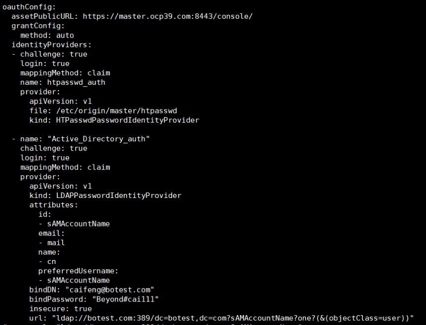
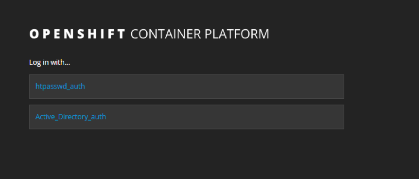
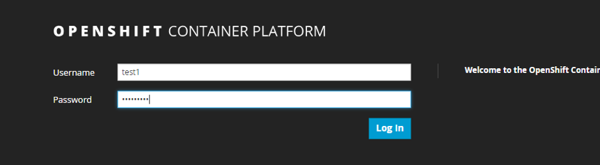
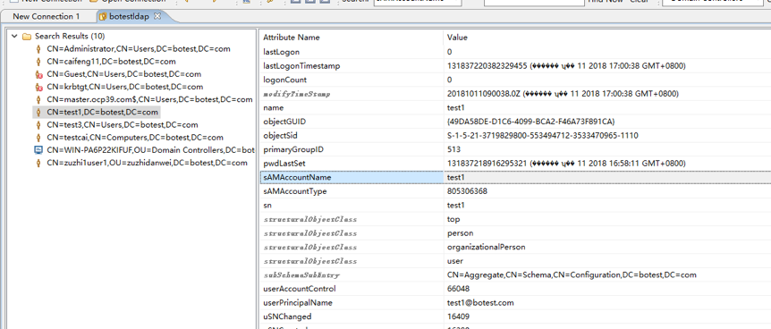
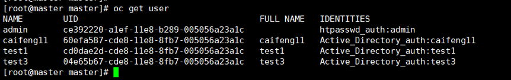
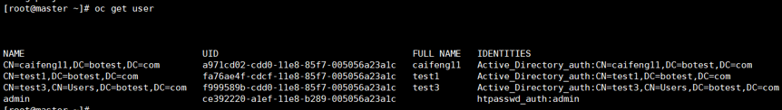
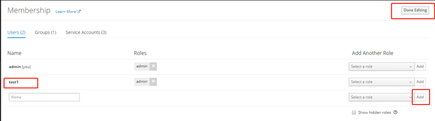
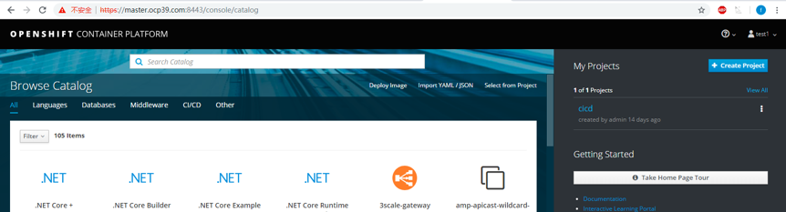

配置openshift使用AD域控作为用户登入。AD使用的也是ldap协议，在配置上稍有差异，本文主要对配置及使用中遇到的问题做了一些记录。

### 准备工作
1. openshift集群，测试过3.9和3.11
2. AD域的地址，端口，bindDN,bindPassword

### openshift 修改配置文件
修改每个master节点下/etc/origin/master/master-config.yaml
（修改前先备份）
添加Active_Directory_auth 与原来htpasswd_auth 平级
```bash
  - name: "Active_Directory_auth"
    challenge: true
    login: true
    mappingMethod: claim
    provider:
      apiVersion: v1
      kind: LDAPPasswordIdentityProvider
      attributes:
        id:
        - sAMAccountName
        email:
        - mail
        name:
        - cn
        preferredUsername:
        - sAMAccountName
      bindDN: "caifeng@botest.com"
      bindPassword: "XXXXX#cai111"
      insecure: true
      url: "ldap://botest.com:389/dc=botest,dc=com?sAMAccountName?one?(&(objectClass=user))"

```
截图如下


参数解读:（不能完全套用openshift对接ldap的参数，有几处不一样）
name： "Active_Directory_auth"  这个是在登陆页面展示的名字，可自定义
kind: LDAPPasswordIdentityProvider   ad也是用的ldap协议
id： preferredUsername: 此处和ldap不一样，不能写uid，写uid会导致无法在openshift页面添加用户
bindDN: caifeng@botest.com 这是申请的ad用户密码，普通用户应该就可以
bindPassword: "xxxxx#cai111"
url: "ldap://botest.com:389/dc=botest,dc=com?sAMAccountName?one?(&(objectClass=user))"
botest.com 是ad域的地址，389是端口
dc=botest,dc=com 域控制器的地址，如果要精准到组下面，前面还可以加ou=
sAMAccountName 这个是ad中的用户名属性，如果是ldap此处就是uid
objectClass=user 是检索条件，只查找用户

重启api服务，每个master都要做
```bash
# openshift 3.9
systemctl daemon-reload
systemctl restart atomic-openshift-master-api

# openshift 3.11, 因为3.11的api服务使用容器启动
cd /etc/origin/node/pods/
mv apiserver.yaml /tmp/
mv /tmp/apiserver.yaml .
```

### 登入测试
登陆页面选Active_Directory_auth


输入可用的AD用户密码
test1  XXXXXX  注意用户后面不要带域名

 
因为登陆是使用的这个参数 sAMAccountName
在ldaoadmin工具中可以看到，这个参数就是用户名，不带后面的域名

 

登陆成功，接入ad只确保了用户能够登陆openshift，权限需要在openshift中配置

 
登陆成功后，在后台 oc get user 能看到用户，来源于ad


问题1:
如果改了master-config里的配置信息导致登陆不了或者提示"could not create user"，后台把ad的用户删一下试试

oc delete user CN=caifeng11,DC=botest,DC=com

### 权限设置
通过管理员把test1 添加到 当前project
先输入用户名 test1
再选择权限admin或者view， 点add 
完成后点Done Editing


换成test1 登陆，可以看到赋权的project


问题2：
如果加了权限后，登陆后看不到project
后台oc get user 看下登陆的用户名称是否正常
应该是test1 这样，不应该是CN=caifeng11,DC=botest,DC=com 这种


如果是CN=caifeng11,DC=botest,DC=com
修改master-config ，修改
        id:
        - sAMAccountName
        preferredUsername:
        - sAMAccountName


