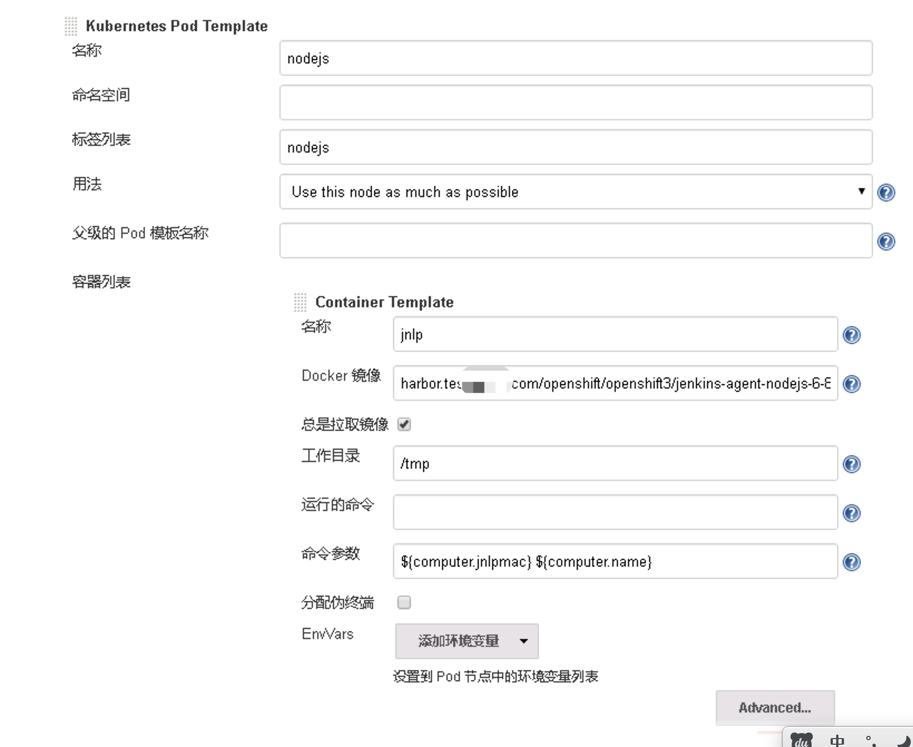
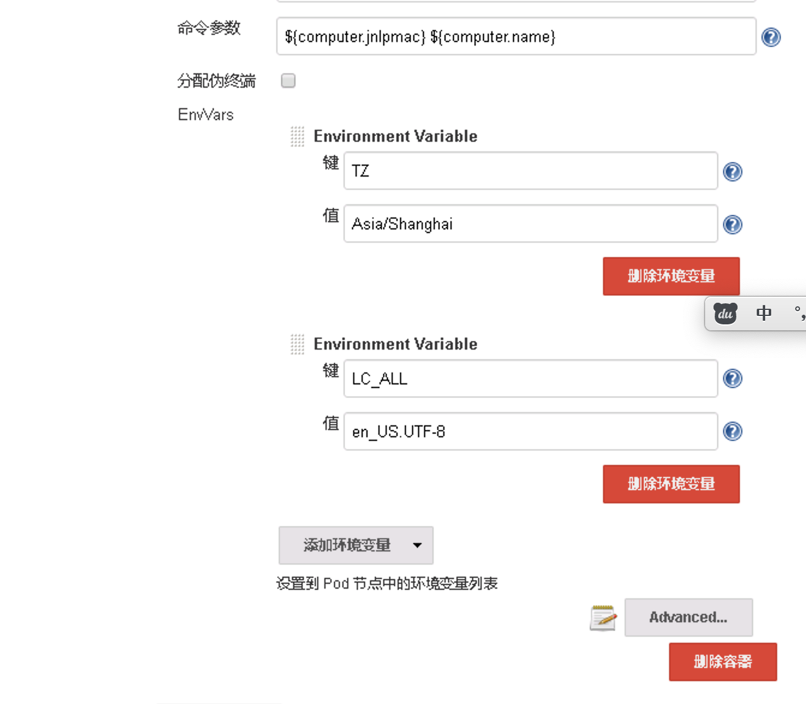
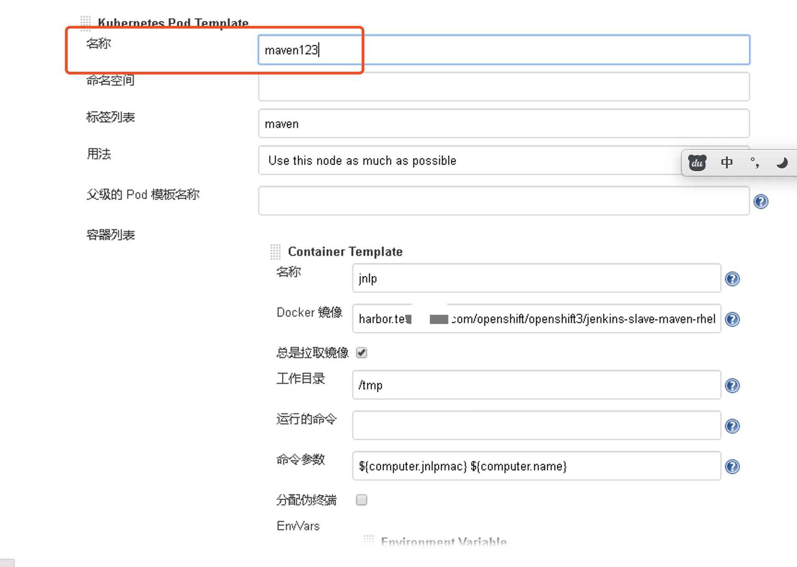

## 我们在使用openshift的时候，经常会出现每个项目一个jenkins，在项目初始化过程我们需要对slave pod做一些配置，需要在部署jenkins后通过页面修改，现在我们可以通过configmap方式快速自动的更新。

比如： 配置maven pod的存储，将maven缓存文件保存在持久化存储上，以加快下次编译速度。  
比如： 配置maven nodejs的时区，使输出日志时间准确。
比如： 配置slave pod的资源限额，避免编译过程出现OOM，因为有的应用编译过程是比较吃内存的。
比如： 配置多个slave pod，要支持jdk7，8，10，nodejs 6，8，10，12 等情况。。。

### Kubernetes Plug-in
Kubernetes Plug-in 是一个动态生成 slave pod 的插件，用于运行jenkins job，job完成后销毁pod。

此插件已经集成在openshift jenkins中，相关默认配置在jenkins初始化过程会自动处理。

slave pod 默认内置了maven 和 nodejs


如果只是变更maven和nodejs的镜像，我们在openshift project下修改jenkins的template，在env 部分新加两个环境变量 MAVEN_SLAVE_IMAGE NODEJS_SLAVE_IMAGE

TZ 时区变量是为了日志时间准确

```bash
          - name: JENKINS_SERVICE_NAME
            value: ${JENKINS_SERVICE_NAME}
          - name: JNLP_SERVICE_NAME
            value: ${JNLP_SERVICE_NAME}
          - name: ENABLE_FATAL_ERROR_LOG_FILE
            value: ${ENABLE_FATAL_ERROR_LOG_FILE}
          - name: MAVEN_SLAVE_IMAGE
            value: harbor.test.bocloud.com/openshift/openshift3/jenkins-slave-maven-rhel7:v3.11.141-settings-oraclejdk678-skope
          - name: NODEJS_SLAVE_IMAGE
            value: harbor.test.bocloud.com/openshift/openshift3/jenkins-agent-nodejs-6-8-10-12-rhel7:v3.11.141
          - name: TZ
            value: Asia/Shanghai


```

### OpenShift Sync plug-in
如果要快速便捷自定义 slave pod，openshift 提供了 OpenShift Sync plug-in 插件，此插件默认已安装。

这个插件会在jenkins 启动时候查找project下的具备以下特性的imagestream或者configmap
* imagestream 具备label  role=jenkins-slave
* imagestream tags 具备 annotation  role=jenkins-slave
* configmap 具备label  role=jenkins-slave

具备相关label 的imagestream 或者具备相关annotation 的imagestream tag，会自动更新到kubernetes plugin 配置中，可以和自带的maven与nodejs slave pod一样，直接被jenkins job调用

configmap 方式提供了与kubernetes plugin配置一致的XML格式文件，通过这种方式可以配置kubernetes plugin 支持的所有格式。

kubernetes plugin 支持的参数见插件官方
https://github.com/jenkinsci/kubernetes-plugin

以下为我们在工作中使用到的configmap，配置了资源限额、环境变量、pvc持久化卷

```bash
kind: ConfigMap
apiVersion: v1
metadata:
  name: jenkins-agent-pod-template
  labels:
    role: jenkins-slave
data:
  template1: |-
    <org.csanchez.jenkins.plugins.kubernetes.PodTemplate>
      <inheritFrom></inheritFrom>
      <name>maven</name>
      <namespace></namespace>
      <privileged>false</privileged>
      <capOnlyOnAlivePods>false</capOnlyOnAlivePods>
      <alwaysPullImage>false</alwaysPullImage>
      <instanceCap>2147483647</instanceCap>
      <slaveConnectTimeout>100</slaveConnectTimeout>
      <idleMinutes>0</idleMinutes>
      <activeDeadlineSeconds>0</activeDeadlineSeconds>
      <label>maven</label>
      <serviceAccount>jenkins</serviceAccount>
      <nodeSelector></nodeSelector>
      <nodeUsageMode>NORMAL</nodeUsageMode>
      <customWorkspaceVolumeEnabled>false</customWorkspaceVolumeEnabled>
      <workspaceVolume class="org.csanchez.jenkins.plugins.kubernetes.volumes.workspace.EmptyDirWorkspaceVolume">
        <memory>false</memory>
      </workspaceVolume>
      <volumes>
        <org.csanchez.jenkins.plugins.kubernetes.volumes.PersistentVolumeClaim>
          <mountPath>/home/jenkins/.m2/repository/</mountPath>
          <claimName>maven-m2</claimName>
          <readOnly>false</readOnly>
        </org.csanchez.jenkins.plugins.kubernetes.volumes.PersistentVolumeClaim>
      </volumes>
      <containers>
        <org.csanchez.jenkins.plugins.kubernetes.ContainerTemplate>
          <name>jnlp</name>
          <image>harbor.test.geely.com/openshift/openshift3/jenkins-slave-maven-rhel7:v3.11.141-settings-oraclejdk678-skope</image>
          <privileged>false</privileged>
          <alwaysPullImage>true</alwaysPullImage>
          <workingDir>/tmp</workingDir>
          <command></command>
          <args>${computer.jnlpmac} ${computer.name}</args>
          <ttyEnabled>false</ttyEnabled>
          <resourceRequestCpu>1</resourceRequestCpu>
          <resourceRequestMemory>2G</resourceRequestMemory>
          <resourceLimitCpu>1</resourceLimitCpu>
          <resourceLimitMemory>2G</resourceLimitMemory>
          <envVars>
            <org.csanchez.jenkins.plugins.kubernetes.model.KeyValueEnvVar>
              <key>TZ</key>
              <value>Asia/Shanghai</value>
            </org.csanchez.jenkins.plugins.kubernetes.model.KeyValueEnvVar>
            <org.csanchez.jenkins.plugins.kubernetes.model.KeyValueEnvVar>
              <key>LC_ALL</key>
              <value>en_US.UTF-8</value>
            </org.csanchez.jenkins.plugins.kubernetes.model.KeyValueEnvVar>
          </envVars>
          <ports/>
          <livenessProbe>
            <execArgs></execArgs>
            <timeoutSeconds>0</timeoutSeconds>
            <initialDelaySeconds>0</initialDelaySeconds>
            <failureThreshold>0</failureThreshold>
            <periodSeconds>0</periodSeconds>
            <successThreshold>0</successThreshold>
          </livenessProbe>
        </org.csanchez.jenkins.plugins.kubernetes.ContainerTemplate>
      </containers>
      <envVars/>
      <annotations/>
      <imagePullSecrets/>
      <nodeProperties/>
      <yaml></yaml>
      <podRetention class="org.csanchez.jenkins.plugins.kubernetes.pod.retention.Default"/>
    </org.csanchez.jenkins.plugins.kubernetes.PodTemplate>
  template2: |-
    <org.csanchez.jenkins.plugins.kubernetes.PodTemplate>
      <inheritFrom></inheritFrom>
      <name>nodejs</name>
      <namespace></namespace>
      <privileged>false</privileged>
      <capOnlyOnAlivePods>false</capOnlyOnAlivePods>
      <alwaysPullImage>false</alwaysPullImage>
      <instanceCap>2147483647</instanceCap>
      <slaveConnectTimeout>100</slaveConnectTimeout>
      <idleMinutes>0</idleMinutes>
      <activeDeadlineSeconds>0</activeDeadlineSeconds>
      <label>nodejs</label>
      <serviceAccount>jenkins</serviceAccount>
      <nodeSelector></nodeSelector>
      <nodeUsageMode>NORMAL</nodeUsageMode>
      <customWorkspaceVolumeEnabled>false</customWorkspaceVolumeEnabled>
      <workspaceVolume class="org.csanchez.jenkins.plugins.kubernetes.volumes.workspace.EmptyDirWorkspaceVolume">
        <memory>false</memory>
      </workspaceVolume>
      <volumes>
        <org.csanchez.jenkins.plugins.kubernetes.volumes.PersistentVolumeClaim>
          <mountPath>/home/jenkins/npm-cache</mountPath>
          <claimName>npm-cache</claimName>
          <readOnly>false</readOnly>
        </org.csanchez.jenkins.plugins.kubernetes.volumes.PersistentVolumeClaim>
      </volumes>
      <containers>
        <org.csanchez.jenkins.plugins.kubernetes.ContainerTemplate>
          <name>jnlp</name>
          <image>harbor.test.geely.com/openshift/openshift3/jenkins-agent-nodejs-6-8-10-12-rhel7:v3.11.141-geely</image>
          <privileged>false</privileged>
          <alwaysPullImage>true</alwaysPullImage>
          <workingDir>/tmp</workingDir>
          <command></command>
          <args>${computer.jnlpmac} ${computer.name}</args>
          <ttyEnabled>false</ttyEnabled>
          <resourceRequestCpu>1</resourceRequestCpu>
          <resourceRequestMemory>3G</resourceRequestMemory>
          <resourceLimitCpu>1</resourceLimitCpu>
          <resourceLimitMemory>3G</resourceLimitMemory>
          <envVars>
            <org.csanchez.jenkins.plugins.kubernetes.model.KeyValueEnvVar>
              <key>TZ</key>
              <value>Asia/Shanghai</value>
            </org.csanchez.jenkins.plugins.kubernetes.model.KeyValueEnvVar>
          </envVars>
          <ports/>
          <livenessProbe>
            <execArgs></execArgs>
            <timeoutSeconds>0</timeoutSeconds>
            <initialDelaySeconds>0</initialDelaySeconds>
            <failureThreshold>0</failureThreshold>
            <periodSeconds>0</periodSeconds>
            <successThreshold>0</successThreshold>
          </livenessProbe>
        </org.csanchez.jenkins.plugins.kubernetes.ContainerTemplate>
      </containers>
      <envVars/>
      <annotations/>
      <imagePullSecrets/>
      <nodeProperties/>
      <yaml></yaml>
      <podRetention class="org.csanchez.jenkins.plugins.kubernetes.pod.retention.Default"/>
    </org.csanchez.jenkins.plugins.kubernetes.PodTemplate>

```

如果不知道XML参数怎么写，可以找一个jenkins，通过页面配置好slave pod的参数，然后进入jenkins容器，配置的参数保存在这里 /var/lib/jenkins/config.xml

导入configmap，sync 插件会把configmap内容自动同步到jenkins pod template，不需要重启jenkins


需要注意几点：
1. 原来的maven nodejs配置会被覆盖，因为configmap中使用了相同的name
2. 删除configmap，会将jenkins中的两个slave pod 同步删除
3. 不要直接在 jenkins 页面中修改 slave pod的参数，因为一重启就会被configmap重置
4. 如果后面不想被configmap同步，但是想保留配置，在jenkins页面把pod template 名称改掉，就是第一个maven 或者nodejs参数
   ，然后把configmap 删了




参考文档：
openshift 官方手册
https://docs.openshift.com/container-platform/3.11/using_images/other_images/jenkins.html
