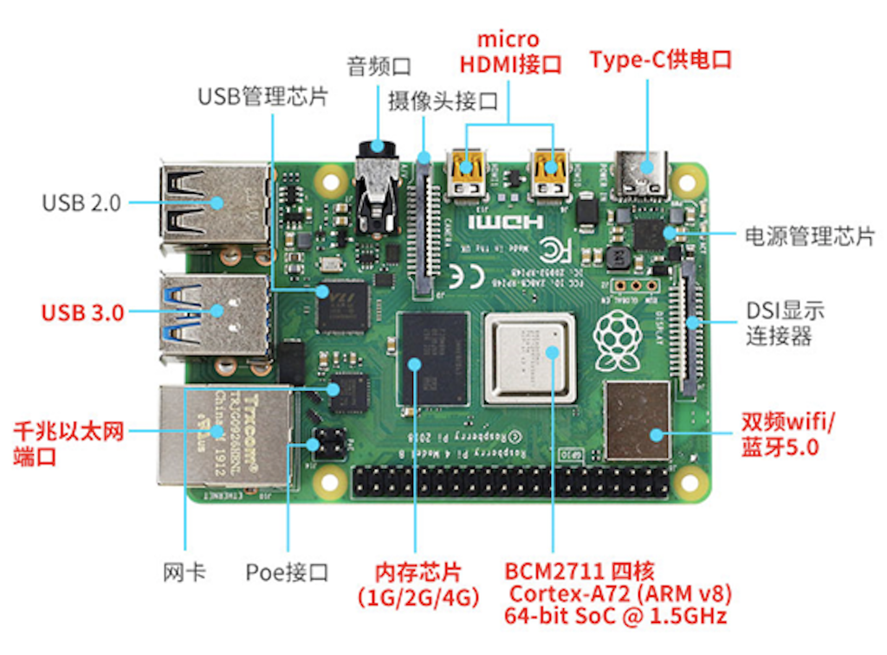
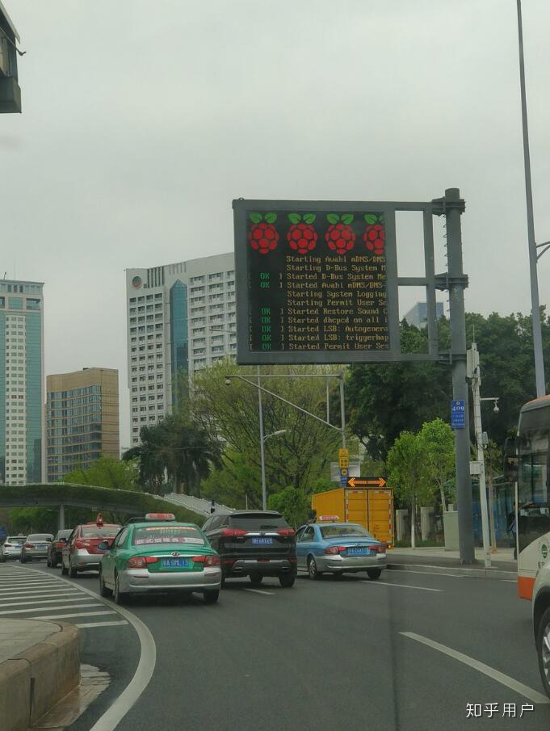
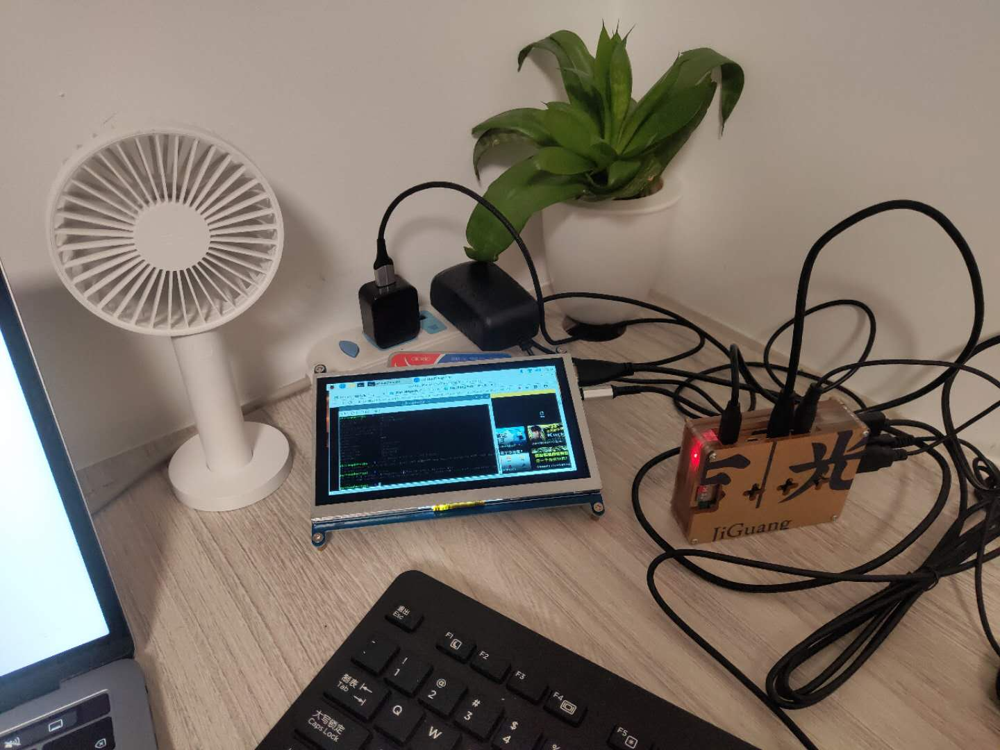
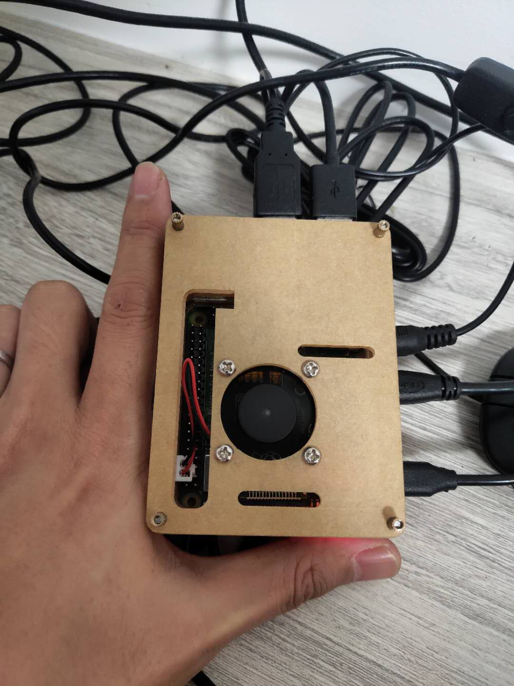

树莓派是一款信用卡大小基于 ARM 的微型电脑主板，却具有电脑的所有基本功能，以及具备丰富的接口。
长这个样子  

 

主要场景面向智能制造/人工智能/工业物联网，也有很多小伙伴拿来折腾成路由器、nas。  
比如这样，信息大屏，在重启。。。  
 

单看cpu性能，应该是几百块的安卓手机水平。鉴于架构和性能不太适用于我们的pc业务场景。  
毕竟一块带2G 内存的主板，在马云家只要260块，4G 内存的裸板420。  
我这次主要拿来熟悉下arm下的docker 和 k8s。  
在咸鱼收了一整套，带个7寸屏幕，屏幕其实可有可无，初期装系统可以直接hdmi接显示器或电视机。  
不得不夸下小黄鱼，450我买了一整套，那哥们买了一次都没用过。。。 那你买了干啥！！！

第一次接触，操作系统选择官方的比较稳妥，在驱动匹配和稳定性各方面会比较可靠。  
官网下载 Raspbian 32位，这是一款基于Debian Linux的树莓派专用系统，适用于树莓派所有的型号。  
系统也选择了带桌面系统的，后面玩溜了可以选最小化系统。

装完系统是这样，尺寸确实很小，后期其实只需要一根电源线就行，支持wifi  
 
 

工欲善其事，必先利其器，先做些准备工作。

### 准备工作
#### 开启 ssh 服务
终端输入 sudo /etc/init.d/ssh start 即可开启
这个开启只对本次启动有效，修改以下内容设置为开机自启

```bash
sudo vi /etc/rc.local
在语句exit 0的上一行加入：
/etc/init.d/ssh start
```

#### 3.5mm耳机接口没声音
我开了个b站视频测试了下发现没声音，需要改下配置
```bash
sudo raspi-config 
找到advanced options>audio
设置成不是HDMI的那个
```

#### 换成国内源，自动的官方源下载太慢
```bash
第一步，先备份源文件
sudo cp /etc/apt/sources.list /etc/apt/sources.list.bak
sudo cp /etc/apt/sources.list.d/raspi.list /etc/apt/sources.list.d/raspi.list.bak

第二步，编辑系统源文件
sudo vi /etc/apt/sources.list

第三步，将初始的源使用#注释掉，添加如下两行清华的镜像源。
【注意】这里的树莓派系统是Raspbian-buster系统，在写系统源链接时要注意是buster，网上很多教程都是之前stretch版本，容易出错！
把原来的都注释掉，添加下面的
deb http://mirrors.tuna.tsinghua.edu.cn/raspbian/raspbian/ buster main contrib non-free rpi
deb-src http://mirrors.tuna.tsinghua.edu.cn/raspbian/raspbian/ buster main contrib non-free rpi

第三步，还需要更改系统源
sudo vi /etc/apt/sources.list.d/raspi.list
用#注释掉原文件内容，用以下内容取代：
deb http://mirrors.tuna.tsinghua.edu.cn/raspberrypi/ buster main ui
deb-src http://mirrors.tuna.tsinghua.edu.cn/raspberrypi/ buster main ui

第四步，保存执行如下命令完成源的更新软件包索引，和包更新。

sudo apt-get update   #更新索引
sudo apt-get upgrade    #更新包

安装中文字体
sudo apt-get install ttf-wqy-zenhei ttf-wqy-microhei

```

#### 获取root权限
自己的测试环境，直接用root更省事

```bash
设置root用户密码
sudo passwd root

启用root用户
sudo passwd --unlock root

设置ssh允许登录
sudo sed -i "s/^#PermitRootLogin.*/PermitRootLogin yes/g" /etc/ssh/sshd_config

重启ssh服务
sudo systemctl restart ssh

为root用户应用于当前用户相同的bash配置
sudo cp ~/.bashrc /root/.bashrc
```

现在可以使用 root 直接 ssh 登录了

#### 开启 vnc 图形化远程

sudo raspi-config
依次操作：Interfacing Options -> VNC -> Yes

按照提示即开启完成

下载vnc 客户端，用于远程连接树莓派
https://www.realvnc.com/en/connect/download/viewer/

至此，有了ssh 和 vnc，如果不用树莓派来看视频，可以断开他的显示器了

### docker 安装
进入正题，docker 搞起

```bash
下载安装脚本：
curl -fsSL https://get.docker.com -o get-docker.sh

使用阿里云镜像下载安装：
sh get-docker.sh --mirror Aliyun

执行脚本后会自动识别arm架构，下载安装对应版本docker，稍等片刻即可

# 将当前用户加入docker组：(我用的root，这步不需要了)
# sudo usermod -aG docker $USER
# 退出当前终端并重新登录，此时操作docker不再需要加sudo权限
```
就这么装完了？ 和我想的不太一样啊。   
docker version 看下版本

注意：
树莓派是arm架构的，所以不能使用x86平台的镜像，在使用docker pull 拉取 dockerhub 官方镜像时，docker会自动根据当前架构去查找是否有架构匹配的镜像，所以，如果是自制镜像，则需要分平台编译。

拉个tomcat， ？？？ 居然没得，手动官网去翻

```bash
root@raspberrypi:~ # docker pull tomcat

Using default tag: latest
latest: Pulling from library/tomcat
no matching manifest for linux/arm/v7 in the manifest list entries
```

一通搜，发现都在这里面  
https://hub.docker.com/u/arm32v7

```bash
先来个tom猫
docker pull arm32v7/tomcat

再来个ng  
docker pull arm32v7/nginx

跑起来
docker run -d --name tom --net=host arm32v7/tomcat
docker run -d --name ng --net=host arm32v7/nginx

访问一下，返回正常
curl localhost:80
curl localhost:8080
```

本篇到此为止，下一篇 k8s， 我预感应该不会这么顺利。 - -！