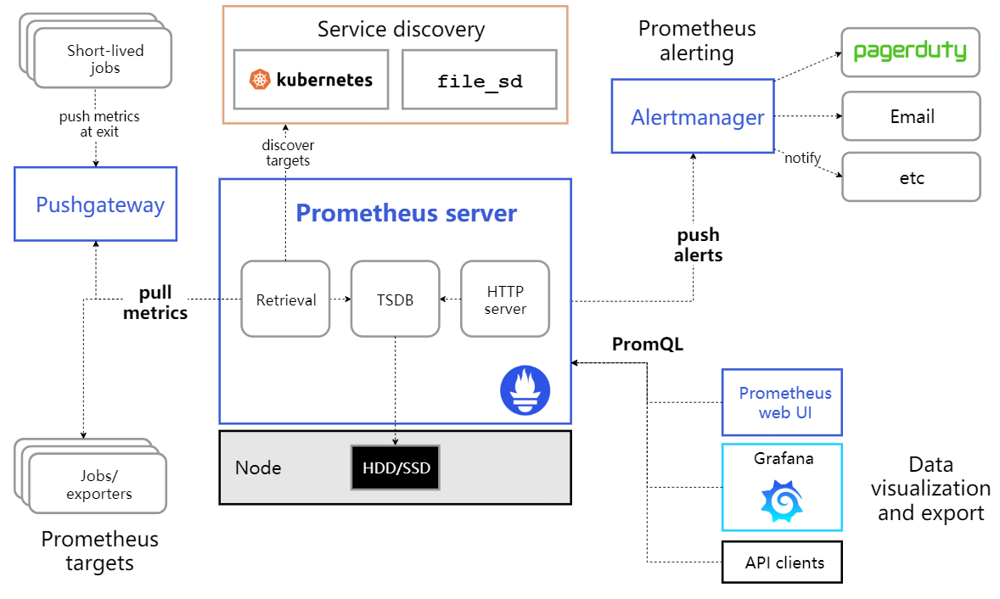
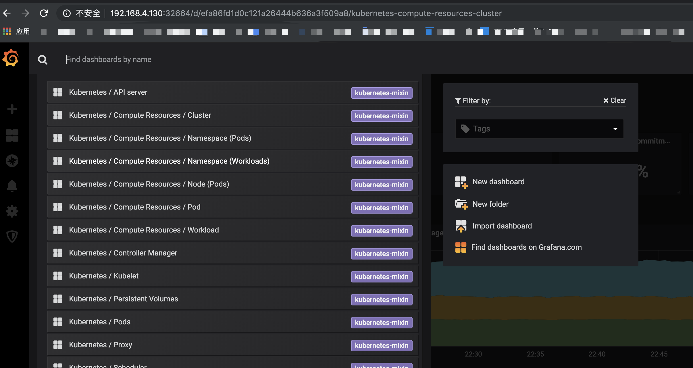
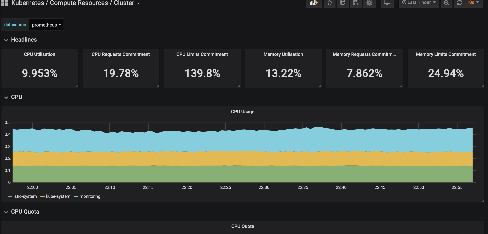
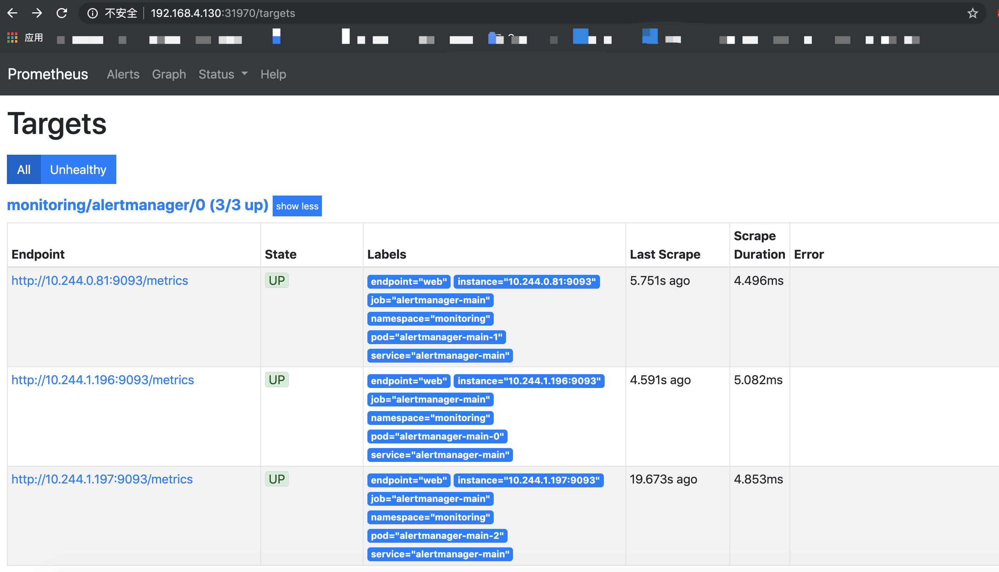
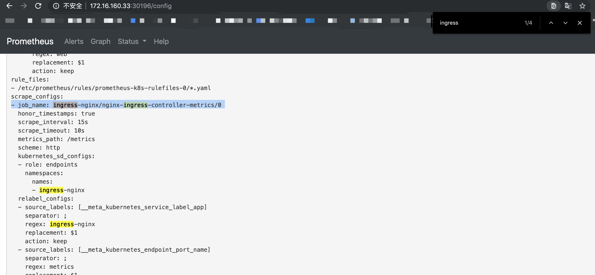
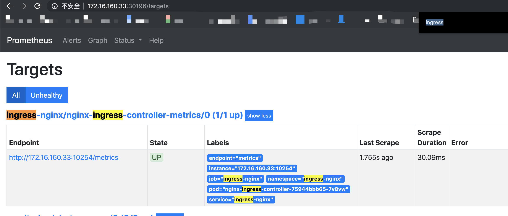
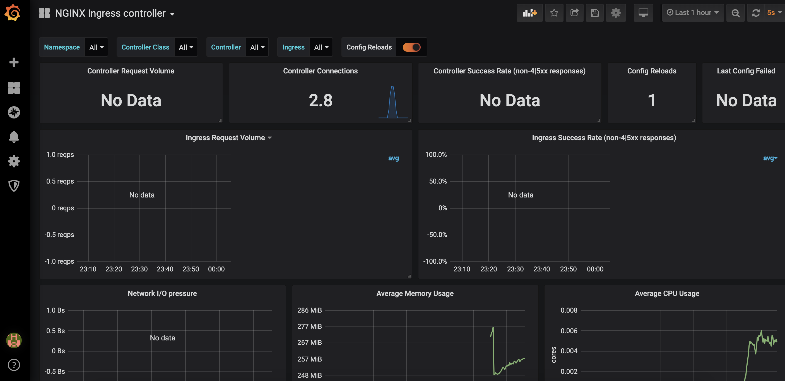
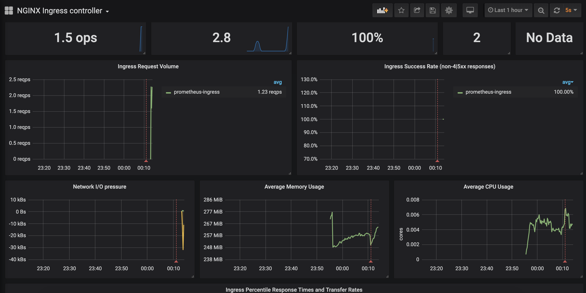

### Prometheus 介绍
prometheus 当前已经成为k8s的主流监控方案。具备集群资源监控、服务监控、告警与一体，具备较强的扩展性与集成能力。

扩展性：可以通过多个prometheus 采集多个不同区域的数据，使用联邦集群技术在一个prometheus上进行汇聚与展示。

集成能力：目前支持： Java， JMX， Python， Go，Ruby， .Net， Node.js等等语言的客户端SDK，基于这些SDK可以快速让应用程序纳入到Prometheus的监控当中，或者开发自己的监控数据收集程序。

我们常用于k8s的prometheus并不单单只有这一组件
- export: Exporter将监控数据采集的端点通过HTTP服务的形式暴露给Prometheus Server，Prometheus Server通过访问该Exporter提供的Endpoint端点，即可获取到需要采集的监控数据。
- prometheus-server：负责实现对监控数据的获取，存储以及查询。 Prometheus Server可以通过静态配置管理监控目标，也可以配合使用Service Discovery的方式动态管理监控目标，并从这些监控目标中获取数据。自带web ui，可以直接通过PromQL实现数据的查询以及可视化。
- grafana：展示面板，将prometheus中的数据通过面板图形化更友好的方式展示
- alertmanager: Prometheus根据PromQL定义的规则，产生一条告警，告警的后续处理流程由AlertManager进行管理。在AlertManager中我们可以与邮件，Slack等等内置的通知方式进行集成，也可以通过Webhook自定义告警处理方式。AlertManager即Prometheus体系中的告警处理中心。

**架构图**



### 安装部署

k8s：1.16
使用operator方式。

Prometheus Operator为Kubernetes服务和Prometheus实例的部署和管理提供了简单的监控定义。全面监控k8s集群各项指标。自动的target管理和tag定义

了解Prometheus Operator能做什么，其实就是要了解Prometheus Operator为我们提供了哪些自定义的Kubernetes资源，列出了Prometheus Operator目前提供的️4类资源：
- Prometheus：声明式创建和管理Prometheus Server实例；
- ServiceMonitor：负责声明式的管理监控配置；
- PrometheusRule：负责声明式的管理告警配置；
- Alertmanager：声明式的创建和管理Alertmanager实例。

简言之，Prometheus Operator能够帮助用户自动化的创建以及管理Prometheus Server以及其相应的配置。

Prometheus 和 Alermanager 负载部署这两块的服务，部署完了很少再操作。

主要需要熟悉 ServiceMonitor 和 PrometheusRule，分别负责管理监控对象和管理告警配置。

部署： 

```bash
# 里面包含了prometheus大全套，kubernetes组件收集指标，grafana常用面板, prometheus operator 
git clone https://github.com/coreos/kube-prometheus.git
cd kube-prometheus/
# 创建namespace和CRD，要等他们就绪后，才能继续后面的。until 那句返回空信息，不报错，就可以执行下一步了
kubectl create -f manifests/setup
until kubectl get servicemonitors --all-namespaces ; do date; sleep 1; echo ""; done
kubectl create -f manifests/
# 看下所有pod，都正常，prometheus就部署好了。当前prometheus 和grafana都是没有挂载持久化存储的，若长期使用需配置存储。
kubectl -n monitoring get po

[root@master1 kube-prometheus]# kubectl -n monitoring get po
NAME                                   READY   STATUS    RESTARTS   AGE
alertmanager-main-0                    2/2     Running   0          22h
alertmanager-main-1                    2/2     Running   0          22h
alertmanager-main-2                    2/2     Running   0          22h
grafana-6bf77bc85f-vx6rg               1/1     Running   0          22h
kube-state-metrics-5c9bd5465b-7jxl8    3/3     Running   0          22h
node-exporter-lrzsj                    2/2     Running   0          22h
node-exporter-p9pjp                    2/2     Running   0          22h
prometheus-adapter-8667948d79-lwmjz    1/1     Running   0          22h
prometheus-k8s-0                       3/3     Running   1          22h
prometheus-k8s-1                       3/3     Running   1          22h
prometheus-operator-579b9fdc44-jjd7f   1/1     Running   0          22h
```

### 配置访问页面

修改service为nodeport，就可以从外部访问了

```bash
# 编辑三个service，把   type: ClusterIP 改为   type: NodePort 
# 也可以再手动指定nodeport端口
kubectl -n monitoring edit svc grafana
kubectl -n monitoring edit svc prometheus-k8s
kubectl -n monitoring edit svc alertmanager-main

kubectl -n monitoring get svc grafana prometheus-k8s alertmanager-main

[root@master1 kube-prometheus]# kubectl -n monitoring get svc grafana prometheus-k8s alertmanager-main
NAME                TYPE       CLUSTER-IP      EXTERNAL-IP   PORT(S)          AGE
grafana             NodePort   10.101.251.76   <none>        3000:32664/TCP   22h
NAME                TYPE       CLUSTER-IP      EXTERNAL-IP   PORT(S)          AGE
prometheus-k8s      NodePort   10.96.18.46     <none>        9090:31970/TCP   22h
NAME                TYPE       CLUSTER-IP      EXTERNAL-IP   PORT(S)          AGE
alertmanager-main   NodePort   10.103.41.177   <none>        9093:32113/TCP   22h
```

任意k8s节点IP:32664 即可访问grafana，其他同理

grafana 初始用户密码 admin/admin

内置了很多默认面板


集群信息面板


prometheus 页面


### 监控Ingress controller

Ingress controller 作为整个集群应用流量的入口，在日常运维管理中需要对他的流量做一定监控与展示。

通过监控ingress controller 来熟悉prometheus监控数据的方法与grafana展示。

ingress-controller 最新部署参照这边，也可以按照下面步骤
https://github.com/kubernetes/ingress-nginx/blob/master/docs/deploy/index.md

**ingress-controller 部署**

```bash
curl https://raw.githubusercontent.com/kubernetes/ingress-nginx/nginx-0.26.2/deploy/static/mandatory.yaml > ingress-nginx-0.26.2-prometheus-hostnetwork.yaml

编辑 ingress-nginx-0.26.2-prometheus-hostnetwork.yaml
// 修改网络模式为主机网络
在containers 上面加一行，两者平级
      hostNetwork: true

// 在deployment 的 ports 增加metrics 10254，prometheus对外查询接口默认已开启，我们只需要把端口加上
            - name: metrics
              containerPort: 10254
              protocol: TCP

修改好的文件已经上传到
https://github.com/cai11745/k8s-ocp-yaml/blob/master/yaml-file/ingress-controller/ingress-nginx-0.26.2-prometheus-hostnetwork.yaml

// 导入yaml
kubectl apply -f ingress-nginx-0.26.2-prometheus-hostnetwork.yaml 

// 部署验证，pod运行正常，且IP为node节点的地址
kubectl -n ingress-nginx get pod -o wide
NAME                                        READY   STATUS    RESTARTS   AGE    IP              NODE   NOMINATED NODE   READINESS GATES
nginx-ingress-controller-75944bbb65-7v8vw   1/1     Running   0          6m5s   172.16.160.33   k8s    <none>           <none>

// 测试metrics接口，有数据返回则prometheus查询接口正常
curl 172.16.160.33:10254/metrics
```

**prometheus-k8s sa 权限调整**

monitoring namespace 下的 prometheus-k8s 这个service account 权限不足，只有default，kube-system，monitoring 这三个的endponits,service 权限。

具体原因见FAQ1

导入这个我修改好的clusterrole可解决

```
// 查看这个权限不足的clusterrole内容
kubectl get  ClusterRole prometheus-k8s  -o yaml

// 导入新的clusterrole，可以用下面apply命令或者FAQ1中直接edit，选一种即可
kubectl apply -f https://raw.githubusercontent.com/cai11745/k8s-ocp-yaml/master/yaml-file/ingress-controller/prometheus-k8s-clusterrole.yaml
```

**ingress监控部署**

监控ingress需要完成两点，一是ingress提供相关的prometheus查询接口（上一步已确认），二创建一条ServiceMonitor规则来指定ingress的数据采集规则。

如果还需要gragana展示，则需在gragana添加对应面板。

此处不使用ingress-controller github带的prometheus，那个不是operator。

1. 创建service
先创建ingres-nginx 对接的service，因为下面servicemonitor会通过service来查询对应的pod，用到了service的服务发现

```bash
kubectl apply -f https://raw.githubusercontent.com/cai11745/k8s-ocp-yaml/master/yaml-file/ingress-controller/service.yaml

内容解读：
apiVersion: v1
kind: Service
metadata:
  name: ingress-nginx
  namespace: ingress-nginx   #与ingress所在namespace一致
  labels:                       
    app: ingress-nginx   #A 这个label记下，servicemonitor会用到
spec:
  type: ClusterIP
  ports:
    - name: http
      port: 80
      targetPort: 80
      protocol: TCP
    - name: https
      port: 443
      targetPort: 443
      protocol: TCP
    - name: metrics   # 三个端口名称与deployment中保持一致
      port: 10254
      targetPort: 10254
      protocol: TCP
  selector:
    app.kubernetes.io/name: ingress-nginx    #这个和deployment中pod的label一致
```

验证

```bash
// service 创建成功
[root@k8s k8s-ocp-yaml]# kubectl -n ingress-nginx get svc
NAME            TYPE        CLUSTER-IP     EXTERNAL-IP   PORT(S)                    AGE
ingress-nginx   ClusterIP   10.111.57.19   <none>        80/TCP,443/TCP,10254/TCP   55m

// 查看endpoints，要能正常显示ingress pod的ip与端口，如果不显示，那就是service 中的selector 写的不对
[root@k8s k8s-ocp-yaml]# kubectl -n ingress-nginx get ep
NAME            ENDPOINTS                                                AGE
ingress-nginx   172.16.160.33:80,172.16.160.33:10254,172.16.160.33:443   56m

```

2. 创建ServiceMonitor

servicenitor中定义了需要监控的对象，创建成功后，在prometheus 的status-configuration 和status - target能查看到ingress的配置与状态

导入文件
```bash
kubectl apply -f https://raw.githubusercontent.com/cai11745/k8s-ocp-yaml/master/yaml-file/ingress-controller/controller-servicemonitor.yaml

内容解读：
apiVersion: monitoring.coreos.com/v1
kind: ServiceMonitor
metadata:
  labels:
    k8s-app: ingress-nginx  # 注解1
  name: nginx-ingress-controller-metrics
  namespace: ingress-nginx   # 最好与被监控对应放一起，也可在monitoring下
spec:
  endpoints:
  - interval: 15s
    port: metrics   # 与service 暴露监控的端口名称一致
  jobLabel: k8s-app
  namespaceSelector:
    matchNames:
    - ingress-nginx    # 监控对象所在namespace
  selector:
    matchLabels:
      app: ingress-nginx   # 与service的label一致，不是service的selector

````

注解1
此处是个隐藏的坑，我这次没遇到。
https://github.com/coreos/prometheus-operator/issues/2119
ServiceMonitor 中的label，需要与monitoring下的prometheus内容里的serviceMonitorSelector保持一致。
因为当前我们serviceMonitorSelector为空，所以 ServiceMonitor 中的label可以自己随便写
```bash
kubectl -n monitoring get prometheus -o yaml

...
    serviceAccountName: prometheus-k8s
    serviceMonitorNamespaceSelector: {}
    serviceMonitorSelector: {}
    version: v2.11.0
...
```

3. 验证
prometheus页面查看status -- configration
如果看不到，检查配置文件及上面注解1


prometheus页面查看status -- target
如果能看到configration，target里面没有，查看FAQ1，可能权限问题


prometheus页面测试查询


**grafana添加面板**

以上，prometheus已经能够获取到ingress数据，下一步就是添加grafana面板，更好的展示数据

在grafana页面点+， import，导入nginx.json
https://github.com/kubernetes/ingress-nginx/tree/dfa7f10fc9691a3be90fd30cb458b64b617ef440/deploy/grafana/dashboards

已经获取到数据，现在没有应用使用ingress负载，很多地方还是空的


可以创建一条ingress来访问prometheus
把grafana，prometheus，alertmanager都通过ingress暴露域名

kubectl apply -f https://raw.githubusercontent.com/cai11745/k8s-ocp-yaml/master/yaml-file/ingress-controller/my-ingress.yaml

文件内容：
```bash
[root@k8s ingress-controller]# cat my-ingress.yaml 
apiVersion: extensions/v1beta1
kind: Ingress
metadata:
  namespace: monitoring
  name: prometheus-ingress
spec:
  rules:
  - host: grafana.localkube.com
    http:
      paths:
      - backend:
          serviceName: grafana
          servicePort: 3000
  - host: prometheus.localkube.com
    http:
      paths:
      - backend:
          serviceName: prometheus-k8s
          servicePort: 9090
  - host: alertmanager.localkube.com
    http:
      paths:
      - backend:
          serviceName: alertmanager-main
          servicePort: 9093
```

在自己电脑写入hosts文件,IP写ingress controller的pod IP
172.16.160.33 grafana.localkube.com prometheus.localkube.com alertmanager.localkube.com

即可以通过域名方式访问到三个服务

同时，grafana页面上ingress的数据也会刷新


### 各服务角色与功能

monitoring 这个namespace下的pod都分别承担了什么角色，如何创建出来的，以及prometheus中容器、节点的数据如何获取、数据来源，下一篇写。

### FAQ 

#### 1. 创建ServiceMonitor后prometheus页面没有看到相应target

在prometheus 页面 status configuration 已经查询到ingress配置，但是target里面没有ingress

查询 operator 日志无报错
`
kubectl -n monitoring logs prometheus-operator-99dccdc56-h5rvq
`

查询prometheus日志，找到原因
```bash
kubectl -n monitoring logs prometheus-k8s-0    prometheus |grep ingress

level=error ts=2020-01-10T09:18:27.676Z caller=klog.go:94 component=k8s_client_runtime func=ErrorDepth msg="/app/discovery/kubernetes/kubernetes.go:263: Failed to list *v1.Endpoints: endpoints is forbidden: User \"system:serviceaccount:monitoring:prometheus-k8s\" cannot list resource \"endpoints\" in API group \"\" in the namespace \"ingress-nginx\""
```

发现是 monitoring 下 prometheus-k8s 这个sa权限不够
```bash
kubectl  get  rolebindings --all-namespaces |grep prometheus
default         prometheus-k8s                                      7d1h
kube-system     prometheus-k8s                                      7d1h
monitoring      prometheus-k8s                                      7d1h
monitoring      prometheus-k8s-config                               7d1h
kubectl  get  ClusterRolebindings |grep prometheus
prometheus-adapter                                     7d1h
prometheus-k8s                                         7d1h
prometheus-operator                                    7d1h
```

查看权限，会发现prometheus-k8s 绑定了clusterrole prometheus-k8s 以及 default,kube-system,monitoring 三个ns下的role  prometheus-k8s

再分别查看 clusterrole prometheus-k8s 和role  prometheus-k8s

找到原因，clusterrole 里面没有endpoints权限，之前上面三个namespaces有，所以我们直接把clusterrole改掉

```bash
# kubectl edit ClusterRole prometheus-k8s
apiVersion: rbac.authorization.k8s.io/v1
kind: ClusterRole
metadata:
  name: prometheus-k8s
rules:
- apiGroups:
  - ""
  resources:
  - nodes/metrics
  - services
  - endpoints
  - pods
  verbs:
  - get
  - list
  - watch
- nonResourceURLs:
  - /metrics
  verbs:
  - get
```

完成后，prometheus页面，status - target 就能查询到 新添加的ingress

**本文全文及见github，欢迎点点小星星**
https://github.com/cai11745/k8s-ocp-yaml/blob/master/prometheus/2019-10-22-prometheus-1-install-and-metricsIngress.md

参考内容：
https://yunlzheng.gitbook.io/prometheus-book/
https://github.com/kubernetes/ingress-nginx/tree/master/deploy
