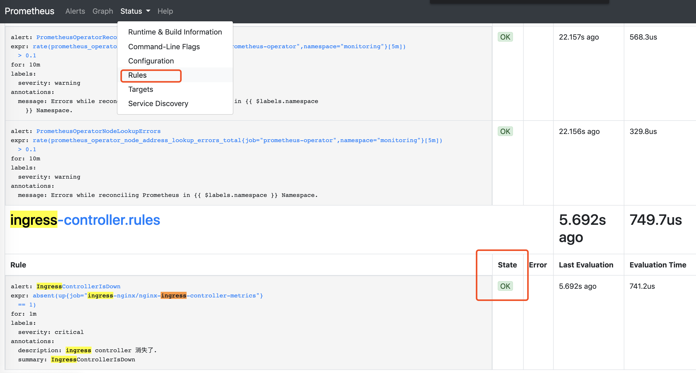
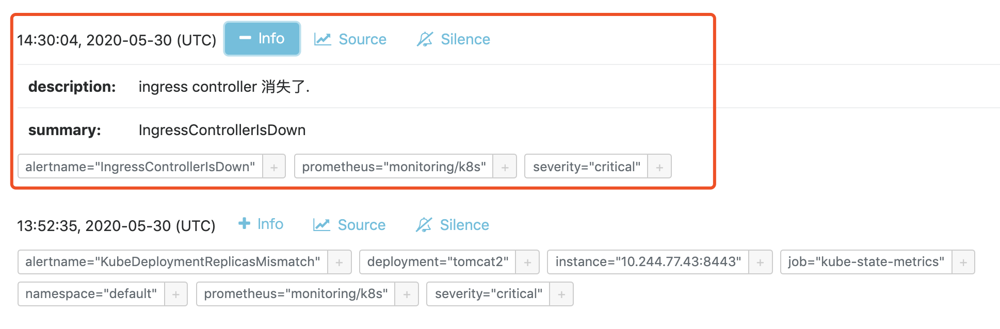
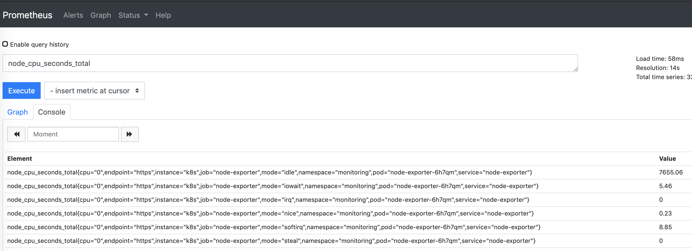
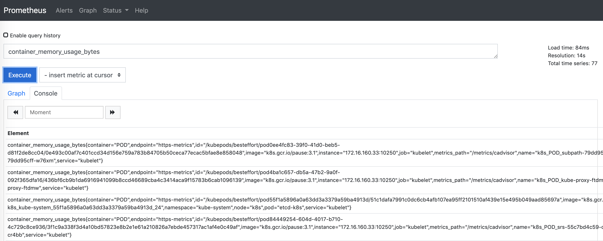
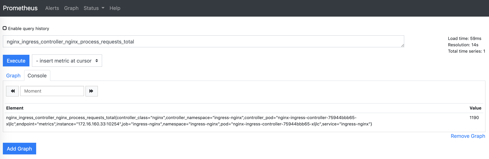
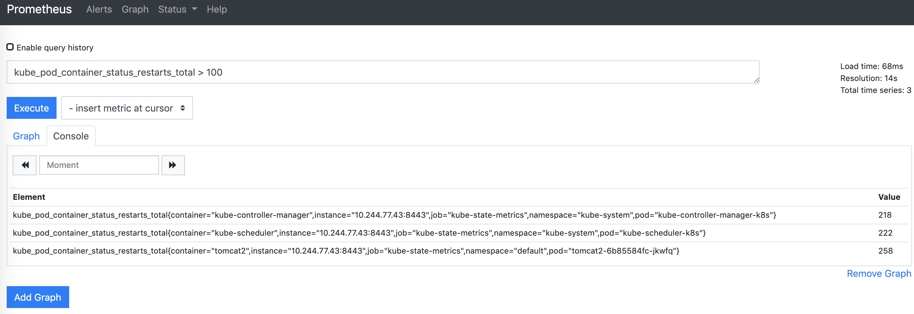

上一篇介绍了prometheus operator的安装部署及如何监控ingress controller。

本篇将介绍prometheus部署完成后，每个组件的功能，在整个监控组件中承担什么角色。以及数据来源，节点、容器、kube组件的监控数据来源，这样有助于我们在异常情况下能够快速定位问题，比如无法获取节点数据、kube组件状态等。

### 各组件角色与功能

从整体架构看，prometheus 一共四大组件。 exporter 通过接口暴露监控数据， prometheus-server 采集并存储数据， grafana 通过prometheus-server查询并友好展示数据， alertmanager 处理告警，对外发送。

从部署看，pod 一共有 alertmanager-main, grafana, kube-state-metrics, node-exporter, prometheus-adapter, prometheus-k8s, prometheus-operator，以下
分别介绍各组件功能。

```bash
[root@k8s ~]# kubectl -n monitoring get pod 
NAME                                  READY   STATUS    RESTARTS   AGE
alertmanager-main-0                   2/2     Running   0          53s
alertmanager-main-1                   2/2     Running   0          55s
alertmanager-main-2                   2/2     Running   0          51s
grafana-58dc7468d7-2v8mg              1/1     Running   0          61s
kube-state-metrics-769f4fd4d5-vf4vg   3/3     Running   0          61s
node-exporter-6h7qm                   2/2     Running   0          52s
prometheus-adapter-5cd5798d96-8ck8k   1/1     Running   0          61s
prometheus-k8s-0                      3/3     Running   1          54s
prometheus-k8s-1                      3/3     Running   1          51s
prometheus-operator-99dccdc56-mmvq9   1/1     Running   0          61s
```

#### prometheus-operator
prometheus-operator 服务是deployment方式部署，他是整个基础组件的核心，他监控我们自定义的 prometheus 和alertmanager，并生成对应的 statefulset。 就是prometheus和alertmanager服务是通过他部署出来的。

```bash
[root@k8s ~]# kubectl -n monitoring get deploy prometheus-operator
NAME                  READY   UP-TO-DATE   AVAILABLE   AGE
prometheus-operator   1/1     1            1           13d
```

#### prometheus-k8s
prometheus-server 获取各端点数据并存储与本地，创建方式为自定义资源 crd中的prometheus。 创建自定义资源prometheus后，会启动一个statefulset，即prometheus-server

```bash
[root@k8s ~]# kubectl -n monitoring get prometheus
NAME   AGE
k8s    13d

prometheus-k8s 这个statefulset即对应上面get prometheus中的 k8s。
所以如果想要删除prometheus-server，只删除statefulset是没用的，会再次被重建，需要删除prometheus这个资源对象里的内容kubectl delete prometheus k8s
[root@k8s ~]# kubectl -n monitoring get statefulset
NAME                READY   AGE
alertmanager-main   3/3     13d
prometheus-k8s      2/2     13d
```

prometheus-server 默认情况下没有配置数据持久化。

#### node-exporter
node-exporter 提供每个node节点的监控数据，以daemonset方式运行，保证每个节点运行一个pod。 pod网络是hostnetwork方式，使用宿主机网络。

```bash
[root@k8s ~]# kubectl -n monitoring get daemonset
NAME            DESIRED   CURRENT   READY   UP-TO-DATE   AVAILABLE   NODE SELECTOR            AGE
node-exporter   1         1         1       1            1           kubernetes.io/os=linux   13d
```

#### kube-state-metrics

已经有了 cadvisor、heapster、metric-server，几乎容器运行的所有指标都能拿到，但是下面这种情况却无能为力：  
我调度了多少个 replicas？现在可用的有几个？  
多少个 Pod 是 running/stopped/terminated 状态？  
Pod 重启了多少次？  
我有多少 job 在运行中  
而这些则是 kube-state-metrics 提供的内容，它基于 client-go 开发，轮询 Kubernetes API，并将 Kubernetes的结构化信息转换为metrics。

kube-state-metrics 提供的指标类别包括：都是k8s的资源对象
- CronJob Metrics
- DaemonSet Metrics
- Deployment Metrics
- Job Metrics
- LimitRange Metrics
- Node Metrics
- PersistentVolume Metrics
- PersistentVolumeClaim Metrics
- Pod Metrics
- Pod Disruption Budget Metrics
- ReplicaSet Metrics
- ReplicationController Metrics
- ResourceQuota Metrics
- Service Metrics
- StatefulSet Metrics
- Namespace Metrics
- Horizontal Pod Autoscaler Metrics
- Endpoint Metrics
- Secret Metrics
- ConfigMap Metrics

#### prometheus-adapter
prometheus采集到的metrics并不能直接给k8s用，因为两者数据格式不兼容，还需要另外一个组件(k8s-prometheus-adpater)，将prometheus的metrics 数据格式转换成k8s API接口能识别的格式，转换以后，因为是自定义 API，所以还需要用Kubernetes aggregator在主APIServer中注册，以便直接通过/apis/来访问。

该功能主要用于自定义监控对象的弹性伸缩。

#### grafana
grafana是数据展示的面板. deployment方式部署。
通过查询prometheus的数据，配合grafana面板进行图形化数据展示。
```bash
[root@k8s ~]# kubectl -n monitoring get deploy grafana
NAME      READY   UP-TO-DATE   AVAILABLE   AGE
grafana   1/1     1            1           13d
```

#### alertmanager-main
alertmanager-main服务和prometheus-server类似，也是通过自定义资源创建出来的。
自定义资源格式叫alertmanager

```bash
[root@k8s ~]# kubectl -n monitoring get alertmanager
NAME   AGE
main   13d

[root@k8s ~]# kubectl -n monitoring get statefulset
NAME                READY   AGE
alertmanager-main   3/3     13d
prometheus-k8s      2/2     6m3s
```

### 五大自定义资源对象
#### prometheus
定义期望的Prometheus实例，同时保证任何时候有期望的Prometheus实例在运行。  
这是配置文件，看下各个参数的定义，默认自带的是没有配持久化存储的。

```bash
[root@k8s manifests]# pwd
/root/kube-prometheus-master/manifests
[root@k8s manifests]# cat prometheus-prometheus.yaml
apiVersion: monitoring.coreos.com/v1
kind: Prometheus
metadata:
  labels:
    prometheus: k8s
  name: k8s
  namespace: monitoring
spec:
  alerting:
    alertmanagers:  # 推送告警目标的alertmanager svc name及端口，所在namespaces
    - name: alertmanager-main
      namespace: monitoring
      port: web
  baseImage: quay.io/prometheus/prometheus  #镜像名称
  nodeSelector:
    kubernetes.io/os: linux
  podMonitorNamespaceSelector: {}   #指定关联的podmonitor 所在 namespace，默认关联所有
  podMonitorSelector: {}    #指定关联podmonitor 的label 
  replicas: 2     #副本数，会自动组成集群
  resources:
    requests:
      memory: 400Mi    #可用内存最低限额，其他参数 limit及cpu 也支持
  ruleSelector:     # 通过labels筛选prometheusRule
    matchLabels:
      prometheus: k8s
      role: alert-rules
  securityContext:
    fsGroup: 2000
    runAsNonRoot: true
    runAsUser: 1000
  serviceAccountName: prometheus-k8s
  serviceMonitorNamespaceSelector: {}    #指定关联的servicemonitor 所在 namespace，默认关联所有
  serviceMonitorSelector: {}     #指定关联servicemonitor 的label 
  version: v2.11.0  #镜像tag
  retention: 1d # 数据保留1天
  storage:
    volumeClaimTemplate:
      spec:
        storageClassName: ssd   #指定使用持久化存储 storageclass
        resources:
          requests:
            storage: 40Gi
```
#### alertmanager
定义期望的Alertmanager实例，同时保证任何时候有期望的Alertmanager实例在运行，对于指定多台Alertmanager，prometheus operator会自动将它们配置成集群。

配置参数，也支持资源限制cpu，memory 配置同上。

```bash
[root@k8s manifests]# cat alertmanager-alertmanager.yaml
apiVersion: monitoring.coreos.com/v1
kind: Alertmanager
metadata:
  labels:
    alertmanager: main
  name: main    #这个名称将来前面会加上'alertmanager-' 变成sts 和svc 名称，这个和上面prometheus 告警推送配置有关，需匹配
  namespace: monitoring
spec:
  baseImage: quay.io/prometheus/alermanager
  nodeSelector:
    kubernetes.io/os: linux
  replicas: 3  #副本数，会自动组成集群
  securityContext:
    fsGroup: 2000
    runAsNonRoot: true
    runAsUser: 1000
  serviceAccountName: alertmanager-main
  retention: 24h # 数据保留时间，注意这里最大的单位是h，没有d。
  version: v0.18.0
  storage:
    volumeClaimTemplate:
      spec:
        storageClassName: ssd   #指定使用持久化存储 storageclass
        resources:
          requests:
            storage: 10Gi
```

#### prometheusrule
配置Prometheus rule文件，包括recording rules和alerting，它能够自动被Prometheus加载。

这边测试一条简单的，监控ingress controller的状态

```bash
apiVersion: monitoring.coreos.com/v1 #这和ServiceMonitor一样
kind: PrometheusRule  #该资源类型是Prometheus，这也是一种自定义资源（CRD）
metadata:
  labels:
    app: "ingress-controller"
    prometheus: k8s
    role: alert-rules  #与prometheus 的 ruleSelector 一致
  name: prometheus-rule-ingress-controller
spec:
  groups:  #编写告警规则，和prometheus的告警规则语法相同
  - name: ingress-controller.rules
    rules:
    - alert: IngressControllerIsDown
      expr: absent(up{job="ingress-nginx/nginx-ingress-controller-metrics"} == 1)
      for: 1m
      labels:
        severity: critical
      annotations:
        description: ingress controller 消失了.
        summary: IngressControllerIsDown
```
alert：告警规则的名称。  
expr: 告警的触发条件，本质上是一条promQL查询表达式，Prometheus Server会定期（一般为15s）对该表达式进行查询，若能够得到相应的时间序列，则告警被触发  
for: 告警持续触发的时间，因为数据可能存在毛刺，Prometheus并不会因为在expr第一次满足的时候就生成告警实例发送到AlertManager。比如上面的例子意为名为"p1"的Pod，每秒接受的HTTP请求的数目超过1000时触发告警且持续时间为一分钟，若告警规则每15s评估一次，则表示只有在连续四次评估该Pod的负载都超过1000QPS的情况下，才会真正生成告警实例。  
labels：自定义标签，允许用户指定要附加到告警上的一组附加标签。  
annotations：用于指定一组附加信息，比如用于描述告警详细信息的文字等，annotations的内容在告警产生时会一同作为参数发送到Alertmanager。

导入规则
```bash
[root@k8s ~]# kubectl -n monitoring apply -f prometheus-rule-ingress-controller.yaml
prometheusrule.monitoring.coreos.com/prometheus-rule-ingress-controller created
```
在prometheus 页面的 status -- rules ，能看到我们导入的规则


prometheus 页面的 alerts 菜单，同样也能查看到ingress的规则，当前状态是绿色的，告警未触发  
IngressControllerIsDown (0 active)

下面把ingress controller 的副本数缩为0，使他不可用，测试下告警状态及触发
```bash
[root@k8s ~]# kubectl -n ingress-nginx scale deploy nginx-ingress-controller --replicas=0
deployment.apps/nginx-ingress-controller scaled
```

prometheus 的alerts 页面 IngressControllerIsDown (1 active) 触发了一次告警

alertmanger 页面可以接受到告警信息


#### servicemonitor
通过声明式的方式指定哪些服务需要被监控，它自动生成Prometheus 的scrape配置。
这是第一篇写的监控 ingress controller，添加完成后，在prometheus 页面的 target 能看到被添加对象的metrics 接口地址，也可以通过页面进行数据查询

```bash
apiVersion: monitoring.coreos.com/v1
kind: ServiceMonitor
metadata:
  labels:
    k8s-app: ingress-nginx  # 注解1
  name: nginx-ingress-controller-metrics
  namespace: ingress-nginx   # 最好与被监控对应放一起，也可在monitoring下
spec:
  endpoints:
  - interval: 15s
    port: metrics   # 与service 暴露监控的端口名称一致
  jobLabel: k8s-app
  namespaceSelector:
    matchNames:
    - ingress-nginx    # 监控对象所在namespace
  selector:
    matchLabels:
      app: ingress-nginx   # 与service的label一致，不是service的selector

```
注解1
此处是个隐藏的坑，我这次没遇到。
https://github.com/coreos/prometheus-operator/issues/2119
ServiceMonitor 中的label，需要与monitoring下的prometheus内容里的serviceMonitorSelector保持一致。
因为当前我们serviceMonitorSelector为空，所以 ServiceMonitor 中的label可以自己随便写

#### podmonitor
通过声明式的方式指定哪些pod需要被监控，它自动生成Prometheus 的scrape配置。
很少用到

### prometheus server 数据来源
缕清楚监控数据的来源有利于我们在遇到异常情况下快速定位问题。

如果想不起来下面的对应关系，可以在prometheus 页面输入一个相应查询条件，通过查询的结果就能看出数据来源

1. 节点的监控数据来自部署于每个节点的 node-exporter 容器
查询窗口输入 node_cpu 根据提示选一个查询条件
看到数据来源 node-exporter 



1. pod的监控数据来自kubelet暴露的 /metrics/cadvisor 接口
kubelet 集成了cadvisor  
查一下容器使用内存 container_memory_usage_bytes 可以看出  
数据来源 instance="172.16.160.33:10250",数据获取任务 job="kubelet", 数据获取接口 metrics_path="/metrics/cadvisor"



3. etcd、ingress controller 来源服务自身暴露的metrics 接口，配合servicemonitor 进行采集

查询 ingress controller 接受到的请求总数


4. 集群内pod、node 等k8s资源对象的数据统计与状态来自 kube-state-metrics
查下重启次数大于100的pod  kube_pod_container_status_restarts_total > 100  
可以看到数据来源kube-state-metrics，和我们上面的组件功能介绍相吻合  
instance="10.244.77.43:8443",job="kube-state-metrics",  

我这是部署在自己笔记本上的环境，频繁开关机造就了无数次的restart 


**本文全文及见github，欢迎点点小星星**
https://github.com/cai11745/k8s-ocp-yaml/blob/master/prometheus/2020-05-30-prometheus-2-components-roles.md

参考内容：
https://yunlzheng.gitbook.io/prometheus-book/
https://github.com/kubernetes/ingress-nginx/tree/master/deploy
https://www.jianshu.com/p/2c899452ab5a
