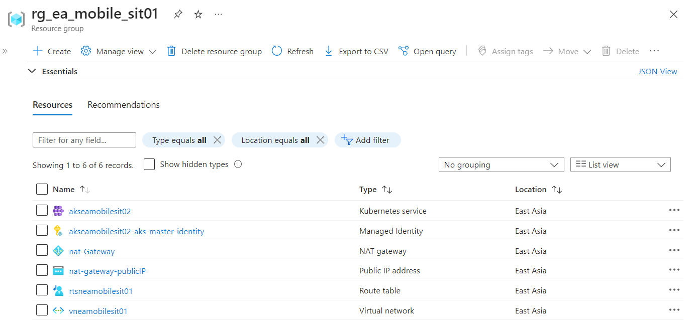
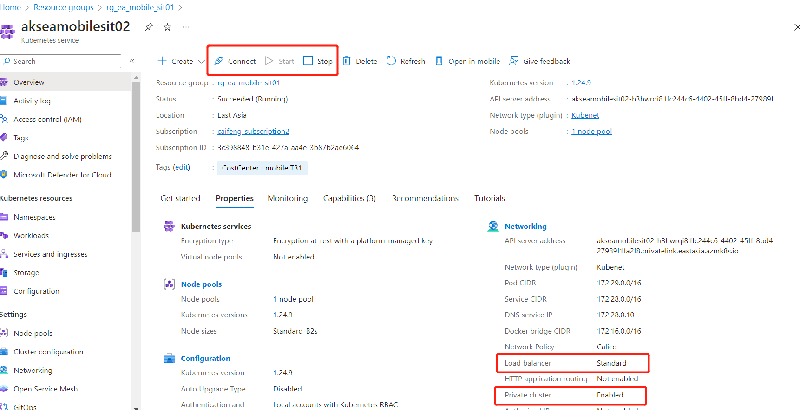

使用Terraform创建Azure k8s 集群

之前学习了terraform的安装与配置，并测试了两个简单场景，创建资源组、Vnet、虚拟机，主要为了熟悉命令的操作。  
以下将我们使用的AKS场景，从命令创建的方式，改造成tf方式。更多的使用变量，具备可复用性，并使用 output 模块。

这个aks 集群模拟了真实生产环境，与网上普遍的文档有几个区别：  
1. 使用了自定义subnet，通过azure portal 创建aks的时候，是不能自定义subnet的，必须通过命令行才可以  
2. 自定义路由表，关联到subnet，创建一个 NAT gateway 关联到subnet，通过 NAT gateway 的public ip 使 node 访问公网，aks node 节点启动要拉取公网镜像
3. aks 控制节点使用了自定义托管标识，原因见4。 node也可以采用自定义托管标识，可配可不配，未配置时系统会自动创建。
4. 要给对路由表赋予 master托管标识 "Network Contributor" 权限。aks 部署过程需要去修改路由表，同时 aks cluster 对于 role assignment 要配置依赖。先赋权，后创建aks。
5. 开启了 private cluster，k8s api 将不暴露公网地址，只能通过 vnet 访问k8s api
6. 未开启RBAC。Azure AAD 未开启，开启需要设定默认管理组，可以在集群创建后再开，方便通过RBAC对AD账号授权

### 实现代码

#### 创建 providers.tf 文件
定义了 azurerm 的版本，不低于3.0

```bash
terraform {
  required_version = ">=1.0"

  required_providers {
    azurerm = {
      source  = "hashicorp/azurerm"
      version = "~>3.0"
    }
  }
}

provider "azurerm" {
  features {}
}
```

#### 创建 main.tf variables.tf

main.tf 中定义要创建的资源，比如resourcegroup，vnet，role assignment，k8s cluster 等，为了复用性，对于资源组名称，vnet 地址池，k8s name 等放在 variables.tf 中定义  

```bash
[root@centos8 aks-private]# cat main.tf

resource "azurerm_resource_group" "rg" {
  location = var.resource_group_location
  name     = var.resource_group_name
  tags = {
    CostCenter = var.resource_group_costcenter
    owner      = var.resource_group_owner
    source     = "terraform"
  }
}

resource "azurerm_virtual_network" "vnet1" {
  name                = var.vnet_name
  address_space       = var.vnet_range
  location            = azurerm_resource_group.rg.location
  resource_group_name = azurerm_resource_group.rg.name
}

resource "azurerm_subnet" "sub1" {
  name                 = var.subnet_name
  resource_group_name  = azurerm_resource_group.rg.name
  virtual_network_name = azurerm_virtual_network.vnet1.name
  address_prefixes     = var.subnet_range
}

# Create NAT Gateway with a public IP. Associates NAT Gateway with sub1.
resource "azurerm_public_ip" "pubip1" {
  name                = "nat-gateway-publicIP"
  location            = azurerm_resource_group.rg.location
  resource_group_name = azurerm_resource_group.rg.name
  allocation_method   = "Static"
  sku                 = "Standard"
  zones               = ["1"]
}

#resource "azurerm_public_ip_prefix" "example" {
#  name                = "nat-gateway-publicIPPrefix"
#  location            = azurerm_resource_group.example.location
#  resource_group_name = azurerm_resource_group.example.name
#  prefix_length       = 30
#  zones               = ["1"]
#}

resource "azurerm_nat_gateway" "gw1" {
  name                    = "nat-Gateway"
  location                = azurerm_resource_group.rg.location
  resource_group_name     = azurerm_resource_group.rg.name
  sku_name                = "Standard"
  idle_timeout_in_minutes = 10
  zones                   = ["1"]
}

resource "azurerm_nat_gateway_public_ip_association" "gw1_pubip1" {
  nat_gateway_id       = azurerm_nat_gateway.gw1.id
  public_ip_address_id = azurerm_public_ip.pubip1.id
}

resource "azurerm_subnet_nat_gateway_association" "gw1_sub1" {
  subnet_id      = azurerm_subnet.sub1.id
  nat_gateway_id = azurerm_nat_gateway.gw1.id
}

# Create route table
resource "azurerm_route_table" "rt1" {
  name                          = "rt${var.subnet_name}"
  location                      = azurerm_resource_group.rg.location
  resource_group_name           = azurerm_resource_group.rg.name
  disable_bgp_route_propagation = false
}

resource "azurerm_subnet_route_table_association" "example" {
  subnet_id      = azurerm_subnet.sub1.id
  route_table_id = azurerm_route_table.rt1.id
}

# Create user assigned managed identity for AKS master and node
resource "azurerm_user_assigned_identity" "uai_master" {
  resource_group_name = azurerm_resource_group.rg.name
  location            = azurerm_resource_group.rg.location
  name                = "${var.cluster_name}-aks-master-identity"
}

#resource "azurerm_user_assigned_identity" "uai_node" {
#  resource_group_name = azurerm_resource_group.rg.name
#  location            = azurerm_resource_group.rg.location
#  name                = "${var.cluster_name}-aks-node-identity"
#}

# Assign the "Network Contributor" role on route table to the AKS managed identity.
resource "azurerm_role_assignment" "route_table_network_contributor" {
  scope                = azurerm_route_table.rt1.id
  role_definition_name = "Network Contributor"
  principal_id         = azurerm_user_assigned_identity.uai_master.principal_id
}

resource "azurerm_kubernetes_cluster" "k8s" {
  depends_on = [azurerm_role_assignment.route_table_network_contributor, azurerm_nat_gateway_public_ip_association.gw1_pubip1, azurerm_subnet_nat_gateway_association.gw1_sub1]

  location                = azurerm_resource_group.rg.location
  name                    = var.cluster_name
  resource_group_name     = azurerm_resource_group.rg.name
  dns_prefix              = var.dns_prefix
  private_cluster_enabled = true

  identity {
    type         = "UserAssigned"
    identity_ids = [azurerm_user_assigned_identity.uai_master.id]
  }

  #  kubelet_identity {
  #    client_id                 = azurerm_user_assigned_identity.uai_node.client_id
  #    object_id                 = azurerm_user_assigned_identity.uai_node.principal_id
  #    user_assigned_identity_id = azurerm_user_assigned_identity.uai_node.id
  #  }

  default_node_pool {
    name           = "agentpool"
    vm_size        = var.agent_vm_size
    node_count     = var.agent_count
    vnet_subnet_id = azurerm_subnet.sub1.id
    type           = "VirtualMachineScaleSets"
  }

  linux_profile {
    admin_username = "ubuntu"

    ssh_key {
      key_data = file(var.ssh_public_key)
    }
  }
  network_profile {
    network_plugin     = "kubenet"
    network_policy     = "calico"
    service_cidr       = "172.28.0.0/16"
    dns_service_ip     = "172.28.0.10"
    pod_cidr           = "172.29.0.0/16"
    docker_bridge_cidr = "172.16.0.0/16"
    outbound_type      = "userDefinedRouting"
    load_balancer_sku  = "standard"
  }
}

```


```bash
[root@centos8 aks-private]# cat variables.tf
variable "resource_group_name" {
  default     = "rg_ea_mobile_sit01"
  description = "ResourceGroup_Location_Application_EnvironmentNumber."
}

variable "resource_group_location" {
  default     = "eastasia"
  description = "Location of the resource group."
}

variable "resource_group_costcenter" {
  default     = "mobile T31"
  description = "CostCenter of the resource group."
}

variable "resource_group_owner" {
  default     = "caifeng"
  description = "Owner of the resource group."
}

variable "vnet_name" {
  default = "vneamobilesit01"
}

variable "vnet_range" {
  type        = list(string)
  default     = ["10.2.0.0/16"]
  description = "Address range for deployment VNet"
}

variable "subnet_name" {
  default = "sneamobilesit01"
}

variable "subnet_range" {
  type        = list(string)
  default     = ["10.2.0.0/24"]
  description = "Address range for session host subnet"
}

variable "cluster_name" {
  default = "akseamobilesit02"
}

variable "dns_prefix" {
  default = "akseamobilesit02"
}

variable "agent_vm_size" {
  default = "Standard_B2s"
}

variable "agent_count" {
  default = 1
}

variable "ssh_public_key" {
  default = "~/.ssh/id_rsa.pub"
}

```

执行 terraform fmt 格式化， terraform plan 模拟运行，一些明显的错误，比如括号不完整，变量格式不对，变量名等问题会被发现。

前两步通过后，执行 terraform apply ，还有很多问题是在发布过程中才会发现的，但随着对terraform的进一步了解，这样的问题应该会越来越少。

第一次弄这个复杂的文件，遇到了不少文件，多查阅官方文档，以及参照创建时候的报错做出调整。

注意点：
1. 依赖关系  
显性依赖：比如vnet、k8s 需要用到 azurerm_resource_group.rg.name ,所以不需要在文件中指定依赖。  
隐形依赖：aks创建的时候，需要master的托管标识具备routetable的"Network Contributor"，这个只有运维或者执行创建的时候才知道，terraform 是不知道的，所以在创建aks的时候，通过 depends_on = [azurerm_role_assignment.route_table_network_contributor] 来指定依赖关系。  
对于没有依赖关系的资源，会采用并行方式创建或修改  

2. 变量的引用  
从变量文件variables.tf引用： var.agent_vm_size  
从前置资源引用：azurerm_user_assigned_identity.uai_node.client_id  
变量拼接字符使用，变量符合加两头双引号："${var.cluster_name}-aks-node-identity"

3. 像aks中，identity default_node_pool network_profile 这些都是子块，写法多多查阅文档，即
```bash
# 需要这样写
  identity {
    type         = "UserAssigned"
    identity_ids = [azurerm_user_assigned_identity.uai_master.id]
  }
# 而不是 
  identity_ids = [azurerm_user_assigned_identity.uai_master.id]
```

4. 我们通过 portal 或者命令完成的操作，拆分到 resource ，其实是好几部分，比如创建Vnet的时候也会要求创建subnet，这其实是两个资源 vnet 与 subnet 。portal 创建nat gateway的时候选择了public ip（新建）和subnet（已存在），这其实存在两个资源 nat gateway，public ip，并且有两个关系定义，即nat gateway 与public ip的关联，nat gateway 与 subnet 的关联。

文件中有一些值，其实是 default 值，可不单独定义，官方文档中都有说明，只是在文中显性的描述出来，方便了解，不用再去查阅文档。

#### outputs.tf
定义了 terraform apply 执行完成后的输出内容。输出值只有在执行terraform apply后才会被计算，光是使用terraform plan并不会计算输出值。

带有"sensitive = true"的不会打在屏幕上。在 terraform.tfstate 查看。

```bash
[root@centos8 aks-private]# cat outputs.tf
output "client_certificate" {
  value     = azurerm_kubernetes_cluster.k8s.kube_config[0].client_certificate
  sensitive = true
}

output "client_key" {
  value     = azurerm_kubernetes_cluster.k8s.kube_config[0].client_key
  sensitive = true
}

output "cluster_ca_certificate" {
  value     = azurerm_kubernetes_cluster.k8s.kube_config[0].cluster_ca_certificate
  sensitive = true
}

output "cluster_password" {
  value     = azurerm_kubernetes_cluster.k8s.kube_config[0].password
  sensitive = true
}

output "cluster_username" {
  value     = azurerm_kubernetes_cluster.k8s.kube_config[0].username
  sensitive = true
}

output "host" {
  value     = azurerm_kubernetes_cluster.k8s.kube_config[0].host
  sensitive = true
}

output "kube_config" {
  value     = azurerm_kubernetes_cluster.k8s.kube_config_raw
  sensitive = true
}

output "resource_group_name" {
  value = azurerm_resource_group.rg.name
}

```

#### 完成

至此，一个私有网络的 aks 发布完成，需要通过 vnet 才能访问，如果要从公网访问，把 
"private_cluster_enabled = true" 去掉。

来个合影，然后 terraform destroy 资源回收，每个月都能收到二三十刀的账单，伤不起！  





### 参考文档
https://github.com/hashicorp/terraform-provider-azurerm/tree/main/examples  
https://learn.microsoft.com/zh-cn/azure/developer/terraform/create-k8s-cluster-with-tf-and-aks  
https://github.com/Azure-Terraform/terraform-azurerm-kubernetes/blob/99935422a30971e3b385a3a9de2d585c59553a06/main.tf  
https://learn.microsoft.com/en-us/samples/azure-samples/private-aks-cluster-terraform-devops/private-aks-cluster-terraform-devops/  
https://github.com/Azure-Samples/private-aks-cluster-terraform-devops/blob/main/terraform/  
https://build5nines.com/terraform-create-an-aks-cluster/

关注我的github，后续更新会同步上去  
https://github.com/cai11745/hybrid-cloud

本次的tf文件在  
https://github.com/cai11745/hybrid-cloud/tree/master/terraform/private-aks
